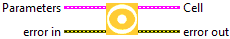
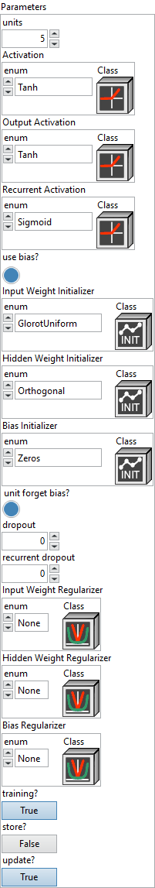
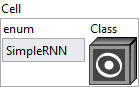
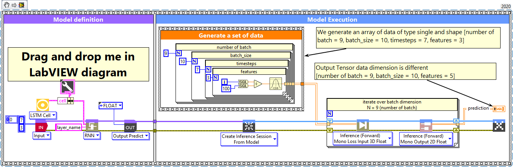

<h1>LSTM Cell</h1>

<h2>Description</h2>

Define the cell lstm layer according to its parameters. To be used for the RNN layer. Type : <em><strong>polymorphic</strong></em>.

<h3>Input parameters</h3>

<table>
  <tbody>
    <tr>
      <td valign="top" width="75%"><table>
  <tbody>
    <tr>
      <td width="64" valign="top"></td>
      <td valign="top"><strong>Parameters :</strong> layer parameters.</td>
    </tr>
    <tr>
      <td></td>
      <td valign="top"><table>
  <tbody>
    <tr>
      <td width="64" valign="top"></td>
      <td valign="top"><strong>units : <em>integer</em></strong>, dimensionality of the output space.</td>
    </tr>
    <tr>
      <td width="64" valign="top"></td>
      <td valign="top"><strong><a href="../../../../more-deep-learning/layers-parameters/activation/README.md">Activation</a> : <em>cluster, </em></strong>applied to the candidate cell input. This function transforms the new information considered for updating the cell state.</td>
    </tr>
    <tr>
      <td width="64" valign="top"></td>
      <td valign="top"><strong><a href="../../../../more-deep-learning/layers-parameters/activation/README.md">Output Activation</a> : <em>cluster, </em></strong>applied to the updated cell state before producing the visible hidden output of the LSTM at each time step.</td>
    </tr>
    <tr>
      <td width="64" valign="top"></td>
      <td valign="top"><strong><a href="../../../../more-deep-learning/layers-parameters/activation/README.md">Recurrent Activation</a> : <em>cluster, </em></strong>applied to the input, forget, and output gates. It controls which parts of the past information are allowed to pass or be blocked.</td>
    </tr>
    <tr>
      <td width="64" valign="top"></td>
      <td valign="top"><strong>use bias? : <em>boolean</em></strong>, whether the layer uses a bias vector.</td>
    </tr>
    <tr>
      <td width="64" valign="top"></td>
      <td valign="top">Default value “True”.</td>
    </tr>
    <tr>
      <td width="64" valign="top"></td>
      <td valign="top"><strong><a href="../../../../more-deep-learning/layers-parameters/initializer/README.md">Input Weight Initializer</a> : <em>cluster, </em></strong>initializer for the <code>kernel</code> weights matrix, used for the linear transformation of the inputs.</td>
    </tr>
    <tr>
      <td width="64" valign="top"></td>
      <td valign="top"><strong><a href="../../../../more-deep-learning/layers-parameters/initializer/README.md">Hidden Weight Initializer</a> : <em>cluster, </em></strong>initializer for the <code>recurrent_kernel</code> weights matrix, used for the linear transformation of the recurrent state.</td>
    </tr>
    <tr>
      <td width="64" valign="top"></td>
      <td valign="top"><strong><a href="../../../../more-deep-learning/layers-parameters/initializer/README.md">Bias Initializer</a> : <em>cluster, </em></strong>initializer for the bias vector.</td>
    </tr>
    <tr>
      <td width="64" valign="top"></td>
      <td valign="top"><strong>unit forget bias? : <em>boolean</em></strong>, if True, add 1 to the bias of the forget gate at initialization.</td>
    </tr>
    <tr>
      <td width="64" valign="top"></td>
      <td valign="top">Default value “True”.</td>
    </tr>
    <tr>
      <td width="64" valign="top"></td>
      <td valign="top"><strong>dropout : <em>float</em></strong>, fraction of the units to drop for the linear transformation of the inputs.</td>
    </tr>
    <tr>
      <td width="64" valign="top"></td>
      <td valign="top">Default value “0.0”.</td>
    </tr>
    <tr>
      <td width="64" valign="top"></td>
      <td valign="top"><strong>recurrent dropout : <em>float</em></strong>, fraction of the units to drop for the linear transformation of the recurrent state.</td>
    </tr>
    <tr>
      <td width="64" valign="top"></td>
      <td valign="top">Default value “0.0”.</td>
    </tr>
    <tr>
      <td width="64" valign="top"></td>
      <td valign="top"><strong><a href="../../../../more-deep-learning/layers-parameters/regularizer/README.md">Input Weight Regularizer</a> : <em>cluster, </em></strong>regularizer function applied to the <code>kernel</code> weights matrix.</td>
    </tr>
    <tr>
      <td width="64" valign="top"></td>
      <td valign="top"><strong><a href="../../../../more-deep-learning/layers-parameters/regularizer/README.md">Hidden Weight Regularizer</a> : <em>cluster, </em></strong>regularizer function applied to the <code>recurrent_kernel</code> weights matrix.</td>
    </tr>
    <tr>
      <td width="64" valign="top"></td>
      <td valign="top"><strong><a href="../../../../more-deep-learning/layers-parameters/regularizer/README.md">Bias Regularizer</a> : <em>cluster, </em></strong>regularizer function applied to the bias vector.</td>
    </tr>
    <tr>
      <td width="64" valign="top"></td>
      <td valign="top"><strong>training? :</strong> <em><strong>boolean</strong></em>, whether the layer is in training mode (can store data for backward).</td>
    </tr>
    <tr>
      <td width="64" valign="top"></td>
      <td valign="top">Default value “True”.</td>
    </tr>
    <tr>
      <td width="64" valign="top"></td>
      <td valign="top"><strong>store? :</strong> <em><strong>boolean</strong></em>, whether the layer stores the last iteration gradient (accessible via the “get_gradients” function).</td>
    </tr>
    <tr>
      <td width="64" valign="top"></td>
      <td valign="top">Default value “False”.</td>
    </tr>
    <tr>
      <td width="64" valign="top"></td>
      <td valign="top"><strong>update? :</strong> <em><strong>boolean</strong></em>, whether the layer’s variables should be updated during backward. Equivalent to freeze the layer.</td>
    </tr>
    <tr>
      <td width="64" valign="top"></td>
      <td valign="top">Default value “True”.</td>
    </tr>
  </tbody>
</table></td>
    </tr>
  </tbody>
</table></td>
      <td valign="top" width="25%">

</td>
    </tr>
  </tbody>
</table>

<h3>Output parameters</h3>

<table>
  <tbody>
    <tr>
      <td valign="top" width="75%"><table>
  <tbody>
    <tr>
      <td width="64" valign="top"></td>
      <td valign="top"><strong>Cell :</strong> <em><strong>cluster,</strong></em> this cluster defines the recurrent cell type used in a recurrent layer.</td>
    </tr>
    <tr>
      <td></td>
      <td valign="top"><table>
  <tbody>
    <tr>
      <td width="64" valign="top"></td>
      <td valign="top"><strong>enum :</strong> <em><strong>enum</strong></em>, an enumeration indicating the cell type (e.g., SimpleRNN, LSTM, GRU, etc.). If <code>enum</code> is set to <code>CustomCell</code>, the class on the right will be used. Otherwise, the selected cell type will be instantiated with default parameters.</td>
    </tr>
    <tr>
      <td width="64" valign="top"></td>
      <td valign="top"><strong>Class :</strong> <em><strong>object</strong></em>, a custom RNN cell class instance.</td>
    </tr>
  </tbody>
</table></td>
    </tr>
  </tbody>
</table></td>
      <td valign="top" width="25%">

</td>
    </tr>
  </tbody>
</table>

<h2>Example</h2>

All these exemples are snippets PNG, you can drop these Snippet onto the block diagram and get the depicted code added to your VI (Do not forget to install Deep Learning library to run it).

<h3>LSTM cell inside RNN layer</h3>

