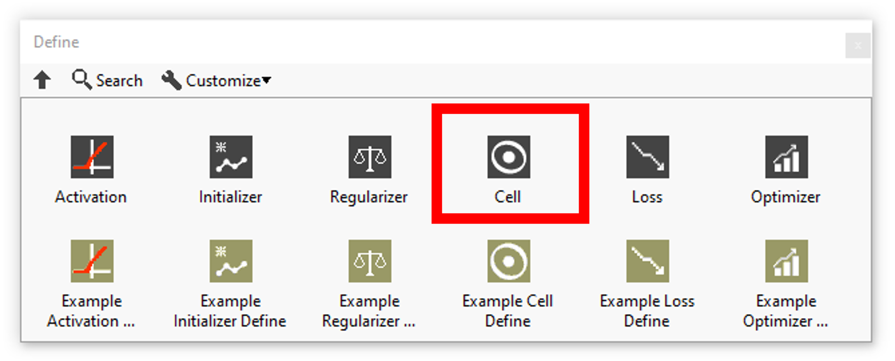
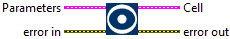
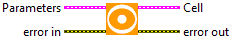

<h1>Cells resume</h1>

<table>
  <tbody>
    <tr>
      <td valign="top" width="50%">

</td>
      <td valign="top" width="50%">

</td>
    </tr>
  </tbody>
</table>

<h2>CELLS</h2>

In this section you’ll find a list of all define cells available.

|  | **ICONS** | **RESUME** |
| --- | --- | --- |
| [GRU](https://haibal.com/documentation/gru-cell-define/) |  | Define the cell gru layer according to its parameters. |
| [LSTM](https://haibal.com/documentation/lstm-cell-define/) |  | Define the cell lstm layer according to its parameters. |
| [SimpleRNN](https://haibal.com/documentation/simple-rnn-cell-define/) |  | Define the cell simple rnn layer according to its parameters. |
