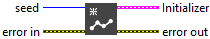
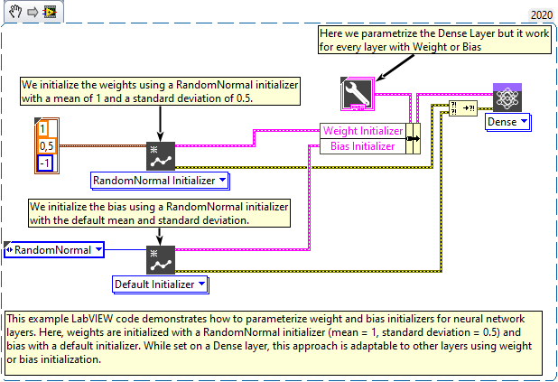

<h1>GlorotUniform</h1>

<h2>Description</h2>

The Glorot uniform initializer, also called Xavier uniform initializer. Type : <em><strong>polymorphic</strong><strong>.</strong></em>

Draws samples from a uniform distribution within <em>[-limit, limit]</em>, where <em><strong>limit = sqrt(6 / (fan_in + fan_out))</strong></em> (<em>fan_in</em> is the number of input units in the weight tensor and <em>fan_out</em> is the number of output units).

<h3>Input parameters</h3>

<table>
  <tbody>
    <tr>
      <td width="64" valign="top"></td>
      <td valign="top"><strong>seed : <em>integer, </em></strong>used to make the behavior of the initializer deterministic. Note that an initializer seeded with an integer or -1 (unseeded) will produce the same random values across multiple calls.</td>
    </tr>
  </tbody>
</table>

<h3>Output parameters</h3>

<table>
  <tbody>
    <tr>
      <td valign="top" width="75%"><table>
  <tbody>
    <tr>
      <td width="64" valign="top"></td>
      <td valign="top"><strong>Initializer :</strong> <em><strong>cluster,</strong></em> this cluster defines the weight initialization strategy for a model.</td>
    </tr>
    <tr>
      <td></td>
      <td valign="top"><table>
  <tbody>
    <tr>
      <td width="64" valign="top"></td>
      <td valign="top"><strong><a href="../../../../more-deep-learning/layers-parameters/initializer/README.md">enum</a> :</strong> <em><strong>enum</strong></em>, an enumeration indicating the initialization type (e.g., Zeros, Glorot, HeNormal, etc.). If <code>enum</code> is set to <code>CustomInitializer</code>, the custom class on the right will be used. Otherwise, the selected initialization strategy will be applied with default parameters.</td>
    </tr>
    <tr>
      <td width="64" valign="top"></td>
      <td valign="top"><strong>Class :</strong> <em><strong>object</strong></em>, a custom initializer class instance.</td>
    </tr>
  </tbody>
</table></td>
    </tr>
  </tbody>
</table></td>
      <td valign="top" width="25%">

</td>
    </tr>
  </tbody>
</table>

<h2>Example</h2>

All these exemples are snippets PNG, you can drop these Snippet onto the block diagram and get the depicted code added to your VI (Do not forget to install Deep Learning library to run it).

