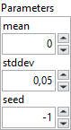

<h1>RandomNormal</h1>

<h2>Description</h2>

Random normal initializer. Type : <em><strong>polymorphic</strong><strong>.</strong></em>

Draws samples from a normal distribution for given parameters.

<table>
  <tbody>
    <tr>
      <td valign="top" width="70%"><h3>Input parameters</h3>

<table>
  <tbody>
    <tr>
      <td width="64" valign="top"></td>
      <td valign="top"><strong>Parameters : <i>cluster,</i></strong></td>
    </tr>
    <tr>
      <td></td>
      <td valign="top"><table>
  <tbody>
    <tr>
      <td width="64" valign="top"></td>
      <td valign="top"><strong>mean : <em>float,</em></strong> a scalar. Mean of the random values to generate.</td>
    </tr>
    <tr>
      <td width="64" valign="top"></td>
      <td valign="top"><strong>stddev : <em>float,</em></strong> a scalar. Standard deviation of the random values to generate.</td>
    </tr>
    <tr>
      <td width="64" valign="top"></td>
      <td valign="top"><strong>seed : <em>integer, </em></strong>used to make the behavior of the initializer deterministic. Note that an initializer seeded with an integer or -1 (unseeded) will produce the same random values across multiple calls.</td>
    </tr>
  </tbody>
</table></td>
    </tr>
  </tbody>
</table></td>
      <td valign="top" width="30%">

</td>
    </tr>
  </tbody>
</table>

<h3>Output parameters</h3>

<table>
  <tbody>
    <tr>
      <td valign="top" width="75%"><table>
  <tbody>
    <tr>
      <td width="64" valign="top"></td>
      <td valign="top"><strong>Initializer :</strong> <em><strong>cluster,</strong></em> this cluster defines the weight initialization strategy for a model.</td>
    </tr>
    <tr>
      <td></td>
      <td valign="top"><table>
  <tbody>
    <tr>
      <td width="64" valign="top"></td>
      <td valign="top"><strong><a href="../../../../more-deep-learning/layers-parameters/initializer/README.md">enum</a> :</strong> <em><strong>enum</strong></em>, an enumeration indicating the initialization type (e.g., Zeros, Glorot, HeNormal, etc.). If <code>enum</code> is set to <code>CustomInitializer</code>, the custom class on the right will be used. Otherwise, the selected initialization strategy will be applied with default parameters.</td>
    </tr>
    <tr>
      <td width="64" valign="top"></td>
      <td valign="top"><strong>Class :</strong> <em><strong>object</strong></em>, a custom initializer class instance.</td>
    </tr>
  </tbody>
</table></td>
    </tr>
  </tbody>
</table></td>
      <td valign="top" width="25%">

</td>
    </tr>
  </tbody>
</table>

<h2>Example</h2>

All these exemples are snippets PNG, you can drop these Snippet onto the block diagram and get the depicted code added to your VI (Do not forget to install Deep Learning library to run it).

