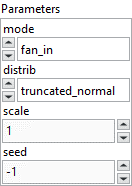
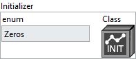

<h1>VarianceScaling</h1>

<h2>Description</h2>

Initializer that adapts its scale to the shape of its input tensors. Type : <em><strong>polymorphic</strong><strong>.</strong></em>

With distribution = <em>“truncated_normal”</em> or <em>“untruncated_normal”</em>, samples are drawn from a truncated/untruncated normal distribution with a mean of zero and a standard deviation (after truncation, if used) <em><strong>stddev = sqrt(scale / n)</strong></em>, where <em>n</em> is:

<ul>
<li>
<ul>
<li>number of input units in the weight tensor, <em>if mode = “fan_in”</em></li>
<li>number of output units, if <em>mode = “fan_out”</em></li>
<li>average of the numbers of input and output units, if <em>mode = “fan_avg”</em></li>
</ul>
</li>
</ul>

With distribution = <em>“uniform”</em>, samples are drawn from a uniform distribution within <em>[-limit, limit]</em><code></code>, where <em><strong>limit = sqrt(3 * scale / n)</strong></em>.

<table>
  <tbody>
    <tr>
      <td valign="top" width="70%"><h3>Input parameters</h3>

<table>
  <tbody>
    <tr>
      <td width="64" valign="top"></td>
      <td valign="top"><strong>Parameters : <i>cluster,</i></strong></td>
    </tr>
    <tr>
      <td></td>
      <td valign="top"><table>
  <tbody>
    <tr>
      <td width="64" valign="top"></td>
      <td valign="top"><strong>mode : <em>enum,</em></strong> one of <code>"fan_in"</code>, <code>"fan_out"</code>, <code>"fan_avg"</code>.</td>
    </tr>
    <tr>
      <td width="64" valign="top"></td>
      <td valign="top"><strong>distrib : <em>enum,</em></strong> random distribution to use. One of <code>"truncated_normal"</code>, <code>"untruncated_normal"</code>, or <code>"uniform"</code>.</td>
    </tr>
    <tr>
      <td width="64" valign="top"></td>
      <td valign="top"><strong>scale : <em>float,</em></strong> scaling factor.</td>
    </tr>
    <tr>
      <td width="64" valign="top"></td>
      <td valign="top"><strong>seed : <em>integer, </em></strong>used to make the behavior of the initializer deterministic. Note that an initializer seeded with an integer or -1 (unseeded) will produce the same random values across multiple calls.</td>
    </tr>
  </tbody>
</table></td>
    </tr>
  </tbody>
</table></td>
      <td valign="top" width="30%">

</td>
    </tr>
  </tbody>
</table>

<h3>Output parameters</h3>

<table>
  <tbody>
    <tr>
      <td valign="top" width="75%"><table>
  <tbody>
    <tr>
      <td width="64" valign="top"></td>
      <td valign="top"><strong>Initializer :</strong> <em><strong>cluster,</strong></em> this cluster defines the weight initialization strategy for a model.</td>
    </tr>
    <tr>
      <td></td>
      <td valign="top"><table>
  <tbody>
    <tr>
      <td width="64" valign="top"></td>
      <td valign="top"><strong><a href="../../../../more-deep-learning/layers-parameters/initializer/README.md">enum</a> :</strong> <em><strong>enum</strong></em>, an enumeration indicating the initialization type (e.g., Zeros, Glorot, HeNormal, etc.). If <code>enum</code> is set to <code>CustomInitializer</code>, the custom class on the right will be used. Otherwise, the selected initialization strategy will be applied with default parameters.</td>
    </tr>
    <tr>
      <td width="64" valign="top"></td>
      <td valign="top"><strong>Class :</strong> <em><strong>object</strong></em>, a custom initializer class instance.</td>
    </tr>
  </tbody>
</table></td>
    </tr>
  </tbody>
</table></td>
      <td valign="top" width="25%">

</td>
    </tr>
  </tbody>
</table>

<h2>Example</h2>

All these exemples are snippets PNG, you can drop these Snippet onto the block diagram and get the depicted code added to your VI (Do not forget to install Deep Learning library to run it).

