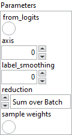
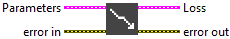
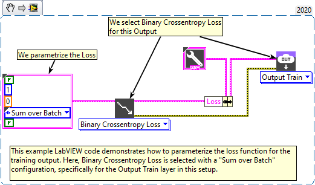

<h1>BinaryCrossentropy</h1>

<h2>Description</h2>

Computes the cross-entropy loss between true labels and predicted labels.​ Type : <em><strong>polymorphic</strong><strong>.</strong></em>

<table>
  <tbody>
    <tr>
      <td valign="top" width="70%"><h3>Input parameters</h3>

<table>
  <tbody>
    <tr>
      <td width="64" valign="top"></td>
      <td valign="top"><strong>Parameters : <em>cluster,</em></strong></td>
    </tr>
    <tr>
      <td></td>
      <td valign="top"><table>
  <tbody>
    <tr>
      <td width="64" valign="top"></td>
      <td valign="top"><strong> from_logits : <em>boolean,</em></strong> whether to interpret <em>y_pred</em> as a tensor of logit values. By default, we assume that <em>y_pred</em> is probabilities.</td>
    </tr>
    <tr>
      <td width="64" valign="top"></td>
      <td valign="top"><strong>axis : <em>integer, </em></strong>the axis along which to compute crossentropy (the features axis).</td>
    </tr>
    <tr>
      <td width="64" valign="top"></td>
      <td valign="top"><strong>label_smoothing : <em>float in range [0, 1], </em></strong>when 0, no smoothing occurs. When > 0, we compute the loss between the predicted labels and a smoothed version of the true labels, where the smoothing squeezes the labels towards 0.5. Larger values of <em>label_smoothing</em> correspond to heavier smoothing.</td>
    </tr>
    <tr>
      <td width="64" valign="top"></td>
      <td valign="top"><strong> reduction : <em>enum,</em></strong> type of reduction to apply to the loss. In almost all cases this should be “S<em>um over Batch</em>“.</td>
    </tr>
    <tr>
      <td width="64" valign="top"></td>
      <td valign="top"><strong> sample weights : <em>boolean,</em></strong> if enabled, adds an input for weighting each sample individually.</td>
    </tr>
  </tbody>
</table></td>
    </tr>
  </tbody>
</table></td>
      <td valign="top" width="30%">

</td>
    </tr>
  </tbody>
</table>

<h3>Output parameters</h3>

<table>
  <tbody>
    <tr>
      <td valign="top" width="75%"><table>
  <tbody>
    <tr>
      <td width="64" valign="top"></td>
      <td valign="top"><strong>Loss :</strong> <em><strong>cluster,</strong></em> this cluster defines the loss function used for model training.</td>
    </tr>
    <tr>
      <td></td>
      <td valign="top"><table>
  <tbody>
    <tr>
      <td width="64" valign="top"></td>
      <td valign="top"><strong>enum :</strong> <em><strong>enum</strong></em>, an enumeration indicating the loss type (e.g., MSE, CrossEntropy, etc.). If <code>enum</code> is set to <code>CustomLoss</code>, the custom class on the right will be used as the loss function. Otherwise, the selected loss will be applied with its default configuration.</td>
    </tr>
    <tr>
      <td width="64" valign="top"></td>
      <td valign="top"><strong>Class :</strong> <em><strong>object</strong></em>, a custom loss class instance.</td>
    </tr>
  </tbody>
</table></td>
    </tr>
  </tbody>
</table></td>
      <td valign="top" width="25%">

</td>
    </tr>
  </tbody>
</table>

<h2>Required data</h2>

<table>
  <tbody>
    <tr>
      <td width="64" valign="top"></td>
      <td valign="top"><strong>y_pred : <em>array, </em></strong>predicted value. This is the model’s prediction, i.e, a single floating-point value which either represents a logit, (i.e, value in [-inf, inf] when <strong>from_logits = True</strong>) or a probability (i.e, value in [0., 1.] when <strong>from_logits = False</strong>).</td>
    </tr>
    <tr>
      <td width="64" valign="top"></td>
      <td valign="top"><strong>y_true : <em>array, </em></strong>true label. This is either 0 or 1.</td>
    </tr>
  </tbody>
</table>

<h2>Use cases</h2>

Binary crossentropy loss, is a loss function commonly used in binary classification problems. It measures the difference between the predicted probabilities and the actual labels, which are typically encoded as 0 or 1.

This function is particularly effective for evaluating model performance when the goal is to predict accurate probabilities for two exclusive classes. It is often used in neural networks to train models on tasks such as spam detection, text classification, or determining whether something is an object or not.

<h2>Example</h2>

All these exemples are snippets PNG, you can drop these Snippet onto the block diagram and get the depicted code added to your VI (Do not forget to install Deep Learning library to run it).

