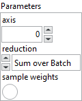

<h1>CosineSimilarity</h1>

<h2>Description</h2>

Computes the cosine similarity between true labels and predicted labels.​ Type : <em><strong>polymorphic</strong><strong>.</strong></em>

<table>
  <tbody>
    <tr>
      <td valign="top" width="70%"><h3>Input parameters</h3>

<table>
  <tbody>
    <tr>
      <td width="64" valign="top"></td>
      <td valign="top"><strong>Parameters : <em>cluster,</em></strong></td>
    </tr>
    <tr>
      <td></td>
      <td valign="top"><table>
  <tbody>
    <tr>
      <td width="64" valign="top"></td>
      <td valign="top"><strong>axis : <em>integer, </em></strong>the axis along which the cosine similarity is computed (the features axis).</td>
    </tr>
    <tr>
      <td width="64" valign="top"></td>
      <td valign="top"><strong> reduction : <em>enum,</em></strong> type of reduction to apply to the loss. In almost all cases this should be “S<em>um over Batch</em>“.</td>
    </tr>
    <tr>
      <td width="64" valign="top"></td>
      <td valign="top"><strong> sample weights : <em>boolean,</em></strong> if enabled, adds an input for weighting each sample individually.</td>
    </tr>
  </tbody>
</table></td>
    </tr>
  </tbody>
</table></td>
      <td valign="top" width="30%">

</td>
    </tr>
  </tbody>
</table>

<h3>Output parameters</h3>

<table>
  <tbody>
    <tr>
      <td valign="top" width="75%">
<strong>Loss :</strong><em><strong>cluster,</strong></em>this cluster defines the loss function used for model training.

<table>
  <tbody>
    <tr>
      <td width="64" valign="top"></td>
      <td valign="top"><strong>enum :</strong> <em><strong>enum</strong></em>, an enumeration indicating the loss type (e.g., MSE, CrossEntropy, etc.). If <code>enum</code> is set to <code>CustomLoss</code>, the custom class on the right will be used as the loss function. Otherwise, the selected loss will be applied with its default configuration.</td>
    </tr>
    <tr>
      <td width="64" valign="top"></td>
      <td valign="top"><strong>Class :</strong> <em><strong>object</strong></em>, a custom loss class instance.</td>
    </tr>
  </tbody>
</table></td>
      <td valign="top" width="25%">

</td>
    </tr>
  </tbody>
</table>

<h2>Required data</h2>

<table>
  <tbody>
    <tr>
      <td width="64" valign="top"></td>
      <td valign="top"><strong>y_pred : <em>array,</em></strong> predicted vector. This is the model’s output, typically a dense vector of floating-point values representing a direction in feature space. It does not need to be normalized, as the cosine similarity function internally handles normalization.</td>
    </tr>
    <tr>
      <td width="64" valign="top"></td>
      <td valign="top"><strong>y_true : <em>array, </em></strong>true label vector. This is the target vector, usually of the same shape as <strong>y_pred</strong>, indicating the desired direction the model should learn to match. Must have the same shape as <strong>y_pred</strong>.</td>
    </tr>
  </tbody>
</table>

<h2>Use cases</h2>

Cosine similarity loss is commonly used to measure the <strong>directional alignment</strong> between two vectors, regardless of their magnitude. The cosine similarity value ranges from -1 (completely opposite) to 1 (identical), and in the context of loss computation, it is usually <strong>negated</strong> so that the loss decreases as similarity increases.

This loss function is particularly effective in tasks where the <strong>angle between vectors matters more than their absolute values</strong>, such as :

<ul>
<li>learning meaningful vector representations (embeddings),</li>
<li>image or text retrieval based on similarity,</li>
<li>recommendation systems,</li>
<li>training Siamese networks or contrastive models to detect similarity or matching pairs.</li>
</ul>

By minimizing the cosine similarity loss, the model learns to produce output vectors that align closely with the target direction in the embedding space.

<h2>Example</h2>

All these exemples are snippets PNG, you can drop these Snippet onto the block diagram and get the depicted code added to your VI (Do not forget to install Deep Learning library to run it).

