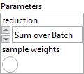
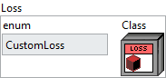

<h1>MeanAbsoluteError</h1>

<h2>Description</h2>

Computes the mean of absolute difference between labels and predictions.​ Type : <em><strong>polymorphic</strong><strong>.</strong></em>

<table>
  <tbody>
    <tr>
      <td valign="top" width="70%"><h3>Input parameters</h3>

<table>
  <tbody>
    <tr>
      <td width="64" valign="top"></td>
      <td valign="top"><strong>Parameters : <em>cluster,</em></strong></td>
    </tr>
    <tr>
      <td></td>
      <td valign="top"><table>
  <tbody>
    <tr>
      <td width="64" valign="top"></td>
      <td valign="top"><strong> reduction : <em>enum,</em></strong> type of reduction to apply to the loss. In almost all cases this should be “S<em>um over Batch</em>“.</td>
    </tr>
    <tr>
      <td width="64" valign="top"></td>
      <td valign="top"><strong> sample weights : <em>boolean,</em></strong> if enabled, adds an input for weighting each sample individually.</td>
    </tr>
  </tbody>
</table></td>
    </tr>
  </tbody>
</table></td>
      <td valign="top" width="30%">

</td>
    </tr>
  </tbody>
</table>

<h3>Output parameters</h3>

<table>
  <tbody>
    <tr>
      <td valign="top" width="75%"><table>
  <tbody>
    <tr>
      <td width="64" valign="top"></td>
      <td valign="top"><strong>Loss :</strong> <em><strong>cluster,</strong></em> this cluster defines the loss function used for model training.</td>
    </tr>
    <tr>
      <td></td>
      <td valign="top"><table>
  <tbody>
    <tr>
      <td width="64" valign="top"></td>
      <td valign="top"><strong>enum :</strong> <em><strong>enum</strong></em>, an enumeration indicating the loss type (e.g., MSE, CrossEntropy, etc.). If <code>enum</code> is set to <code>CustomLoss</code>, the custom class on the right will be used as the loss function. Otherwise, the selected loss will be applied with its default configuration.</td>
    </tr>
    <tr>
      <td width="64" valign="top"></td>
      <td valign="top"><strong>Class :</strong> <em><strong>object</strong></em>, a custom loss class instance.</td>
    </tr>
  </tbody>
</table></td>
    </tr>
  </tbody>
</table></td>
      <td valign="top" width="25%">

</td>
    </tr>
  </tbody>
</table>

<h2>Required data</h2>

<table>
  <tbody>
    <tr>
      <td width="64" valign="top"></td>
      <td valign="top"><strong>y_pred : <em>array, </em></strong>predicted values.</td>
    </tr>
    <tr>
      <td width="64" valign="top"></td>
      <td valign="top"><strong>y_true : <em>array, </em></strong>true values.</td>
    </tr>
  </tbody>
</table>

<h2>Use cases</h2>

Mean Absolute Error (MAE) is a loss function primarily used in regression problems. It calculates the average of the absolute differences between predictions and the actual values. 

This function is particularly useful when you want to prevent large errors from disproportionately impacting the loss function, which can occur with mean squared error (MSE). Therefore, MAE is often used in situations where data may contain outliers or non-uniform variations.

<h2>Example</h2>

All these exemples are snippets PNG, you can drop these Snippet onto the block diagram and get the depicted code added to your VI (Do not forget to install Deep Learning library to run it).

