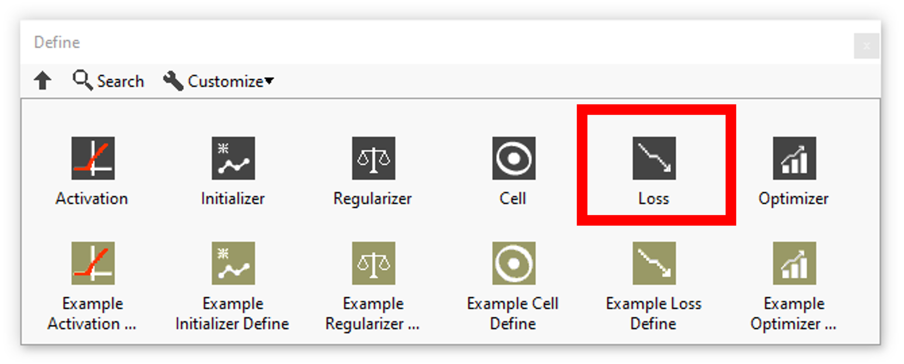
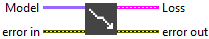

<h1>Losses resume</h1>

<table>
  <tbody>
    <tr>
      <td valign="top" width="50%">

</td>
      <td valign="top" width="50%">

</td>
    </tr>
  </tbody>
</table>

In this section you’ll find a list of all losses fonctionalities.

|  | **ICONS** | **RESUME** |
| --- | --- | --- |
| [BinaryCrossentropy](../binarycrossentropy/README.md) |  | Computes the cross-entropy loss between true labels and predicted labels. |
| [CategoricalCrossentropy](../categoricalcrossentropy/README.md) |  | Computes the crossentropy loss between the labels and predictions.​ |
| [CategoricalHinge](../categoricalhinge/README.md) |  | Computes the categorical hinge loss between y_true and y_pred.​ |
| [CosineSimilarity](../cosinesimilarity/README.md) |  | Computes the cosine similarity between true labels and predicted labels.​ |
| [Hinge](../hinge/README.md) |  | Computes the hinge loss between y_true and y_pred.​ |
| [Huber](../huber/README.md) |  | Computes the Huber loss between y_true and y_pred.​ |
| [KLDivergence](../kldivergence/README.md) |  | Computes Kullback-Leibler divergence loss between y_true and y_pred.​ |
| [LogCosh](../logcosh/README.md) |  | Computes the logarithm of the hyperbolic cosine of the prediction error. |
| [MeanAbsoluteError](../meanabsoluteerror/README.md) |  | Computes the mean of absolute difference between labels and predictions.​ |
| [MeanAbsolutePercentageError](../meanabsolutepercentageerror/README.md) |  | Computes the mean absolute percentage error between y_true and y_pred.​ |
| [MeanSquaredError](../meansquarederror/README.md) |  | Computes the mean of squares of errors between labels and predictions. |
| [MeanSquaredLogarithmicError](../meansquaredlogarithmicerror/README.md) |  | Computes the mean squared logarithmic error between y_true and y_pred. |
| [Poisson](../poisson/README.md) |  | Computes the Poisson loss between y_true and y_pred.​ |
| [SquaredHinge](../squaredhinge/README.md) |  | Computes the squared hinge loss between y_true and y_pred.​ |
| [Custom](../custom/README.md) |  | A custom loss function allows you to define your own loss logic, making it possible to go beyond the standard loss functions provided by libraries. |
