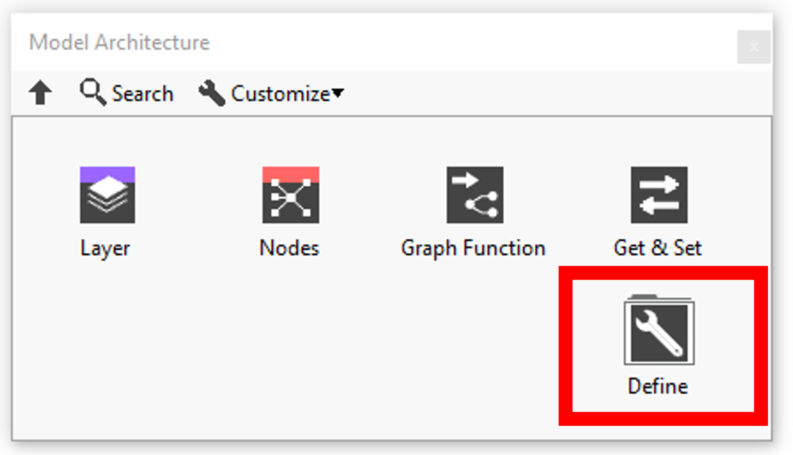
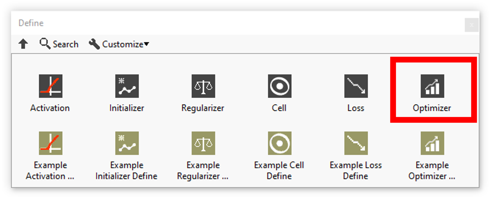

<h1>Optimizers resume</h1>

<table>
  <tbody>
    <tr>
      <td valign="top" width="50%">

</td>
      <td valign="top" width="50%">

</td>
    </tr>
  </tbody>
</table>

In this section you’ll find a list of all optimizers fonctionalities.

|  | **ICONS** | **RESUME** |
| --- | --- | --- |
| [Adam](../adam/README.md) |  | Optimizer that implements the Adam algorithm. |
| [SGD](../sgd/README.md) |  | Optimizer that implements the SGD algorithm. |
