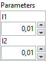
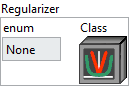
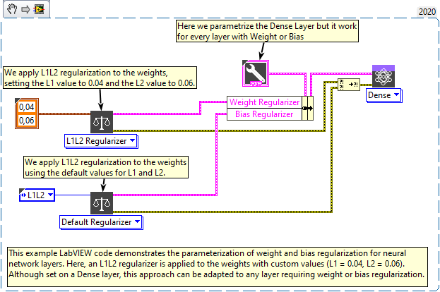

<h1>L1L2</h1>

<h2>Description</h2>

Define L1L2 regularizer. This mode combines both <strong>L1 and L2</strong> penalties, allowing a trade-off between <strong>sparsity</strong> and <strong>weight decay</strong>. It is useful when you want to benefit from both effects in a single model. When selected explicitly, <strong>both <code>l1</code> and <code>l2</code> coefficients are user-defined</strong>. Type : <em><strong>polymorphic</strong><strong>.</strong></em>

<table>
  <tbody>
    <tr>
      <td valign="top" width="70%"><h3>Input parameters</h3>

<table>
  <tbody>
    <tr>
      <td width="64" valign="top"></td>
      <td valign="top"><strong>Parameters : <i>cluster,</i></strong></td>
    </tr>
    <tr>
      <td></td>
      <td valign="top"><table>
  <tbody>
    <tr>
      <td width="64" valign="top"></td>
      <td valign="top"><strong>l1 : <em>float,</em></strong> L1 regularization factor.</td>
    </tr>
    <tr>
      <td width="64" valign="top"></td>
      <td valign="top"><strong>l2 : <em>float,</em></strong> L2 regularization factor.</td>
    </tr>
  </tbody>
</table></td>
    </tr>
  </tbody>
</table></td>
      <td valign="top" width="30%">

</td>
    </tr>
  </tbody>
</table>

<h3>Output parameters</h3>

<table>
  <tbody>
    <tr>
      <td valign="top" width="75%"><table>
  <tbody>
    <tr>
      <td width="64" valign="top"></td>
      <td valign="top"><strong>Regularizer :</strong> <em><strong>cluster,</strong></em> this cluster defines the regularization strategy used to constrain model weights.</td>
    </tr>
    <tr>
      <td></td>
      <td valign="top"><table>
  <tbody>
    <tr>
      <td width="64" valign="top"></td>
      <td valign="top"><strong><a href="../../../../more-deep-learning/layers-parameters/regularizer/README.md">enum</a> :</strong> <em><strong>enum</strong></em>, an enumeration indicating the regularizer type (e.g., None, L1, L2, etc.). If <code>enum</code> is set to <code>CustomRegularizer</code>, the custom class will be used. Otherwise, the selected regularizer will be applied using default settings.</td>
    </tr>
    <tr>
      <td width="64" valign="top"></td>
      <td valign="top"><strong>Class :</strong> <em><strong>object</strong></em>, a custom regularizer class instance.</td>
    </tr>
  </tbody>
</table></td>
    </tr>
  </tbody>
</table></td>
      <td valign="top" width="25%">

</td>
    </tr>
  </tbody>
</table>

<h2>Example</h2>

All these exemples are snippets PNG, you can drop these Snippet onto the block diagram and get the depicted code added to your VI (Do not forget to install Deep Learning library to run it).

