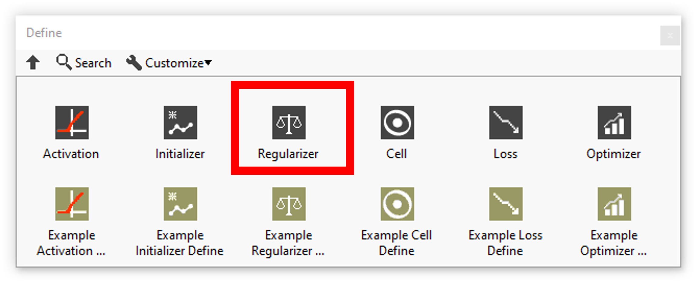

<h1>Regularizers resume</h1>

<table>
  <tbody>
    <tr>
      <td valign="top" width="50%">

</td>
      <td valign="top" width="50%">

</td>
    </tr>
  </tbody>
</table>

In this section you’ll find a list of all regularizers fonctionalities.

|  | **ICONS** | **RESUME** |
| --- | --- | --- |
| [L1](../l1/README.md) |  | Define L1 regularizer. |
| [L1L2](../l1l2/README.md) |  | Define L1L2 regularizer. |
| [L2](../l2/README.md) |  | Define L2 regularizer. |
