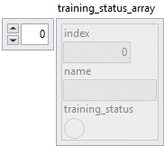

<h1>Get all training status</h1>

<h2>Description</h2>

Gets for all layers contained in the model the state of the boolean “training_status”. If the boolean is “True”, then a layer backward is performed.

<h3>Input parameters</h3>

<table>
  <tbody>
    <tr>
      <td width="64" valign="top"></td>
      <td valign="top"><strong>Model in : </strong>model architecture.</td>
    </tr>
  </tbody>
</table>

<h3>Output parameters</h3>

<table>
  <tbody>
    <tr>
      <td width="64" valign="top"></td>
      <td valign="top"><strong>Model out : </strong>model architecture.</td>
    </tr>
  </tbody>
</table>

<table>
  <tbody>
    <tr>
      <td valign="top" width="70%">
<strong>training_status_array : <em>array</em></strong>

<table>
  <tbody>
    <tr>
      <td width="64" valign="top"></td>
      <td valign="top"><strong>index : <em>integer</em>,</strong> index of layer.</td>
    </tr>
    <tr>
      <td width="64" valign="top"></td>
      <td valign="top"><strong>name : <em>string</em>,</strong> name of layer.</td>
    </tr>
    <tr>
      <td width="64" valign="top"></td>
      <td valign="top"><strong>training_status : <em>boolean</em>,</strong> returns the training status.</td>
    </tr>
  </tbody>
</table></td>
      <td valign="top" width="30%">

</td>
    </tr>
  </tbody>
</table>

<h2>Example</h2>

All these exemples are snippets PNG, you can drop these Snippet onto the block diagram and get the depicted code added to your VI (Do not forget to install Deep Learning library to run it).

<h3>Using the “Get All Train Status” function</h3>

1 – Define Graph

We define the graph with one input and two Dense layers named Dense1 and Dense2 parameterized in different ways.

2 – Get Function

We use the “Get All Train Status” function to get the value of the “training?” parameter for all layers of the model.

