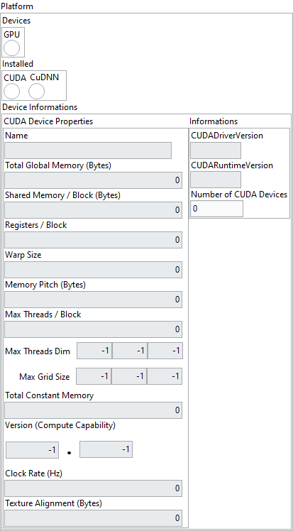

<h1>Get GPU platform</h1>

<h2>Description</h2>

Check if your computer is GPU ready. First check if CUDA is installed, if yes display device informations according to deviceID and check if CuDNN is also installed. If both are installed, it’s GPU ready.

<h3>Input parameters</h3>

<table>
  <tbody>
    <tr>
      <td width="64" valign="top"></td>
      <td valign="top"><strong>Model in : </strong>model architecture.</td>
    </tr>
    <tr>
      <td width="64" valign="top"></td>
      <td valign="top">deviceID : integer, ID of GPU device.</td>
    </tr>
  </tbody>
</table>

<h3>Output parameters</h3>

<table>
  <tbody>
    <tr>
      <td width="64" valign="top"></td>
      <td valign="top"><strong>Model out : </strong>model architecture.</td>
    </tr>
  </tbody>
</table>

<table>
  <tbody>
    <tr>
      <td valign="top" width="70%"><table>
  <tbody>
    <tr>
      <td width="64" valign="top"></td>
      <td valign="top"><strong>Platform : <em>cluster</em></strong></td>
    </tr>
    <tr>
      <td></td>
      <td valign="top"><table>
  <tbody>
    <tr>
      <td width="64" valign="top"></td>
      <td valign="top"><strong>Devices : <em>cluster</em></strong></td>
    </tr>
    <tr>
      <td></td>
      <td valign="top"><table>
  <tbody>
    <tr>
      <td width="64" valign="top"></td>
      <td valign="top"><strong>GPU : <em>boolean,</em></strong> true if computer is GPU ready.</td>
    </tr>
  </tbody>
</table></td>
    </tr>
    <tr>
      <td width="64" valign="top"></td>
      <td valign="top"><strong>Installed : <em>cluster</em></strong></td>
    </tr>
    <tr>
      <td></td>
      <td valign="top"><table>
  <tbody>
    <tr>
      <td width="64" valign="top"></td>
      <td valign="top"><strong>CUDA : <em>boolean,</em></strong> true if CUDA is installed.</td>
    </tr>
    <tr>
      <td width="64" valign="top"></td>
      <td valign="top"><strong>CUDNN :</strong> <em><strong>boolean,</strong></em> true if CUDNN is installed.</td>
    </tr>
  </tbody>
</table></td>
    </tr>
    <tr>
      <td width="64" valign="top"></td>
      <td valign="top"><strong>Device Informations : <em>cluster</em></strong></td>
    </tr>
    <tr>
      <td></td>
      <td valign="top"><table>
  <tbody>
    <tr>
      <td width="64" valign="top"></td>
      <td valign="top"><strong>Name : <em>string,</em></strong> returns an identifier string for the device.</td>
    </tr>
    <tr>
      <td width="64" valign="top"></td>
      <td valign="top"><strong>Total Global Memory (Bytes) : <em>integer, </em></strong>returns the total amount of memory on the device.</td>
    </tr>
    <tr>
      <td width="64" valign="top"></td>
      <td valign="top"><strong>Shared Memory / Block (Bytes) : <em>integer, </em></strong>maximum shared memory available per block in bytes.</td>
    </tr>
    <tr>
      <td width="64" valign="top"></td>
      <td valign="top">Registers / Block : <em>integer, </em>maximum number of 32-bit registers available per block.</td>
    </tr>
    <tr>
      <td width="64" valign="top"></td>
      <td valign="top">Warp Size : <em>integer, </em>warp size in threads.</td>
    </tr>
    <tr>
      <td width="64" valign="top"></td>
      <td valign="top">Memory Pitch (Bytes) : <em>integer, </em>maximum pitch in bytes allowed by memory copies.</td>
    </tr>
    <tr>
      <td width="64" valign="top"></td>
      <td valign="top">Max Threads / Block : <em>integer, </em>maximum number of threads per block.</td>
    </tr>
    <tr>
      <td width="64" valign="top"></td>
      <td valign="top">Max Threads Dim :<em> array, </em>maximum block dimensions X, Y, and Z.</td>
    </tr>
    <tr>
      <td width="64" valign="top"></td>
      <td valign="top">Max Grid Size :<em> array, </em>maximum grid dimension X, Y and Z.</td>
    </tr>
    <tr>
      <td width="64" valign="top"></td>
      <td valign="top">Total Constant Memory : <em>integer, </em>memory available on device for __constant__ variables in a CUDA C kernel in bytes.</td>
    </tr>
    <tr>
      <td width="64" valign="top"></td>
      <td valign="top">Version (Compute Capability) :<em> cluster</em></td>
    </tr>
    <tr>
      <td></td>
      <td valign="top"><table>
  <tbody>
    <tr>
      <td width="64" valign="top"></td>
      <td valign="top"><strong>Major : <em>integer, </em></strong>major revision number.</td>
    </tr>
    <tr>
      <td width="64" valign="top"></td>
      <td valign="top">Minor : <em>integer, </em>minor revision number.</td>
    </tr>
  </tbody>
</table></td>
    </tr>
    <tr>
      <td width="64" valign="top"></td>
      <td valign="top"><strong>Clock Rate (Hz) : <em>integer, </em></strong>typical clock frequency in kilohertz.</td>
    </tr>
    <tr>
      <td width="64" valign="top"></td>
      <td valign="top">Texture Alignment (Bytes) : <em>integer, </em>alignment requirement for textures.</td>
    </tr>
  </tbody>
</table></td>
    </tr>
    <tr>
      <td width="64" valign="top"></td>
      <td valign="top"><strong>Informations : <em>cluster</em></strong></td>
    </tr>
    <tr>
      <td></td>
      <td valign="top"><table>
  <tbody>
    <tr>
      <td width="64" valign="top"></td>
      <td valign="top"><strong>CUDADriverVersion : <em>string,</em></strong> returns the latest CUDA version supported by driver.</td>
    </tr>
    <tr>
      <td width="64" valign="top"></td>
      <td valign="top"><strong>CUDARuntimeVersion : <em>string,</em></strong> returns the CUDA Runtime version.</td>
    </tr>
    <tr>
      <td width="64" valign="top"></td>
      <td valign="top"><strong>Number of CUDA Devives : <em>integer, r</em></strong>eturns the number of compute-capable devices.</td>
    </tr>
  </tbody>
</table></td>
    </tr>
  </tbody>
</table></td>
    </tr>
  </tbody>
</table></td>
      <td valign="top" width="30%">

</td>
    </tr>
  </tbody>
</table>

<h2>Example</h2>

All these exemples are snippets PNG, you can drop these Snippet onto the block diagram and get the depicted code added to your VI (Do not forget to install Deep Learning library to run it).

