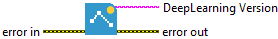

<h1>Version</h1>

<h2>Description</h2>

Gets the Deep Learning library version.

<h3>Output parameters</h3>

<table>
  <tbody>
    <tr>
      <td width="64" valign="top"></td>
      <td valign="top"><strong>DeepLearning Version : <em>string, </em></strong>representing the current version of the Deep Learning library.</td>
    </tr>
  </tbody>
</table>

<h2>Example</h2>

All these exemples are snippets PNG, you can drop these Snippet onto the block diagram and get the depicted code added to your VI (Do not forget to install Deep Learning library to run it).

