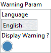

<h1>Get warning parameters</h1>

<h2>Description</h2>

Gets the parameters of warnings. If “Display Warning ?” is set to “True” then the warning messages are displayed.

<h3>Input parameters</h3>

<table>
  <tbody>
    <tr>
      <td width="64" valign="top"></td>
      <td valign="top"><strong>Model in : </strong>model architecture.</td>
    </tr>
  </tbody>
</table>

<h3>Output parameters</h3>

<table>
  <tbody>
    <tr>
      <td width="64" valign="top"></td>
      <td valign="top"><strong>Model out : </strong>model architecture.</td>
    </tr>
  </tbody>
</table>

<table>
  <tbody>
    <tr>
      <td valign="top" width="70%"><table>
  <tbody>
    <tr>
      <td width="64" valign="top"></td>
      <td valign="top"><strong>Warning Param :</strong> <em><strong>cluster</strong></em></td>
    </tr>
    <tr>
      <td></td>
      <td valign="top"><table>
  <tbody>
    <tr>
      <td width="64" valign="top"></td>
      <td valign="top"><strong>Language : <em>enum</em>,</strong> warning language.</td>
    </tr>
    <tr>
      <td width="64" valign="top"></td>
      <td valign="top"><strong>Display Warning ? : <em>boolean</em>,</strong> status of the warning display.</td>
    </tr>
  </tbody>
</table></td>
    </tr>
  </tbody>
</table></td>
      <td valign="top" width="30%">

</td>
    </tr>
  </tbody>
</table>

<h2>Example</h2>

All these exemples are snippets PNG, you can drop these Snippet onto the block diagram and get the depicted code added to your VI (Do not forget to install Deep Learning library to run it).

<h3>Using the “Get Warning Param” function</h3>

1 – Set Function

The “Set Warning Param” function is used to define the language of the warnings and if they are displayed.

2 – Define Graph

We define the graph with one input and Dense layers. We also add an input via the “in/out param” input of the Dense layer. Since here two inputs are defined a warning will be issued.

3 – Get Function

We use the “Get Warning Param” function to get the settings made.

