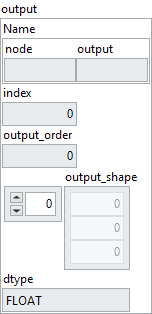
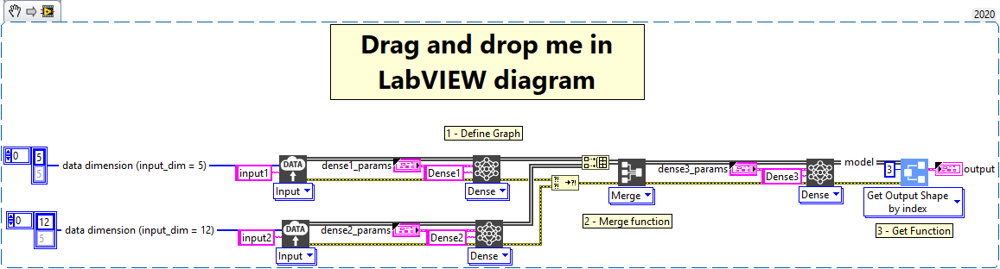

<h1>Get output shape by index</h1>

<h2>Description</h2>

Gets the output size of the layer selected by the index given as input.

<h3>Input parameters</h3>

<table>
  <tbody>
    <tr>
      <td width="64" valign="top"></td>
      <td valign="top"><strong>Model in : </strong>model architecture.</td>
    </tr>
    <tr>
      <td width="64" valign="top"></td>
      <td valign="top"><strong>index : <em>integer</em>, </strong>layer index.</td>
    </tr>
  </tbody>
</table>

<h3>Output parameters</h3>

<table>
  <tbody>
    <tr>
      <td width="64" valign="top"></td>
      <td valign="top"><strong>Model out : </strong>model architecture.</td>
    </tr>
  </tbody>
</table>

<table>
  <tbody>
    <tr>
      <td valign="top" width="70%"><table>
  <tbody>
    <tr>
      <td width="64" valign="top"></td>
      <td valign="top"><strong>output : <em>cluster,</em></strong></td>
    </tr>
    <tr>
      <td></td>
      <td valign="top"><table>
  <tbody>
    <tr>
      <td width="64" valign="top"></td>
      <td valign="top"><strong>Name : <em>cluster,</em></strong></td>
    </tr>
    <tr>
      <td></td>
      <td valign="top"><table>
  <tbody>
    <tr>
      <td width="64" valign="top"></td>
      <td valign="top"><strong>node : <em>string</em>,</strong> name of the ONNX node producing the output (e.g., <code>Dense_342_output</code>).</td>
    </tr>
    <tr>
      <td width="64" valign="top"></td>
      <td valign="top"><strong>output : <em>string</em>,</strong> identifier of the output tensor from this node.</td>
    </tr>
  </tbody>
</table></td>
    </tr>
    <tr>
      <td width="64" valign="top"></td>
      <td valign="top"><strong>index : <em>integer</em>,</strong> index of the node within the ONNX graph, used to perform <code>get</code> or <code>set</code> operations on a specific node.</td>
    </tr>
    <tr>
      <td width="64" valign="top"></td>
      <td valign="top"><strong>output_order : <em>integer</em>,</strong> index of the output (useful to retrieve the data after execution if there are multiple outputs).</td>
    </tr>
    <tr>
      <td width="64" valign="top"></td>
      <td valign="top"><strong>output_shape : <em>array</em>,</strong> expected shape of the output tensor. This shape is only valid for models using explicit <code>Layers</code>, and the first dimension always corresponds to the batch size (even if shown as 1 here).</td>
    </tr>
    <tr>
      <td width="64" valign="top"></td>
      <td valign="top"><strong>dtype : <em>enum, </em></strong>data type of the output tensor (e.g., <code>FLOAT</code> for floating-point tensors).</td>
    </tr>
  </tbody>
</table></td>
    </tr>
  </tbody>
</table></td>
      <td valign="top" width="30%">

</td>
    </tr>
  </tbody>
</table>

<h2>Example</h2>

All these exemples are snippets PNG, you can drop these Snippet onto the block diagram and get the depicted code added to your VI (Do not forget to install Deep Learning library to run it).

<h3>Using the “Get Output Shape by index” function</h3>

1 – Define Graph

We define two graphs with an input of different size and a Dense layer. We merge the two graphs to have only one and we add a last Dense to the graph. Each Dense layer is parameterized differently.

2 – Merge Function

We use the “Merge” function to merge the two graphs.

3 – Get Function

We use the “Get Output Shape by index” function to get output size of layer at index 3.

