<h1>Get & Set resume</h1>

<table>
  <tbody>
    <tr>
      <td valign="top" width="50%">

</td>
      <td valign="top" width="50%">

</td>
    </tr>
  </tbody>
</table>

<h2>GET</h2>

In this section you’ll find a list of all get functionalities available.

|  | **ICONS** | **RESUME** |
| --- | --- | --- |
| [Get all index/name](../get-deep-learning/label/all/README.md) | 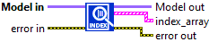 | Gets the index and name of all layers contained in the model. |
| [Get name by index](../get-deep-learning/label/individual-by-index/README.md) | 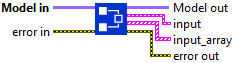 | Gets the name of the layer selected by the index given as input. |
| [Get index by name](../get-deep-learning/label/individual-by-name/README.md) |  | Gets the index of the layer selected by the name given as input. |
| [Get all “lda_coeff”](../get-deep-learning/layer-get-dl/lda_coeff/get-all-lda-coeff/README.md) |  | Gets the loss derivative attenuation coefficient of all layers contained in the model. |
| [Get “lda_coeff” by index](../get-deep-learning/layer-get-dl/lda_coeff/get-lda-coeff-by-index/README.md) | 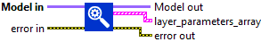 | Gets the loss derivative attenuation coefficient of layer selected by the index given as input. |
| [Get “lda_coeff” by name](../get-deep-learning/layer-get-dl/lda_coeff/get-lda-coeff-by-name/README.md) | 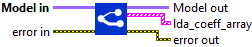 | Gets the loss derivative attenuation coefficient of layer selected by the name given as input. |
| [Get all parameters](../get-deep-learning/layer-get-dl/parameters/get-all-layer-params/README.md) | 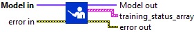 | Gets for every layer the parameters cluster. |
| [Get parameters by index](../get-deep-learning/layer-get-dl/parameters/get-layer-params-by-index/README.md) | 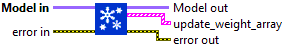 | Gets the parameter of the layer selected by the index given as input. |
| [Get parameters by name](../get-deep-learning/layer-get-dl/parameters/get-layer-params-by-name/README.md) | 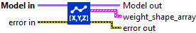 | Gets the parameter of the layer selected by the name given as input. |
| [Get all training status](../get-deep-learning/layer-get-dl/training-status/get-all-train-status/README.md) | 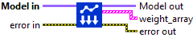 | Gets for all layers contained in the model the state of the boolean “training_status”. |
| [Get training status by index](../get-deep-learning/layer-get-dl/training-status/get-train-status-by-index/README.md) | 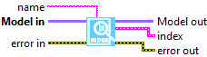 | Gets the boolean “training_status” of layer selected by index given as input. |
| [Get training status by name](../get-deep-learning/layer-get-dl/training-status/get-train-status-by-name/README.md) | 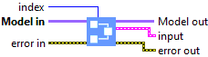 | Gets the boolean “training_status” of layer selected by name given as input. |
| [Get GPU platform](../get-deep-learning/model/gpu/README.md) | 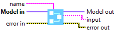 | Check if your computer is GPU ready. First check if CUDA is installed, if yes display device informations according to deviceID and check if CuDNN is also installed. If both are installed, it’s GPU ready. |
| [Get Version](../../graph-function/toolkit-version/README.md) | 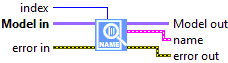 | Gets the Deep Learning library version. |
| [Get model name](../get-deep-learning/model/name-3/README.md) | 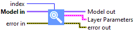 | Gets the name of the model. |
| [Get warning parameters](../get-deep-learning/model/warning-parameters/README.md) |  | Gets the parameters of warnings. |
| [Get all input layers shape](../get-deep-learning/shape/all-inputs-layers/README.md) | 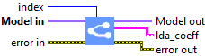 | Gets the input form of the model. |
| [Get all output layers shape](../get-deep-learning/shape/all-outputs-layers/README.md) | 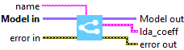 | Gets the output form of the model. |
| [Get all input shape](../get-deep-learning/shape/layer-shape-get/all-inputs/README.md) | 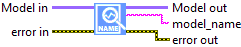 | Gets the input size of each layer contained in the model. |
| [Get input shape by index](../get-deep-learning/shape/layer-shape-get/input-by-index/README.md) | 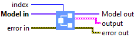 | Gets the input size of the layer selected by the index given as input. |
| [Get input shape by name](../get-deep-learning/shape/layer-shape-get/input-by-name/README.md) | 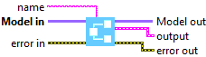 | Gets the input size of the layer selected by the name given as input. |
| [Get all output shape](../get-deep-learning/shape/layer-shape-get/all-outputs/README.md) | 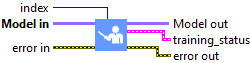 | Gets the output size of each layer contained in the model. |
| [Get output shape by index](../get-deep-learning/shape/layer-shape-get/output-by-index/README.md) | 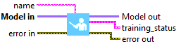 | Gets the output size of the layer selected by the index given as input. |
| [Get output shape by name](../get-deep-learning/shape/layer-shape-get/output-by-name/README.md) | 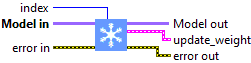 | Gets the output size of the layer selected by the name given as input. |
| [Get all weights](../get-deep-learning/weight-architecture-get/read-weight-get/get-all-weights/README.md) | 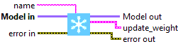 | Gets the weights of all layers contained in the model. |
| [Get all weights shape](../get-deep-learning/weight-architecture-get/weight-shape-get/get-all-weights-shape/README.md) | 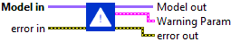 | Gets the form of the weights of every layer contained in the model. |
| [Get weights shape by index](../get-deep-learning/weight-architecture-get/weight-shape-get/get-weights-shape-by-index/README.md) | 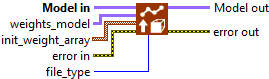 | Gets the shape of the weights of the layer selected by the index given as input. |
| [Get weights shape by name](../get-deep-learning/weight-architecture-get/weight-shape-get/get-weights-shape-by-name/README.md) |  | Gets the shape of the weights of the layer selected by the name given as input. |
| [Get all update weights](../get-deep-learning/weight-architecture-get/update-weight-get/get-all-update-weights/README.md) | 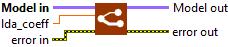 | Gets the “update_weight?” parameter of each layer in the model. |
| [Get update weights by index](../get-deep-learning/weight-architecture-get/update-weight-get/get-update-weights-by-index/README.md) | 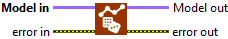 | Gets the “update_weight?” parameter of the layer selected by the index given as input. |
| [Get update weights by name](../get-deep-learning/weight-architecture-get/update-weight-get/get-update-weights-by-name/README.md) | 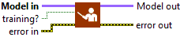 | Gets the “update_weight?” parameter of the layer selected by the name given as input. |

<h2>SET</h2>

In this section you’ll find a list of all set functionalities available.

|  | **ICONS** | **RESUME** |
| --- | --- | --- |
| [Set all “lda_coeff”](../set-deep-learning/layer-set-dl/lda-coeff-set-dl/set-all-lda-coeff/README.md) | 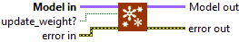 | Sets the loss derivative attenuation coefficient of all layers contained in the model. |
| [Set “lda_coeff” by index](../set-deep-learning/layer-set-dl/lda-coeff-set-dl/set-lda-coeff-by-index/README.md) | 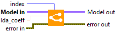 | Sets the loss derivative attenuation coefficient of layer selected by the index given as input. |
| [Set “lda_coeff” by name](../set-deep-learning/layer-set-dl/lda-coeff-set-dl/set-lda-coeff-by-name/README.md) | 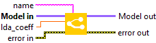 | Sets the loss derivative attenuation coefficient of layer selected by the name given as input. |
| [Set all training status](../set-deep-learning/layer-set-dl/training-status-set-dl/set-all-train-status/README.md) |  | Sets for all layers contained in the model the state of the boolean “training?”. |
| [Set training status by index](../set-deep-learning/layer-set-dl/training-status-set-dl/set-train-status-by-index/README.md) | 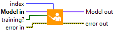 | Sets the boolean “training?” of layer selected by index given as input. |
| [Set training status by name](../set-deep-learning/layer-set-dl/training-status-set-dl/set-train-status-by-name/README.md) | 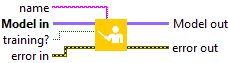 | Sets the boolean “training?” of layer selected by name given as input. |
| [Set all update weights](../set-deep-learning/weight-set-dl/update-set-dl/set-all-update-weights/README.md) | 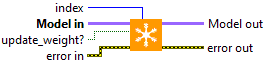 | Sets the “update_weight?” parameter of each layer in the model. |
| [Set update weights by index](../set-deep-learning/weight-set-dl/update-set-dl/set-update-weights-by-index/README.md) | 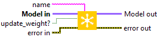 | Sets the “update_weight?” parameter of the layer selected by the index given as input. |
| [Set update weights by name](../set-deep-learning/weight-set-dl/update-set-dl/set-update-weights-by-name/README.md) | 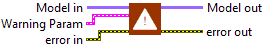 | Sets the “update_weight?” parameter of the layer selected by the name given as input. |
| [Load all weights by index](../set-deep-learning/weight-set-dl/write/all-index-array/README.md) | 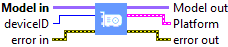 | Load weights in the model. |
| [Load all weights by name](../set-deep-learning/weight-set-dl/write/all-name-array/README.md) |  | Load weights in the model. |
| [Load all weights model](../set-deep-learning/weight-set-dl/write/all-model/README.md) | 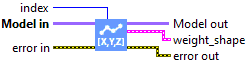 | Load the weights of a model. |
| [Set all random weights](../set-deep-learning/weight-set-dl/write/all-random/README.md) | 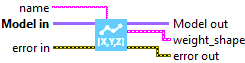 | Creates random weights for all layers in the model. |
| [Set model name](../set-deep-learning/model-get-dl/set-model-name/README.md) |  | Sets the name of the model. |
| [Warning Parameters](../set-deep-learning/model-get-dl/set-warning-parameters/README.md) |  | Sets the parameters of warning. |
