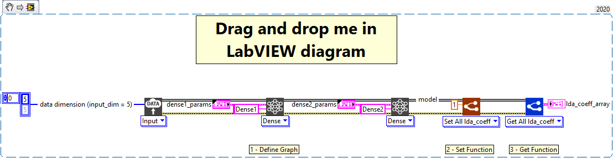

<h1>Set All “lda_coeff”</h1>

<h2>Description</h2>

Sets the loss derivative attenuation coefficient of all layers contained in the model.

<h3>Input parameters</h3>

<table>
  <tbody>
    <tr>
      <td width="64" valign="top"></td>
      <td valign="top"><strong>Model in : </strong>model architecture.</td>
    </tr>
    <tr>
      <td width="64" valign="top"></td>
      <td valign="top"><strong>lda_coeff : <em>float, </em></strong>loss derivative attenuation coefficient value.</td>
    </tr>
  </tbody>
</table>

<h3>Output parameters</h3>

<table>
  <tbody>
    <tr>
      <td width="64" valign="top"></td>
      <td valign="top"><strong>Model out : </strong>model architecture.</td>
    </tr>
  </tbody>
</table>

<h2>Example</h2>

All these exemples are snippets PNG, you can drop these Snippet onto the block diagram and get the depicted code added to your VI (Do not forget to install Deep Learning library to run it).

<h3>Using the “Set All lda_coeff” function</h3>

1 – Define Graph

We define the graph with one input and two Dense layers named Dense1 and Dense2. We set the Dense1 layer with a “lda_coeff” equal to 2 and the Dense2 layer with a “lda_coeff” equal to 5.

2 – Set Function

We use the function “Set All lda_coeff” to set the loss derivative attenuation of all layers of the model with the value 1.

3 – Get Function

We use the “Get All lda_coeff” function to get the value of this parameter for all layers in the model.

