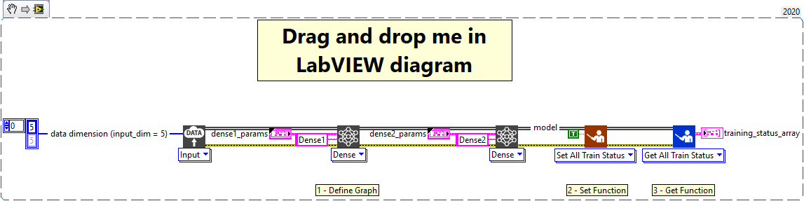

<h1>Set all training status</h1>

<h2>Description</h2>

Sets for all layers contained in the model the state of the boolean “training?”. If the boolean is “True”, then a layer backward is performed.

<h3>Input parameters</h3>

<table>
  <tbody>
    <tr>
      <td width="64" valign="top"></td>
      <td valign="top"><strong>Model in : </strong>model architecture.</td>
    </tr>
    <tr>
      <td width="64" valign="top"></td>
      <td valign="top"><strong>training? : <em>boolean</em>,</strong> performs the backward of the layer if true.</td>
    </tr>
  </tbody>
</table>

<h3>Output parameters</h3>

<table>
  <tbody>
    <tr>
      <td width="64" valign="top"></td>
      <td valign="top"><strong>Model out : </strong>model architecture.</td>
    </tr>
  </tbody>
</table>

<h2>Example</h2>

All these exemples are snippets PNG, you can drop these Snippet onto the block diagram and get the depicted code added to your VI (Do not forget to install Deep Learning library to run it).

<h3>Using the “Set All Train Status” function</h3>

1 – Define Graph

We define the graph with one input and two Dense layers named Dense1 and Dense2 parameterized in different ways.

2 – Set Function

We use the “Set All Train Status” function to set to “True” the boolean that allows the training of a layer(training?). The value of the boolean is applied to all layers of the model.

3 – Get Function

We use the “Get All Train Status” function to get the value of the “training?” parameter for all layers of the model.

