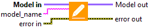
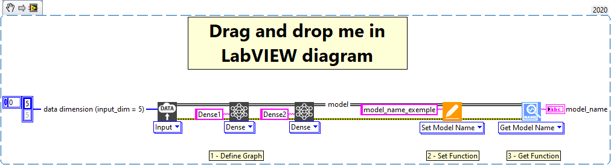

<h1>Set model name</h1>

<h2>Description</h2>

Sets the name of the model.

<h3>Input parameters</h3>

<table>
  <tbody>
    <tr>
      <td width="64" valign="top"></td>
      <td valign="top"><strong>Model in : </strong>model architecture.</td>
    </tr>
    <tr>
      <td width="64" valign="top"></td>
      <td valign="top"><strong>model_name : <em>string</em>, </strong>name of model.</td>
    </tr>
  </tbody>
</table>

<h3>Output parameters</h3>

<table>
  <tbody>
    <tr>
      <td width="64" valign="top"></td>
      <td valign="top"><strong>Model out : </strong>model architecture.</td>
    </tr>
  </tbody>
</table>

<h2>Example</h2>

All these exemples are snippets PNG, you can drop these Snippet onto the block diagram and get the depicted code added to your VI (Do not forget to install Deep Learning library to run it).

<h3>Using the “Set Model Name” function</h3>

1 – Define Graph

We define the graph with one input and two Dense layers named Dense1 and Dense2.

2 – Set Function

We use the function “Set Model Name” to give the template a name.

3 – Get Function

We use the function “Get Model Name” to get the name of modèle give avec la fonction set.

