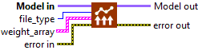
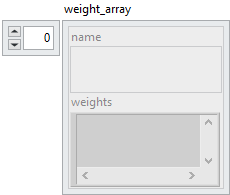
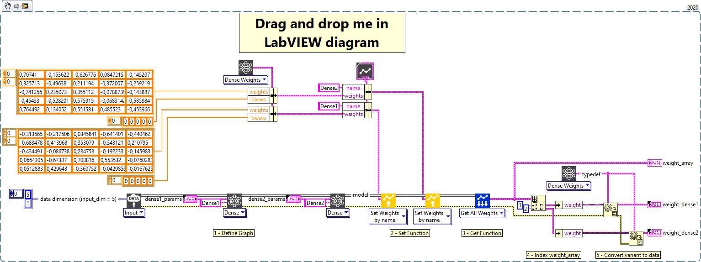

<h1>Load all weights by name</h1>

<h2>Description</h2>

Load weights in the model. The table of weights is authentic, it defines the names for which weights are loaded, the others will be initialized randomly. You can choose to display a log file in .txt or .csv format to resume the model architecture and the loading of weights.

<h3>Input parameters</h3>

<table>
  <tbody>
    <tr>
      <td width="64" valign="top"></td>
      <td valign="top"><strong>Model in : </strong>model architecture.</td>
    </tr>
    <tr>
      <td width="64" valign="top"></td>
      <td valign="top"><strong>file_type : <em>enum</em>,</strong> type of the file on which the summary is written.
<ul>
<li>
<ul>
<li><strong>None :</strong> returns the summary only in a cluster array.</li>
<li><strong>txt :</strong> returns the summary in a text file and cluster array. (default)</li>
<li><strong>csv : </strong>returns the summary in a comma-separated values (csv) file and cluster array.</li>
</ul>
</li>
</ul></td>
    </tr>
  </tbody>
</table>

<table>
  <tbody>
    <tr>
      <td valign="top" width="70%">
<strong>weight_array :</strong><em><strong>cluster</strong></em>

<table>
  <tbody>
    <tr>
      <td width="64" valign="top"></td>
      <td valign="top"><strong>name : <em>string</em>, </strong>name of layer.</td>
    </tr>
    <tr>
      <td width="64" valign="top"></td>
      <td valign="top"><strong>weights : <em>variant</em>,</strong> weight value.</td>
    </tr>
  </tbody>
</table></td>
      <td valign="top" width="30%">

</td>
    </tr>
  </tbody>
</table>

<h3>Output parameters</h3>

<table>
  <tbody>
    <tr>
      <td width="64" valign="top"></td>
      <td valign="top"><strong>Model out : </strong>model architecture.</td>
    </tr>
  </tbody>
</table>

<h2>Example</h2>

All these exemples are snippets PNG, you can drop these Snippet onto the block diagram and get the depicted code added to your VI (Do not forget to install Deep Learning library to run it).

<h3>Using the “Set Weights by name” function</h3>

1 – Define Graph

We define the graph with one input and two Dense layers named Dense1 and Dense2.

2 – Set Function

We use the “Set Weights by name” function to set weights for the layers named Dense1 and Dense2.

3 – Get Function

We use the “Get All Weights” function to get the weights of all layers that have them from the model.

4 – Index weight_array

Since the only layers that have weights are Dense1 and Dense2 we index the array returned by the get function to retrieve their weight.

5 – Convert variant to data

The get function returns the weights in a variant, so we use the “Variant To Data” function of LabVIEW to get the result in an array. For that, we use the polymorph which transmits us directly the typedef of the Dense layer.

