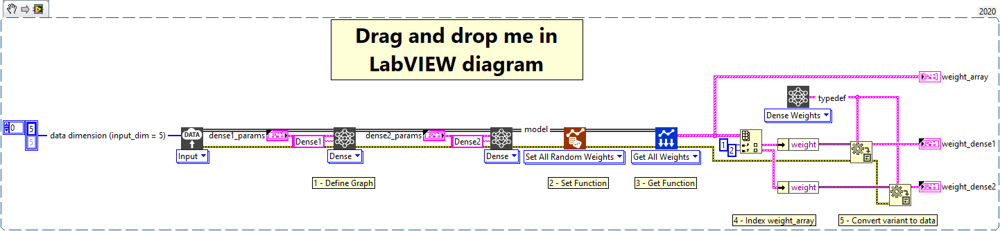

<h1>Set all random weights</h1>

<h2>Description</h2>

Creates random weights for all layers in the model.

<h3>Input parameters</h3>

<table>
  <tbody>
    <tr>
      <td width="64" valign="top"></td>
      <td valign="top"><strong>Model in : </strong>model architecture.</td>
    </tr>
  </tbody>
</table>

<h3>Output parameters</h3>

<table>
  <tbody>
    <tr>
      <td width="64" valign="top"></td>
      <td valign="top"><strong>Model out : </strong>model architecture.</td>
    </tr>
  </tbody>
</table>

<h2>Example</h2>

All these exemples are snippets PNG, you can drop these Snippet onto the block diagram and get the depicted code added to your VI (Do not forget to install Deep Learning library to run it).

<h3>Using the “Set All Random Weights” function</h3>

1 – Define Graph

We define the graph with one input and two Dense layers named Dense1 and Dense2.

2 – Set Function

We use the “Set All Random Weights” function to create random weights for all layers which have weights in the model.

3 – Get Function

We use the “Get All Weights” function to get the weights of all layers that have them from the model.

4 – Index weight_array

Since the only layers that have weights are Dense1 and Dense2 we index the array returned by the get function to retrieve their weight.

5 – Convert variant to data

The get function returns the weights in a variant, so we use the “Variant To Data” function of LabVIEW to get the result in an array. For that, we use the polymorph which transmits us directly the typedef of the Dense layer.

