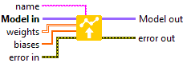
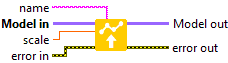
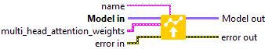
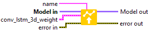
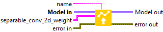
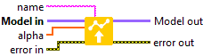
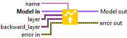
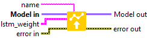
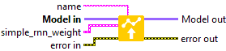

<h1>Set weights by name</h1>

In this section you will find a list for set the layer weight.

ICONS

RESUME

Dense

Defines the weights of the Dense layer selected by the name.

Embedding

Defines the weight of the Embedding layer selected by the name.

AdditiveAttention

Defines the weight of the AdditiveAttention layer selected by the name.

Attention

Defines the weight of the Attention layer selected by the name.

MultiHeadAttention

Defines the weights of the MultiHeadAttention layer selected by the name.

Conv1D

Defines the weights of the Conv1D layer selected by the name.

Conv2D

Defines the weights of the Conv2D layer selected by the name.

Conv3D

Defines the weights of the Conv3D layer selected by the name.

ConvLSTM1D

Defines the weights of the ConvLSTM1D layer selected by the name.

ConvLSTM2D

Defines the weights of the ConvLSTM2D layer selected by the name.

ConvLSTM3D

Defines the weights of the ConvLSTM3D layer selected by the name.

Conv1DTranspose

Defines the weights of the Conv1DTranspose layer selected by the name.

Conv2DTranspose

Defines the weights of the Conv2DTranspose layer selected by the name.

Conv3DTranspose

Defines the weights of the Conv3DTranspose layer selected by the name.

DepthwiseConv2D

Defines the weights of the DepthwiseConv2D layer selected by the name.

SeparableConv1D

Defines the weights of the SeparableConv1D layer selected by the name.

SeparableConv2D

Defines the weights of the SeparableConv2D layer selected by the name.

BatchNormalization

Defines the weights of the BatchNormalization layer selected by the name.

LayerNormalization

Defines the weights of the LayerNormalization layer selected by the name.

PReLU 2D

Defines the weight of the PReLU2D layer selected by the name.

PReLU 3D

Defines the weight of the PReLU3D layer selected by the name.

PReLU 4D

Defines the weight of the PReLU4D layer selected by the name.

PReLU 5D

Defines the weight of the PReLU5D layer selected by the name.

Bidirectional

Defines the weights of the Bidirectional layer selected by the name.

GRU

Defines the weights of the GRU layer selected by the name.

LSTM

Defines the weights of the LSTM layer selected by the name.

RNN (GRU)

Defines the weights of the RNN layer selected by the name.

RNN (LSTM)

Defines the weights of the RNN layer selected by the name.

RNN (SimpleRNN)

Defines the weights of the RNN layer selected by the name.

SimpleRNN

Defines the weights of the SimpleRNN layer selected by the name.

