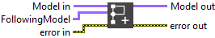

<h1>Add Graph</h1>

<h2>Description</h2>

Adds the “FollowingModel” to the model. 
If the model has several outputs and you want to link a particular output with the FollowingModel, you must use the “OneToMult” VI. This VI separates the Model into an array of Models representing the different branches/outputs. This function does not handle the case where FollowingModel has several inputs.

<h3>Input parameters</h3>

<table>
  <tbody>
    <tr>
      <td width="64" valign="top"></td>
      <td valign="top"><strong>Model in : </strong>model architecture.</td>
    </tr>
    <tr>
      <td width="64" valign="top"></td>
      <td valign="top"><strong>FollowingModel : </strong>model architecture.</td>
    </tr>
  </tbody>
</table>

<h3>Output parameters</h3>

<table>
  <tbody>
    <tr>
      <td width="64" valign="top"></td>
      <td valign="top"><strong>Model out : </strong>model architecture.</td>
    </tr>
  </tbody>
</table>

<h2>Example</h2>

All these exemples are snippets PNG, you can drop these Snippet onto the block diagram and get the depicted code added to your VI (Do not forget to install Deep Learning library to run it).

