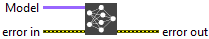

<h1>Netron Summary</h1>

<h2>Description</h2>

Open Netron visualization of the given model.

<h3>Input parameters</h3>

<table>
  <tbody>
    <tr>
      <td width="64" valign="top"></td>
      <td valign="top"><strong>Model : </strong>reference to the model. This is an instance of the <code>Model</code> class of the Deep Learning toolkit.</td>
    </tr>
  </tbody>
</table>

<h2>Example</h2>

All these exemples are snippets PNG, you can drop these Snippet onto the block diagram and get the depicted code added to your VI (Do not forget to install Deep Learning library to run it).

