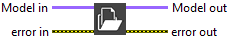
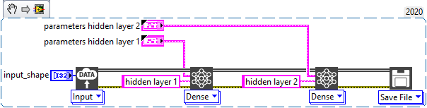

<h1>Open Log Folder</h1>

<h2>Description</h2>

When an error occurs during the execution of the model it is recorded in a temporary file. The “Open Log Folder” function allows you to open the folder that contains these temporary files.

<h3>Input parameters</h3>

<table>
  <tbody>
    <tr>
      <td width="64" valign="top"></td>
      <td valign="top"><strong>Model in : </strong>model architecture.</td>
    </tr>
  </tbody>
</table>

<h3>Output parameters</h3>

<table>
  <tbody>
    <tr>
      <td width="64" valign="top"></td>
      <td valign="top"><strong>Model out : </strong>model architecture.</td>
    </tr>
  </tbody>
</table>

<h2>Example</h2>

All these exemples are snippets PNG, you can drop these Snippet onto the block diagram and get the depicted code added to your VI (Do not forget to install Deep Learning library to run it).

<h3>Opens the folder that contains the errors related to the model</h3>

1 – Define Graph

We define the graph with one input, one dense layer and one convolution layer.

2 – Clear Errors

We cause a dimensional error between the dense and convolution layer. The output of the dense layer is incompatible with the input of the convolution layer. Indeed, in output of the dense layer we have data in 2D and in input of the convolution data in 3D. 
This error is temporarily recorded in a log file. 
We use the “Clear Errors” function of LabVIEW to execute our “Open Log Folder.

3 – Log Folder

We use the “Open Log Folder” function to open the folder that contains the error files related to the execution of the model.

