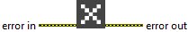

<h1>Reset GPU Device</h1>

<h2>Description</h2>

Close all references.

<h2>Example</h2>

All these exemples are snippets PNG, you can drop these Snippet onto the block diagram and get the depicted code added to your VI (Do not forget to install Deep Learning library to run it).

