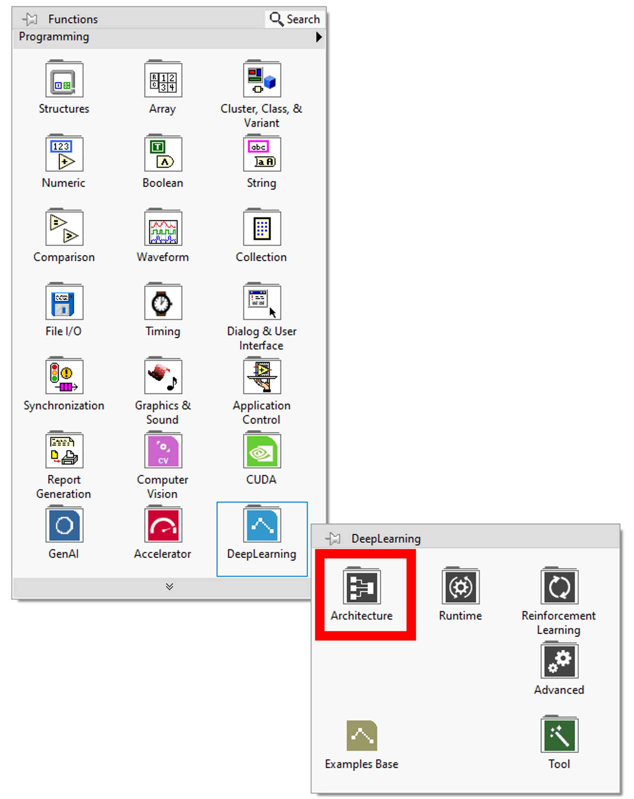
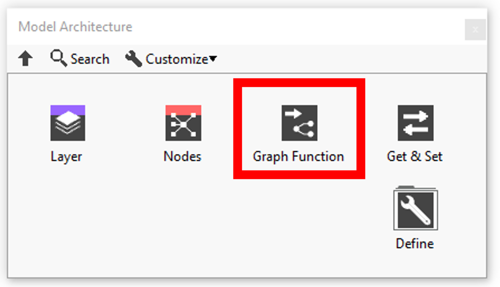
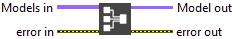
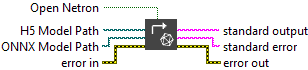
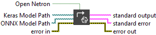
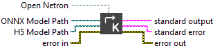
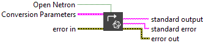
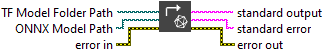
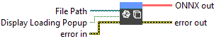
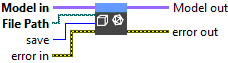

<h1>Graph function resume</h1>

<table>
  <tbody>
    <tr>
      <td valign="top" width="50%">

</td>
      <td valign="top" width="50%">

</td>
    </tr>
  </tbody>
</table>

In this section you’ll find a list of all model fonctionalities.

|  | **ICONS** | **RESUME** |
| --- | --- | --- |
| [Open Log Folder](../open-log-folder/README.md) |  | When an error occurs during the execution of the model it is recorded in a temporary file. |
| [Reset GPU Device](../reset-gpu-device/README.md) |  | Close all references. |
| [Toolkit Version](../toolkit-version/README.md) |  | Gets the Deep Learning library version. |
| [Summary](../summary/README.md) |  | Returns the summary of the model. |
| [Netron Summary](../netron-summary/README.md) |  | Open Netron visualization of the given model. |
| [Add Graph](../graph-deep-learning/add-graph/README.md) |  | Adds the “FollowingModel” to the model. |
| [Merge](../graph-deep-learning/merge/README.md) |  | Merge multiple branches of graphs to create a single graph and avoid duplication. |
| [One To Mult](../graph-deep-learning/one-to-mult/README.md) |  | Allows you to retrieve the different merged graphs. |
| [Load ONNX File](../file-graph-function-dl/load-onnx-file/README.md) |  | Loads an ONNX model from file and creates the corresponding execution graph. |
| [Save ONNX File](https://haibal.com/documentation/save-onnx-file/) |  | This VI exports a model to a .onnx file. |
| [Convert H5 To ONNX](https://haibal.com/documentation/convert-h5-to-onnx/) |  | This VI uses the keras2onnx Python utility to perform the conversion. |
| [Convert Keras To ONNX](https://haibal.com/documentation/convert-keras-to-onnx/) |  | This VI transforms a .keras model file (in the new Keras v3 format) into a standard .onnx file using a Python conversion tool. |
| [Convert ONNX To H5](https://haibal.com/documentation/convert-onnx-to-h5/) |  | This VI transforms a .onnx model into the HDF5 format (.h5) commonly used in TensorFlow/Keras workflows. |
| [Convert ONNX To Keras](https://haibal.com/documentation/convert-onnx-to-keras/) |  | This VI transforms a .onnx model file into the native .keras format introduced in Keras 3.x. |
| [Convert ONNX To Pytorch](https://haibal.com/documentation/convert-onnx-to-pytorch/) |  | This VI exports an ONNX model into the PyTorch .pt format using a Python-based toolchain. |
| [Convert To TF SavedModel](https://haibal.com/documentation/convert-onnx-to-tf-saved-model/) |  | This VI transforms a .onnx file into a TensorFlow model using the standard SavedModel directory structure. |
| [Convert Pytorch To ONNX](https://haibal.com/documentation/convert-pytorch-to-onnx/) |  | This VI uses a Python-based export pipeline to convert a PyTorch model saved as .pt (TorchScript) into a .onnx file. |
| [Convert TF SavedModel To ONNX](https://haibal.com/documentation/convert-tf-saved-model-to-onnx/) |  | This VI converts a TensorFlow model saved in the SavedModel directory format into a .onnx file, using the tf2onnx converter. |
