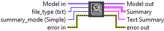
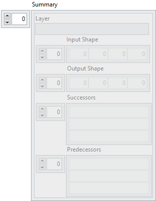

<h1>Summary</h1>

<h2>Description</h2>

Returns the summary of the model. Possibility to retrieve a cluster or a text with the information and save it in a file. This information consists of the successors, predecessors, the output shape, the layer and its name.

<h3>Input parameters</h3>

<table>
  <tbody>
    <tr>
      <td width="64" valign="top"></td>
      <td valign="top"><strong>Model in : </strong>model architecture.</td>
    </tr>
    <tr>
      <td width="64" valign="top"></td>
      <td valign="top"><strong>file_type : <em>enum</em>,</strong> type of the file on which the summary is written.
<ul>
<li>
<ul>
<li><strong>None :</strong> returns the summary only in a cluster array.</li>
<li><strong>txt :</strong> returns the summary in a text file and cluster array. (default)</li>
<li><strong>csv : </strong>returns the summary in a comma-separated values (csv) file and cluster array.</li>
</ul>
</li>
</ul></td>
    </tr>
    <tr>
      <td width="64" valign="top"></td>
      <td valign="top"><strong>summary_mode : <em>enum</em>, </strong>display mode of the summary.
<ul>
<li>
<ul>
<li><strong>Simple :</strong> displays simple information (index, layer, input shape, output shape, predecessors, successors, parameters).</li>
<li><strong>Advanced :</strong> displays advanced information (index, layer, input shape, output shape, predecessors, successors, parameters, data format, init weight, weights shape).</li>
<li><strong>Complete :</strong> displays complete information (index, layer, input shape, output shape, predecessors, successors, parameters, data format, init weight, weights shape, boolean “training?”, boolean “update?”, boolean “store?”, loss derivative attenuation).</li>
</ul>
</li>
</ul></td>
    </tr>
  </tbody>
</table>

<h3>Output parameters</h3>

<table>
  <tbody>
    <tr>
      <td width="64" valign="top"></td>
      <td valign="top"><strong>Model out : </strong>model architecture.</td>
    </tr>
  </tbody>
</table>

<table>
  <tbody>
    <tr>
      <td valign="top" width="70%">
<strong>Summary :</strong><em><strong>array</strong></em>

<table>
  <tbody>
    <tr>
      <td width="64" valign="top"></td>
      <td valign="top"><strong>Layer : <em>string</em>, </strong>type and name of layer.</td>
    </tr>
    <tr>
      <td width="64" valign="top"></td>
      <td valign="top"><strong>Input Shape : <em>integer array</em>,</strong> input size of the layer.</td>
    </tr>
    <tr>
      <td width="64" valign="top"></td>
      <td valign="top"><strong>Output Shape : <em>integer array</em>,</strong> output size of the layer.</td>
    </tr>
    <tr>
      <td width="64" valign="top"></td>
      <td valign="top"><strong>Successors :</strong> <em><strong>string array, </strong></em>the layer(s) connected to the output of the current layer.</td>
    </tr>
    <tr>
      <td width="64" valign="top"></td>
      <td valign="top"><strong>Predecessors :</strong> <em><strong>string array, </strong></em>the layer(s) connected to the input of the current layer.</td>
    </tr>
    <tr>
      <td width="64" valign="top"></td>
      <td valign="top"><strong>Text Summary : <em>string,</em></strong></td>
    </tr>
  </tbody>
</table></td>
      <td valign="top" width="30%">

</td>
    </tr>
  </tbody>
</table>

<h2>Example</h2>

All these exemples are snippets PNG, you can drop these Snippet onto the block diagram and get the depicted code added to your VI (Do not forget to install HAIBAL library to run it).

<h3>Simple summary of the model in a text file</h3>

1 – Define Graph

We define the graph with one input and two Dense layers named Dense1 and Dense2.

2 – Summary

We use the “Summary” function to have the model information in a text file.

