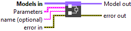
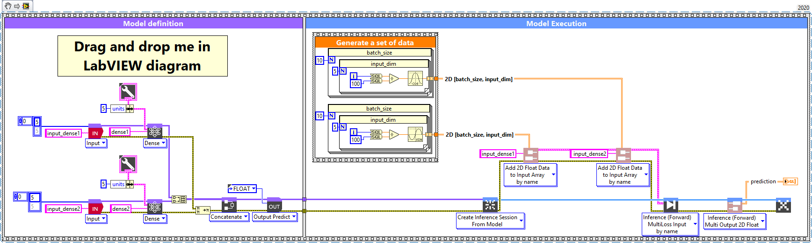
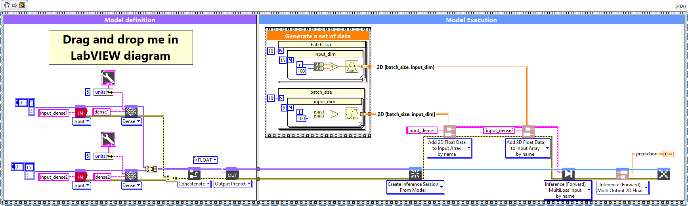

<h1>Concatenate</h1>

<h2>Description</h2>

Setup and add the concatenate layer into the model during the definition graph step. Type : <em><strong>polymorphic</strong><strong>.</strong></em>

<h3>Input parameters</h3>

<table>
  <tbody>
    <tr>
      <td width="64" valign="top"></td>
      <td valign="top"><strong>Models in :<em> array</em></strong>, model architecture.</td>
    </tr>
  </tbody>
</table>

<table>
  <tbody>
    <tr>
      <td valign="top" width="75%"><table>
  <tbody>
    <tr>
      <td width="64" valign="top"></td>
      <td valign="top"><strong>Parameters :</strong> layer parameters.</td>
    </tr>
    <tr>
      <td></td>
      <td valign="top"><table>
  <tbody>
    <tr>
      <td width="64" valign="top"></td>
      <td valign="top"><strong>axis : <em>integer</em></strong>, axis along which to concatenate.</td>
    </tr>
    <tr>
      <td width="64" valign="top"></td>
      <td valign="top">Default value “-1”.</td>
    </tr>
    <tr>
      <td width="64" valign="top"></td>
      <td valign="top"><strong>training? :</strong> <em><strong>boolean</strong></em>, whether the layer is in training mode (can store data for backward).</td>
    </tr>
    <tr>
      <td width="64" valign="top"></td>
      <td valign="top">Default value “True”.</td>
    </tr>
    <tr>
      <td width="64" valign="top"></td>
      <td valign="top"><strong>lda coeff :</strong> <em><strong>float</strong></em>, defines the coefficient by which the loss derivative will be multiplied before being sent to the previous layer (since during the backward run we go backwards).</td>
    </tr>
    <tr>
      <td width="64" valign="top"></td>
      <td valign="top">Default value “1”.</td>
    </tr>
  </tbody>
</table></td>
    </tr>
  </tbody>
</table></td>
      <td valign="top" width="25%">

</td>
    </tr>
  </tbody>
</table>

<table>
  <tbody>
    <tr>
      <td width="64" valign="top"></td>
      <td valign="top"><strong>name (optional) :</strong> <em><strong>string,</strong></em> name of the layer.</td>
    </tr>
  </tbody>
</table>

<h3>Output parameters</h3>

<table>
  <tbody>
    <tr>
      <td width="64" valign="top"></td>
      <td valign="top"><strong>Model out : </strong>model architecture.</td>
    </tr>
  </tbody>
</table>

<h2>Dimension</h2>

<h3>Input shape</h3>

All layer used for concatenation must have the same shape, except along the concatenation axis. Refer to each layer’s output shape and ensure compatibility on all axes except the concatenation one.

<h3>Output shape</h3>

The output shape is identical to the input shape, except on the concatenation axis, where the sizes are summed.

<h2>Example</h2>

All these exemples are snippets PNG, you can drop these Snippet onto the block diagram and get the depicted code added to your VI (Do not forget to install Deep Learning library to run it).

<h3>Concatenate layer with two identical input layer shape</h3>

1 – Generate a set of data

We generate an array of data of type single and shape [batch_size = 10, input_dim = 5] (same input shape).

2 – Define graph

We first define two input layers named input_dense1 and input_dense2. This layers is setup as an input array shaped [input_dim = 5]. In order to have same output shape for added dense layers we define for both of these the same “units” parameter (units = 5) (refer <a href="../dense-add-to-graph/README.md">Dense</a> layer add to graph documentation for more details). Then we build an array of the two graphs generated by the dense layers and inject it into the input of the Concatenate layer.

3 – Summarize graph

Returns the summary of the model in file text.

3 – Run graph

We call the forward method and retrieve the result with the “Prediction 2D” method. This method returns two variables, the first one is the layer information (cluster composed of the layer name, the graph index and the shape of the output layer) and the second one is the prediction with a shape of [batch_size, units] (Dense output shape).

<h3>Concatenate layer with two different input layer shape</h3>

1 – Generate a set of data

We generate two array of data of type single and shape1 [batch_size = 10, input_dim = 5] and shape2 [batch_size = 10, input_dim = 15] (different input shape).

2 – Define graph

We first define two input layers named input_dense1 and input_dense2. This layers is setup as an input array shaped [input_dim = 5] and [input_dim = 15]. In order to have same output shape for added dense layers we define for both of these the same “units” parameter (units = 5) (refer <a href="../dense-add-to-graph/README.md">Dense</a> layer add to graph documentation for more details). Then we build an array of the two graphs generated by the dense layers and inject it into the input of the Concatenate layer.

3 – Summarize graph

Returns the summary of the model in file text.

4 – Run graph

We call the forward method and retrieve the result with the “Prediction 2D” method. This method returns two variables, the first one is the layer information (cluster composed of the layer name, the graph index and the shape of the output layer) and the second one is the prediction with a shape of [batch_size, units] (Dense output shape).

