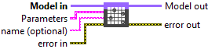
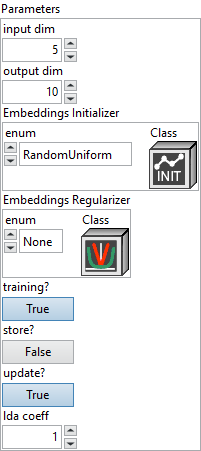
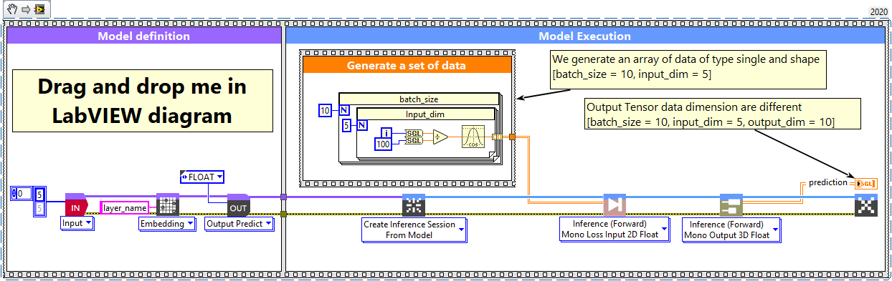
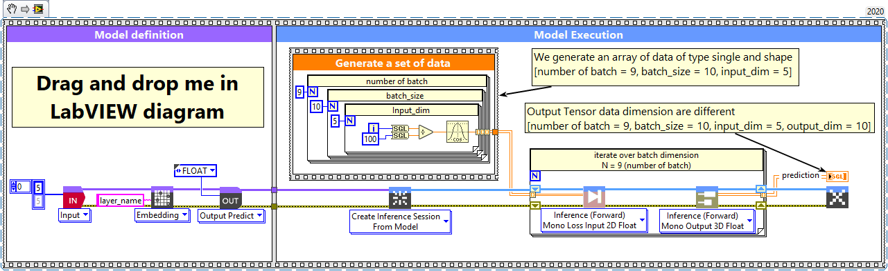

<h1>Embedding</h1>

<h2>Description</h2>

Setup and add the embedding layer into the model during the definition graph step. Type : <em><strong>polymorphic</strong><strong>.</strong></em>

<h3>Input parameters</h3>

<table>
  <tbody>
    <tr>
      <td width="64" valign="top"></td>
      <td valign="top"><strong>Model in : </strong>model architecture.</td>
    </tr>
  </tbody>
</table>

<table>
  <tbody>
    <tr>
      <td valign="top" width="75%"><table>
  <tbody>
    <tr>
      <td width="64" valign="top"></td>
      <td valign="top"><strong>Parameters : </strong>layer parameters.</td>
    </tr>
    <tr>
      <td></td>
      <td valign="top"><table>
  <tbody>
    <tr>
      <td width="64" valign="top"></td>
      <td valign="top"><strong>input dim : <em>integer</em></strong>, size of the vocabulary (maximum integer index + 1).</td>
    </tr>
    <tr>
      <td width="64" valign="top"></td>
      <td valign="top"><strong>output dim : <em>integer</em></strong>, dimension of the dense embedding.</td>
    </tr>
    <tr>
      <td width="64" valign="top"></td>
      <td valign="top"><strong><a href="../../../more-deep-learning/layers-parameters/initializer/README.md">Embeddings Initializer</a> </strong><strong>: </strong><strong><em>cluster, </em></strong>initializer for the <code>embeddings</code> matrix.</td>
    </tr>
    <tr>
      <td width="64" valign="top"></td>
      <td valign="top"><strong><a href="../../../more-deep-learning/layers-parameters/regularizer/README.md">Embeddings Regularizer</a> : <em>cluster, r</em></strong>egularizer function applied to the <code>embeddings</code> matrix.</td>
    </tr>
    <tr>
      <td width="64" valign="top"></td>
      <td valign="top"><strong>training? :</strong> <em><strong>boolean</strong></em>, whether the layer is in training mode (can store data for backward).</td>
    </tr>
    <tr>
      <td width="64" valign="top"></td>
      <td valign="top">Default value “True”.</td>
    </tr>
    <tr>
      <td width="64" valign="top"></td>
      <td valign="top"><strong>store? :</strong> <em><strong>boolean</strong></em>, whether the layer stores the last iteration gradient (accessible via the “get_gradients” function).</td>
    </tr>
    <tr>
      <td width="64" valign="top"></td>
      <td valign="top">Default value “False”.</td>
    </tr>
    <tr>
      <td width="64" valign="top"></td>
      <td valign="top"><strong>update? :</strong> <em><strong>boolean</strong></em>, whether the layer’s variables should be updated during backward. Equivalent to freeze the layer.</td>
    </tr>
    <tr>
      <td width="64" valign="top"></td>
      <td valign="top">Default value “True”.</td>
    </tr>
    <tr>
      <td width="64" valign="top"></td>
      <td valign="top"><strong>lda coeff :</strong> <em><strong>float</strong></em>, defines the coefficient by which the loss derivative will be multiplied before being sent to the previous layer (since during the backward run we go backwards).</td>
    </tr>
    <tr>
      <td width="64" valign="top"></td>
      <td valign="top">Default value “1”.</td>
    </tr>
  </tbody>
</table></td>
    </tr>
  </tbody>
</table></td>
      <td valign="top" width="25%">

</td>
    </tr>
  </tbody>
</table>

<table>
  <tbody>
    <tr>
      <td width="64" valign="top"></td>
      <td valign="top"><strong>name (optional) :</strong> <em><strong>string,</strong></em> name of the layer.</td>
    </tr>
  </tbody>
</table>

<h3>Output parameters</h3>

<table>
  <tbody>
    <tr>
      <td width="64" valign="top"></td>
      <td valign="top"><strong>Model out : </strong>model architecture.</td>
    </tr>
  </tbody>
</table>

<h2>Dimension</h2>

<h3>Input shape</h3>

2D tensor with shape : (batch_size, input_length).

<h3>Output shape</h3>

3D tensor with shape : (batch_size, input_length, output_dim).

<h2>Example</h2>

All these exemples are snippets PNG, you can drop these Snippet onto the block diagram and get the depicted code added to your VI (Do not forget to install Deep Learning library to run it).

<h3>Embedding layer</h3>

1 – Generate a set of data

We generate an array of data of type single and shape [batch_size = 10, input_length = 5].

2 – Define graph

First, we define the first layer of the graph which is an Input layer (explicit input layer method). This layer is setup as an input array shaped [input_length = 5].  Then we add to the graph the Embedding layer.

3 – Run graph

We call the forward method and retrieve the result with the “Prediction 3D” method. This method returns two variables, the first one is the layer information (cluster composed of the layer name, the graph index and the shape of the output layer) and the second one is the prediction with a shape of [batch_size, input_length, output_dim].

<h3>Embedding layer, batch and dimension</h3>

1 – Generate a set of data

We generate an array of data of type single and shape [number of batch = 9, batch_size = 10, input_length = 5].

2 – Define graph

First, we define the first layer of the graph which is an Input layer (explicit input layer method). This layer is setup as an input array shaped [input_length = 5].  Then we add to the graph the Embedding layer.

3 – Run graph

We call the forward method and retrieve the result with the “Prediction 3D” method. This method returns two variables, the first one is the layer information (cluster composed of the layer name, the graph index and the shape of the output layer) and the second one is the prediction with a shape of [batch_size, input_length, output_dim].

