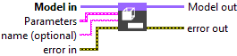
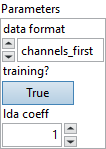
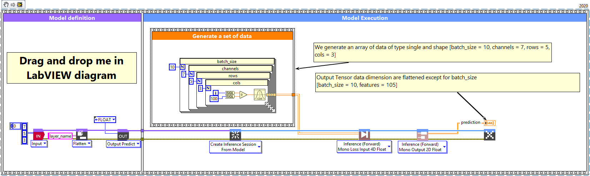
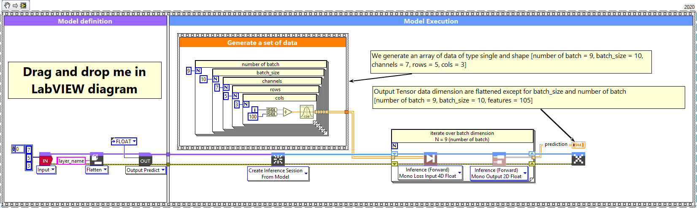

<h1>Flatten</h1>

<h2>Description</h2>

Setup and add the flatten layer into the model during the definition graph step. Type : <em><strong>polymorphic</strong><strong>.</strong></em>

<h3>Input parameters</h3>

<table>
  <tbody>
    <tr>
      <td width="64" valign="top"></td>
      <td valign="top"><strong>Model in : </strong>model architecture.</td>
    </tr>
  </tbody>
</table>

<table>
  <tbody>
    <tr>
      <td valign="top" width="75%"><table>
  <tbody>
    <tr>
      <td width="64" valign="top"></td>
      <td valign="top"><strong>Parameters :</strong> layer parameters.</td>
    </tr>
    <tr>
      <td></td>
      <td valign="top"><table>
  <tbody>
    <tr>
      <td width="64" valign="top"></td>
      <td valign="top"><strong>data format : <em>enum</em></strong>, one of <strong>channels_last</strong> or <strong>channels_first</strong> (default) . The ordering of the dimensions in the inputs. <strong>channel_last</strong> corresponds to inputs with shape <strong>(batch, steps, features)</strong> while <strong>channels_first</strong> corresponds to inputs with shape <strong>(batch, features, steps)</strong>.</td>
    </tr>
    <tr>
      <td width="64" valign="top"></td>
      <td valign="top">Default value “channels_first”.</td>
    </tr>
    <tr>
      <td width="64" valign="top"></td>
      <td valign="top"><strong>training? :</strong> <em><strong>boolean</strong></em>, whether the layer is in training mode (can store data for backward).</td>
    </tr>
    <tr>
      <td width="64" valign="top"></td>
      <td valign="top">Default value “True”.</td>
    </tr>
    <tr>
      <td width="64" valign="top"></td>
      <td valign="top"><strong>lda coeff :</strong> <em><strong>float</strong></em>, defines the coefficient by which the loss derivative will be multiplied before being sent to the previous layer (since during the backward run we go backwards).</td>
    </tr>
    <tr>
      <td width="64" valign="top"></td>
      <td valign="top">Default value “1”.</td>
    </tr>
  </tbody>
</table></td>
    </tr>
  </tbody>
</table></td>
      <td valign="top" width="25%">

</td>
    </tr>
  </tbody>
</table>

<table>
  <tbody>
    <tr>
      <td width="64" valign="top"></td>
      <td valign="top"><strong>name (optional) :</strong> <em><strong>string,</strong></em> name of the layer.</td>
    </tr>
  </tbody>
</table>

<h3>Output parameters</h3>

<table>
  <tbody>
    <tr>
      <td width="64" valign="top"></td>
      <td valign="top"><strong>Model out : </strong>model architecture.</td>
    </tr>
  </tbody>
</table>

<h2>Dimension</h2>

<h3>Input shape</h3>

2D tensor with shape :

<ul>
<li>If data_format = ‘channels_last’ : (batch_size, input_dim).</li>
<li>If data_format = ‘channels_first’ : (batch_size, input_dim).</li>
</ul>

3D tensor with shape :

<ul>
<li>If data_format = ‘channels_last’ : (batch_size, steps, features).</li>
<li>If data_format = ‘channels_first’ : (batch_size, features, steps).</li>
</ul>

4D tensor with shape :

<ul>
<li>If data_format is “channels_last” : (batch_size, rows, cols, channels).</li>
<li>If data_format is “channels_first” : (batch_size, channels, rows, cols).</li>
</ul>

5D tensor with shape :

<ul>
<li>If data_format = ‘channels_last’ : (batch_size, input_dim1, input_dim2, input_dim3, channels).</li>
<li>If data_format = ‘channels_first’ : (batch_size, channels, input_dim1, input_dim2, input_dim3).</li>
</ul>

<h3>Output shape</h3>

2D tensor with shape (with a 2D tensor as input) :

<ul>
<li>If data_format = ‘channels_last’ : (batch_size, new_input).</li>
<li>If data_format = ‘channels_first’ : (batch_size, new_input).</li>
</ul>

2D tensor with shape (with a 3D tensor as input) :

<ul>
<li>If data_format = ‘channels_last’ : (batch_size, steps * features).</li>
<li>If data_format = ‘channels_first’ : (batch_size, features * steps).</li>
</ul>

2D tensor with shape (with a 4D tensor as input) :

<ul>
<li>If data_format is “channels_last” : (batch_size, rows * cols * channels). If data_format is “channels_first” : (batch_size, channels * rows * cols).</li>
</ul>

2D tensor with shape (with a 5D tensor as input) :

<ul>
<li>If data_format = ‘channels_last’ : (batch_size, input_dim1 * input_dim2 * input_dim3 * channels).</li>
<li>If data_format = ‘channels_first’ : (batch_size, channels * input_dim1 * input_dim2 * input_dim3).</li>
</ul>

<h2>Example</h2>

All these exemples are snippets PNG, you can drop these Snippet onto the block diagram and get the depicted code added to your VI (Do not forget to install Deep Learning library to run it).

<h3>Flatten layer</h3>

1 – Generate a set of data

We generate an array of data of type single and shape [batch_size, channels, rows, cols] (channel first is default layer configuration). In case of channel last layer configuration, shape is [batch_size, rows, cols, channels].

2 – Define graph

First, we define the first layer of the graph which is an Input layer (explicit input layer method). This layer is setup as an input array shaped [channels = 7, rows = 5, cols = 3]. Then we add to the graph the Flatten layer.

3 – Run graph

We call the forward method and retrieve the result with the “Prediction 2D” method. This method returns two variables, the first one is the layer information (cluster composed of the layer name, the graph index and the shape of the output layer) and the second one is the prediction with a shape of [batch_size, channels * rows * cols].

<h3>Flatten layer, batch and dimension</h3>

1 – Generate a set of data

We generate an array of data of type single and shape [number of batch, batch_size, channels, rows, cols] (channel first is default layer configuration). In case of channel last layer configuration, shape is [number of batch, batch_size, rows, cols, channels].

2 – Define graph

First, we define the first layer of the graph which is an Input layer (explicit input layer method). This layer is setup as an input array shaped [channels = 7, rows = 5, cols = 3]. Then we add to the graph the Flatten layer.

3 – Run graph

We call the forward method and retrieve the result with the “Prediction 2D” method. This method returns two variables, the first one is the layer information (cluster composed of the layer name, the graph index and the shape of the output layer) and the second one is the prediction with a shape of [batch_size, channels * rows * cols].

