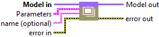
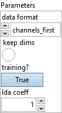
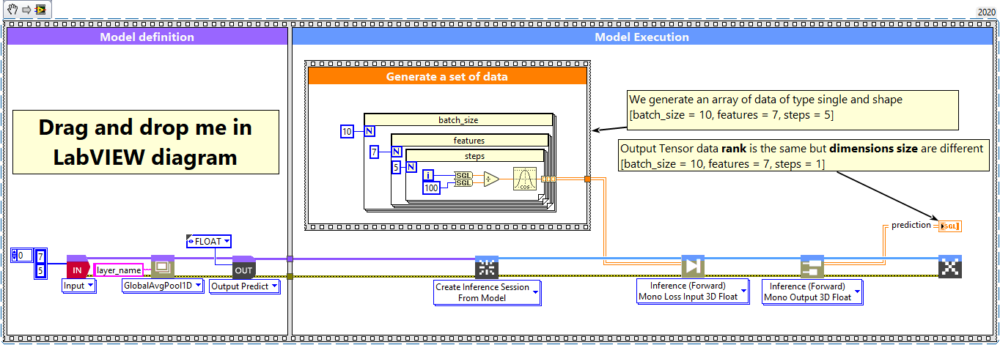
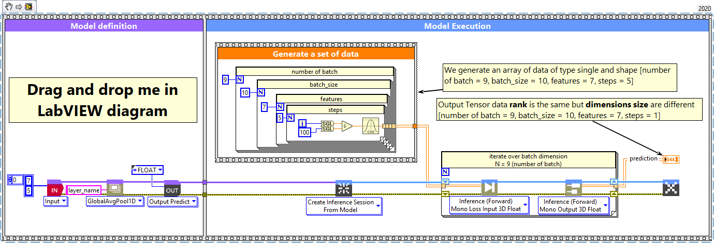

<h1>GlobalAvgPool1D</h1>

<h2>Description</h2>

Setup and add the global average pooling 1D layer into the model during the definition graph step. Type : <em><strong>polymorphic</strong><strong>.</strong></em>

<h3>Input parameters</h3>

<table>
  <tbody>
    <tr>
      <td width="64" valign="top"></td>
      <td valign="top"><strong>Model in : </strong>model architecture.</td>
    </tr>
  </tbody>
</table>

<table>
  <tbody>
    <tr>
      <td valign="top" width="75%"><table>
  <tbody>
    <tr>
      <td width="64" valign="top"></td>
      <td valign="top"><strong>Parameters :</strong> layer parameters.</td>
    </tr>
    <tr>
      <td></td>
      <td valign="top"><table>
  <tbody>
    <tr>
      <td width="64" valign="top"></td>
      <td valign="top"><strong>data format : <em>enum</em></strong>, one of <strong>channels_last</strong> or <strong>channels_first</strong> (default) . The ordering of the dimensions in the inputs. <strong>channel_last</strong> corresponds to inputs with shape <strong>(batch, steps, features)</strong> while <strong>channels_first</strong> corresponds to inputs with shape <strong>(batch, features, steps)</strong>.</td>
    </tr>
    <tr>
      <td width="64" valign="top"></td>
      <td valign="top">Default value “channels_first”.</td>
    </tr>
    <tr>
      <td width="64" valign="top"></td>
      <td valign="top"><strong>keep dims :</strong> <em><strong>boolean</strong></em>, A boolean, whether to keep the spatial dimensions or not. If keepdims is ‘False’ (default), the rank of the tensor is reduced for spatial dimensions. If keepdims is ‘True’, the spatial dimensions are retained with length 1.</td>
    </tr>
    <tr>
      <td width="64" valign="top"></td>
      <td valign="top">Default value “False”.</td>
    </tr>
    <tr>
      <td width="64" valign="top"></td>
      <td valign="top"><strong>training? :</strong> <em><strong>boolean</strong></em>, whether the layer is in training mode (can store data for backward).</td>
    </tr>
    <tr>
      <td width="64" valign="top"></td>
      <td valign="top">Default value “True”.</td>
    </tr>
    <tr>
      <td width="64" valign="top"></td>
      <td valign="top"><strong>lda coeff :</strong> <em><strong>float</strong></em>, defines the coefficient by which the loss derivative will be multiplied before being sent to the previous layer (since during the backward run we go backwards).</td>
    </tr>
    <tr>
      <td width="64" valign="top"></td>
      <td valign="top">Default value “1”.</td>
    </tr>
  </tbody>
</table></td>
    </tr>
  </tbody>
</table></td>
      <td valign="top" width="25%">

</td>
    </tr>
  </tbody>
</table>

<table>
  <tbody>
    <tr>
      <td width="64" valign="top"></td>
      <td valign="top"><strong>name (optional) :</strong> <em><strong>string,</strong></em> name of the layer.</td>
    </tr>
  </tbody>
</table>

<h3>Output parameters</h3>

<table>
  <tbody>
    <tr>
      <td width="64" valign="top"></td>
      <td valign="top"><strong>Model out : </strong>model architecture.</td>
    </tr>
  </tbody>
</table>

<h2>Dimension</h2>

<h3>Input shape</h3>

3D tensor with shape

<ul>
<li>If data_format = ‘channels_last’ : (batch_size, steps, features).</li>
<li>If data_format = ‘channels_first’ : (batch_size, features, steps).</li>
</ul>

<h3>Output shape</h3>

<ul>
<li>If keepdims = ‘False’ : 2D tensor with shape (batch_size, features).</li>
<li>If keepdims = ‘True’ :
<ul>
<li>If data_format = ‘channels_last’ : 3D tensor with shape (batch_size, 1, features).</li>
<li>If data_format = ‘channels_first’ : 3D tensor with shape (batch_size, features, 1).</li>
</ul>
</li>
</ul>

<h2>Example</h2>

All these exemples are snippets PNG, you can drop these Snippet onto the block diagram and get the depicted code added to your VI (Do not forget to install Deep Learning library to run it).

<h3>GlobalAvgPool1D layer</h3>

1 – Generate a set of data

We generate an array of data of type single and shape [batch size = 10, features = 7, steps = 5].

2 – Define graph

First, we define the first layer of the graph which is an Input layer (explicit input layer method). This layer is setup as an input array shaped [features = 7, steps = 5]. Then we add to the graph the GlobalAvgPool1D layer.

3 – Run graph

We call the forward method and retrieve the result with the “Prediction 2D” method. This method returns two variables, the first one is the layer information (cluster composed of the layer name, the graph index and the shape of the output layer) and the second one is the prediction with a shape of [batch_size, features]. The output dimension depends on the parameters “keepdims” refer to the chapter “Dimension” of this documentation.

<h3>GlobalAvgPool1D layer, batch and dimension</h3>

1 – Generate a set of data

We generate an array of data of type single and shape [number of batch = 9, batch size = 10, features = 7, steps = 5].

2 – Define graph

First, we define the first layer of the graph which is an Input layer (explicit input layer method). This layer is setup as an input array shaped [features = 7, steps = 5]. Then we add to the graph the GlobalAvgPool1D layer.

3 – Run graph

We call the forward method and retrieve the result with the “Prediction 2D” method. This method returns two variables, the first one is the layer information (cluster composed of the layer name, the graph index and the shape of the output layer) and the second one is the prediction with a shape of [batch_size, features]. The output dimension depends on the parameters “keepdims” refer to the chapter “Dimension” of this documentation.

