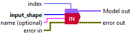

<h1>Input</h1>

<h2>Description</h2>

Setup and add the input layer into the model during the definition graph step. Type : <em><strong>polymorphic</strong><strong>.</strong></em>

<h3>Input parameters</h3>

<table>
  <tbody>
    <tr>
      <td width="64" valign="top"></td>
      <td valign="top"><strong>index : <em>integer, </em></strong>this parameter refers to the position of the input within the ONNX graph. When executing a model with multiple inputs, the index helps you identify which input you are targeting. It is especially useful when configuring input data, using the <strong>Input Data</strong> polymorph found in the <strong>Deep Learning</strong> → <strong>Runtime</strong> palette.</td>
    </tr>
    <tr>
      <td width="64" valign="top"></td>
      <td valign="top"><strong>input_shape : <em>integer array</em></strong>, shape (not including the batch axis).</td>
    </tr>
    <tr>
      <td width="64" valign="top"></td>
      <td valign="top"><strong>name (optional) :</strong> <em><strong>string,</strong></em> name of the layer.</td>
    </tr>
  </tbody>
</table>

<h3>Output parameters</h3>

<table>
  <tbody>
    <tr>
      <td width="64" valign="top"></td>
      <td valign="top"><strong>Model out : </strong>model architecture.</td>
    </tr>
  </tbody>
</table>
