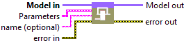
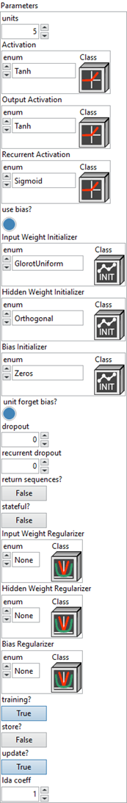
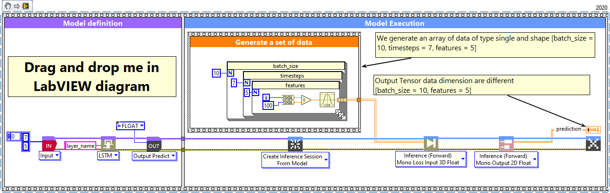
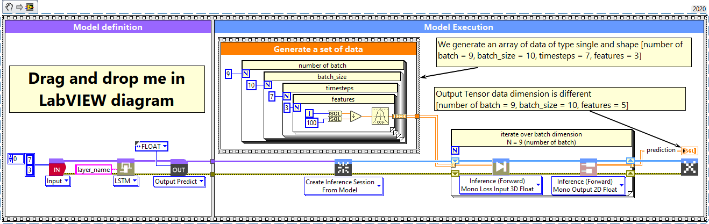

<h1>LSTM</h1>

<h2>Description</h2>

Setup and add the lstm layer into the model during the definition graph step. Type : <em><strong>polymorphic</strong><strong>.</strong></em>

<h3>Input parameters</h3>

<table>
  <tbody>
    <tr>
      <td width="64" valign="top"></td>
      <td valign="top"><strong>Model in : </strong>model architecture.</td>
    </tr>
  </tbody>
</table>

<table>
  <tbody>
    <tr>
      <td valign="top" width="75%"><table>
  <tbody>
    <tr>
      <td width="64" valign="top"></td>
      <td valign="top"><strong>Parameters :</strong> layer parameters.</td>
    </tr>
    <tr>
      <td></td>
      <td valign="top"><table>
  <tbody>
    <tr>
      <td width="64" valign="top"></td>
      <td valign="top"><strong>units : <em>integer</em></strong>, dimensionality of the output space.</td>
    </tr>
    <tr>
      <td width="64" valign="top"></td>
      <td valign="top"><strong><a href="../../../more-deep-learning/layers-parameters/activation/README.md">Activation</a> : <em>cluster, </em></strong>applied to the candidate cell input. This function transforms the new information considered for updating the cell state.</td>
    </tr>
    <tr>
      <td width="64" valign="top"></td>
      <td valign="top"><strong><a href="../../../more-deep-learning/layers-parameters/activation/README.md">Output Activation</a> : <em>cluster, </em></strong>applied to the updated cell state before producing the visible hidden output of the LSTM at each time step.</td>
    </tr>
    <tr>
      <td width="64" valign="top"></td>
      <td valign="top"><strong><a href="../../../more-deep-learning/layers-parameters/activation/README.md">Recurrent Activation</a> : <em>cluster, </em></strong>applied to the input, forget, and output gates. It controls which parts of the past information are allowed to pass or be blocked.</td>
    </tr>
    <tr>
      <td width="64" valign="top"></td>
      <td valign="top"><strong>use bias? : <em>boolean</em></strong>, whether the layer uses a bias vector.</td>
    </tr>
    <tr>
      <td width="64" valign="top"></td>
      <td valign="top">Default value “True”.</td>
    </tr>
    <tr>
      <td width="64" valign="top"></td>
      <td valign="top"><strong><a href="../../../more-deep-learning/layers-parameters/initializer/README.md">Input Weight Initializer</a> : <em>cluster, </em></strong>initializer for the <code>kernel</code> weights matrix, used for the linear transformation of the inputs.</td>
    </tr>
    <tr>
      <td width="64" valign="top"></td>
      <td valign="top"><strong><a href="../../../more-deep-learning/layers-parameters/initializer/README.md">Hidden Weight Initializer</a> : <em>cluster, </em></strong>initializer for the <code>recurrent_kernel</code> weights matrix, used for the linear transformation of the recurrent state.</td>
    </tr>
    <tr>
      <td width="64" valign="top"></td>
      <td valign="top"><strong><a href="../../../more-deep-learning/layers-parameters/initializer/README.md">Bias Initializer</a> : <em>cluster, </em></strong>initializer for the bias vector.</td>
    </tr>
    <tr>
      <td width="64" valign="top"></td>
      <td valign="top"><strong>unit forget bias? : <em>boolean</em></strong>, if True, add 1 to the bias of the forget gate at initialization.</td>
    </tr>
    <tr>
      <td width="64" valign="top"></td>
      <td valign="top">Default value “True”.</td>
    </tr>
    <tr>
      <td width="64" valign="top"></td>
      <td valign="top"><strong>dropout : <em>float</em></strong>, fraction of the units to drop for the linear transformation of the inputs.</td>
    </tr>
    <tr>
      <td width="64" valign="top"></td>
      <td valign="top">Default value “0.0”.</td>
    </tr>
    <tr>
      <td width="64" valign="top"></td>
      <td valign="top"><strong>recurrent dropout : <em>float</em></strong>, fraction of the units to drop for the linear transformation of the recurrent state.</td>
    </tr>
    <tr>
      <td width="64" valign="top"></td>
      <td valign="top">Default value “0.0”.</td>
    </tr>
    <tr>
      <td width="64" valign="top"></td>
      <td valign="top"><strong>return sequences? : <em>boolean</em></strong>, whether to return the last output in the output sequence, or the full sequence.</td>
    </tr>
    <tr>
      <td width="64" valign="top"></td>
      <td valign="top">Default value “False”.</td>
    </tr>
    <tr>
      <td width="64" valign="top"></td>
      <td valign="top"><strong>stateful? : <em>boolean</em></strong>, if True, the last state for each sample at index i in a batch will be used as initial state for the sample of index i in the following batch.</td>
    </tr>
    <tr>
      <td width="64" valign="top"></td>
      <td valign="top">Default value “False”.</td>
    </tr>
    <tr>
      <td width="64" valign="top"></td>
      <td valign="top"><strong><a href="../../../more-deep-learning/layers-parameters/regularizer/README.md">Input Weight Regularizer</a> : <em>cluster, </em></strong>regularizer function applied to the <code>kernel</code> weights matrix.</td>
    </tr>
    <tr>
      <td width="64" valign="top"></td>
      <td valign="top"><strong><a href="../../../more-deep-learning/layers-parameters/regularizer/README.md">Hidden Weight Regularizer</a> : <em>cluster, </em></strong>regularizer function applied to the <code>recurrent_kernel</code> weights matrix.</td>
    </tr>
    <tr>
      <td width="64" valign="top"></td>
      <td valign="top"><strong><a href="../../../more-deep-learning/layers-parameters/regularizer/README.md">Bias Regularizer</a> : <em>cluster, </em></strong>regularizer function applied to the bias vector.</td>
    </tr>
    <tr>
      <td width="64" valign="top"></td>
      <td valign="top"><strong>training? :</strong> <em><strong>boolean</strong></em>, whether the layer is in training mode (can store data for backward).</td>
    </tr>
    <tr>
      <td width="64" valign="top"></td>
      <td valign="top">Default value “True”.</td>
    </tr>
    <tr>
      <td width="64" valign="top"></td>
      <td valign="top"><strong>store? :</strong> <em><strong>boolean</strong></em>, whether the layer stores the last iteration gradient (accessible via the “get_gradients” function).</td>
    </tr>
    <tr>
      <td width="64" valign="top"></td>
      <td valign="top">Default value “False”.</td>
    </tr>
    <tr>
      <td width="64" valign="top"></td>
      <td valign="top"><strong>update? :</strong> <em><strong>boolean</strong></em>, whether the layer’s variables should be updated during backward. Equivalent to freeze the layer.</td>
    </tr>
    <tr>
      <td width="64" valign="top"></td>
      <td valign="top">Default value “True”.</td>
    </tr>
    <tr>
      <td width="64" valign="top"></td>
      <td valign="top"><strong>lda coeff :</strong> <em><strong>float</strong></em>, defines the coefficient by which the loss derivative will be multiplied before being sent to the previous layer (since during the backward run we go backwards).</td>
    </tr>
    <tr>
      <td width="64" valign="top"></td>
      <td valign="top">Default value “1”.</td>
    </tr>
  </tbody>
</table></td>
    </tr>
  </tbody>
</table></td>
      <td valign="top" width="25%">

</td>
    </tr>
  </tbody>
</table>

<table>
  <tbody>
    <tr>
      <td width="64" valign="top"></td>
      <td valign="top"><strong>name (optional) :</strong> <em><strong>string,</strong></em> name of the layer.</td>
    </tr>
  </tbody>
</table>

<h3>Output parameters</h3>

<table>
  <tbody>
    <tr>
      <td width="64" valign="top"></td>
      <td valign="top"><strong>Model out : </strong>model architecture.</td>
    </tr>
  </tbody>
</table>

<h2>Dimension</h2>

<h3>Input shape</h3>

A 3D tensor, with shape : (batch, timesteps, features).

<h3>Output shape</h3>

3D tensor with shape :

<ul>
<li>If “return_sequences” = True : (batch_size, timesteps, units).</li>
<li>If “return_sequences” = False  : (batch_size, units).</li>
</ul>

<h2>Example</h2>

All these exemples are snippets PNG, you can drop these Snippet onto the block diagram and get the depicted code added to your VI (Do not forget to install Deep Learning library to run it).

<h3>LSTM layer</h3>

1 – Generate a set of data

We generate an array of data of type single and shape [batch_size = 10, timesteps = 7, features = 5].

2 – Define graph

First, we define the first layer of the graph which is an Input layer (explicit input layer method). This layer is setup as an input array shaped [timesteps = 7, features = 5]. Then we add to the graph the LSTM layer.

3 – Run graph

We call the forward method and retrieve the result with the “Prediction 2D” method. This method returns two variables, the first one is the layer information (cluster composed of the layer name, the graph index and the shape of the output layer) and the second one is the prediction with a shape of [batch_size, units]. The output dimension depends on the parameters “return-sequences” refer to the chapter “Dimension” of this documentation.

<h3>LSTM layer, batch and dimension</h3>

1 – Generate a set of data

We generate an array of data of type single and shape [number of batch = 9, batch_size = 10, timesteps = 7, features = 3].

2 – Define graph

First, we define the first layer of the graph which is an Input layer (explicit input layer method). This layer is setup as an input array shaped [timesteps = 7, features = 3]. Then we add to the graph the LSTM layer.

3 – Run graph

We call the forward method and retrieve the result with the “Prediction 2D” method. This method returns two variables, the first one is the layer information (cluster composed of the layer name, the graph index and the shape of the output layer) and the second one is the prediction with a shape of [batch_size, units]. The output dimension depends on the parameters “return-sequences” refer to the chapter “Dimension” of this documentation.

