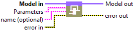
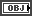
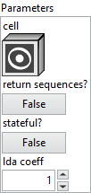
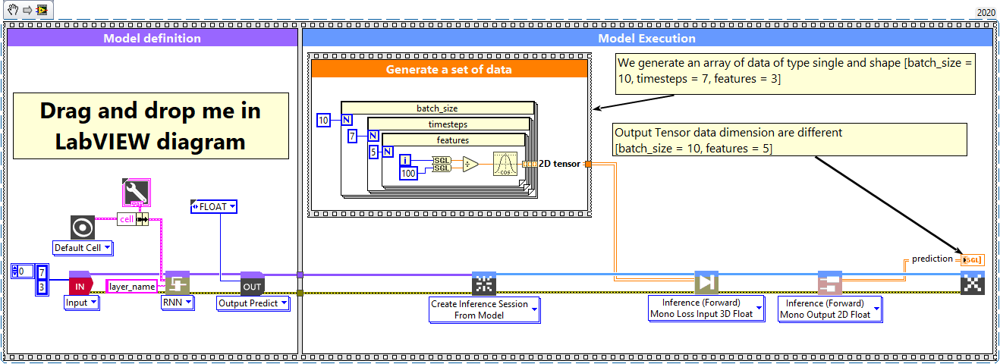
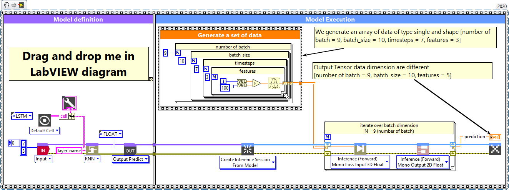

<h1>RNN</h1>

<h2>Description</h2>

Setup and add the rnn layer into the model during the definition graph step. Type : <em><strong>polymorphic</strong><strong>.</strong></em>

<h3>Input parameters</h3>

<table>
  <tbody>
    <tr>
      <td width="64" valign="top"></td>
      <td valign="top"><strong>Model in : </strong>model architecture.</td>
    </tr>
  </tbody>
</table>

<table>
  <tbody>
    <tr>
      <td valign="top" width="75%"><table>
  <tbody>
    <tr>
      <td width="64" valign="top"></td>
      <td valign="top"><strong>Parameters : </strong>layer parameters.</td>
    </tr>
    <tr>
      <td></td>
      <td valign="top"><table>
  <tbody>
    <tr>
      <td width="64" valign="top"></td>
      <td valign="top"><a href="../../define-deep-learning-architecture/cells/resume-3/README.md"><strong>cell</strong></a> <strong>: <em>object</em></strong><em>,</em> a rnn cell instance.</td>
    </tr>
    <tr>
      <td width="64" valign="top"></td>
      <td valign="top"><strong>return sequences? : <em>boolean</em></strong>, Whether to return the last output in the output sequence, or the full sequence.</td>
    </tr>
    <tr>
      <td width="64" valign="top"></td>
      <td valign="top">Default value “False”.</td>
    </tr>
    <tr>
      <td width="64" valign="top"></td>
      <td valign="top"><strong>stateful? : <em>boolean</em></strong>, if True, the last state for each sample at index i in a batch will be used as initial state for the sample of index i in the following batch.</td>
    </tr>
    <tr>
      <td width="64" valign="top"></td>
      <td valign="top">Default value “False”.</td>
    </tr>
    <tr>
      <td width="64" valign="top"></td>
      <td valign="top"><strong>lda coeff :</strong> <em><strong>float</strong></em>, defines the coefficient by which the loss derivative will be multiplied before being sent to the previous layer (since during the backward run we go backwards).</td>
    </tr>
    <tr>
      <td width="64" valign="top"></td>
      <td valign="top">Default value “1”.</td>
    </tr>
  </tbody>
</table></td>
    </tr>
  </tbody>
</table></td>
      <td valign="top" width="25%">

</td>
    </tr>
  </tbody>
</table>

<table>
  <tbody>
    <tr>
      <td width="64" valign="top"></td>
      <td valign="top"><strong>name (optional) :</strong> <em><strong>string,</strong></em> name of the layer.</td>
    </tr>
  </tbody>
</table>

<h3>Output parameters</h3>

<table>
  <tbody>
    <tr>
      <td width="64" valign="top"></td>
      <td valign="top"><strong>Model out : </strong>model architecture.</td>
    </tr>
  </tbody>
</table>

<h2>Dimension</h2>

<h3>Input shape</h3>

A 3D tensor, with shape : (batch, timesteps, features).

<h3>Output shape</h3>

3D tensor with shape :

<ul>
<li>If “return_sequences” = True : (batch_size, timesteps, output_size).</li>
<li>If “return_sequences” = False  : (batch_size, output_size).</li>
</ul>

<h2>Example</h2>

All these exemples are snippets PNG, you can drop these Snippet onto the block diagram and get the depicted code added to your VI (Do not forget to install Deep Learning library to run it).

<h3>RNN layer</h3>

1 – Generate a set of data

We generate an array of data of type single and shape [batch_size = 10, timesteps = 7, features = 5].

2 – Define graph

First, we define the first layer of the graph which is an Input layer (explicit input layer method). This layer is setup as an input array shaped [timesteps = 7, features = 5].  Then we add to the graph the RNN layer.

3 – Run graph

We call the forward method and retrieve the result with the “Prediction 2D” method. This method returns two variables, the first one is the layer information (cluster composed of the layer name, the graph index and the shape of the output layer) and the second one is the prediction with a shape of [batch_size, output_size].  The output dimension depends on the parameters “return-sequences” refer to the chapter “Dimension” of this documentation.

<h3>RNN layer, batch and dimension</h3>

1 – Generate a set of data

We generate an array of data of type single and shape [number of batch = 9, batch_size = 10, timesteps = 7, features = 3].

2 – Define graph

First, we define the first layer of the graph which is an Input layer (explicit input layer method). This layer is setup as an input array shaped [timesteps = 7, features = 3]. Then we add to the graph the RNN layer.

3 – Run graph

We call the forward method and retrieve the result with the “Prediction 2D” method. This method returns two variables, the first one is the layer information (cluster composed of the layer name, the graph index and the shape of the output layer) and the second one is the prediction with a shape of [batch_size, output_size]. The output dimension depends on the parameters “return-sequences”, refer to the chapter “Dimension” of this documentation.

