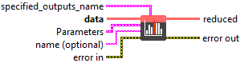
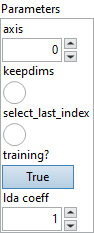

<h1>ArgMax</h1>

<h2>Description</h2>

Computes the indices of the max elements of the input tensor’s element along the provided axis. The resulting tensor has the same rank as the input if keepdims equals 1. If keepdims equals 0, then the resulting tensor has the reduced dimension pruned. If select_last_index is True (default False), the index of the last occurrence of the max is selected if the max appears more than once in the input. Otherwise the index of the first occurrence is selected. The type of the output tensor is integer.

<h3>Input parameters</h3>

<table>
  <tbody>
    <tr>
      <td width="64" valign="top"></td>
      <td valign="top"><strong><a href="../../../../../../more-deep-learning/nodes-parameters/specified_outputs_name/README.md">specified_outputs_name</a> : <em>array, </em></strong>this parameter lets you manually assign custom names to the output tensors of a node.</td>
    </tr>
    <tr>
      <td width="64" valign="top"></td>
      <td valign="top"><strong>data (heterogeneous) – T : <em>object, </em></strong>an input tensor.</td>
    </tr>
  </tbody>
</table>

<table>
  <tbody>
    <tr>
      <td valign="top" width="70%">
<strong>Parameters : <em>cluster,</em></strong>

<table>
  <tbody>
    <tr>
      <td width="64" valign="top"></td>
      <td valign="top"><strong>axis : <em>integer,</em></strong> the axis in which to compute the arg indices. Accepted range is [-r, r-1] where r = rank(data).</td>
    </tr>
    <tr>
      <td width="64" valign="top"></td>
      <td valign="top">Default value “0”.</td>
    </tr>
    <tr>
      <td width="64" valign="top"></td>
      <td valign="top"><strong>keepdims :</strong> <em><strong>boolean</strong></em>, keep the reduced dimension or not, if true, this means that the reduced dimension is retained.</td>
    </tr>
    <tr>
      <td width="64" valign="top"></td>
      <td valign="top">Default value “False”.</td>
    </tr>
    <tr>
      <td width="64" valign="top"></td>
      <td valign="top"><strong>select_last_index :</strong> <em><strong>boolean</strong></em>, whether to select the last index or the first index if the {name} appears in multiple indices.</td>
    </tr>
    <tr>
      <td width="64" valign="top"></td>
      <td valign="top">Default value “False”.</td>
    </tr>
    <tr>
      <td width="64" valign="top"></td>
      <td valign="top"><strong>training? :</strong> <em><strong>boolean</strong></em>, whether the layer is in training mode (can store data for backward).</td>
    </tr>
    <tr>
      <td width="64" valign="top"></td>
      <td valign="top">Default value “True”.</td>
    </tr>
    <tr>
      <td width="64" valign="top"></td>
      <td valign="top"><strong>lda coeff :</strong> <em><strong>float</strong></em>, defines the coefficient by which the loss derivative will be multiplied before being sent to the previous layer (since during the backward run we go backwards).</td>
    </tr>
    <tr>
      <td width="64" valign="top"></td>
      <td valign="top">Default value “1”.</td>
    </tr>
    <tr>
      <td width="64" valign="top"></td>
      <td valign="top"><strong>name (optional) :</strong> <em><strong>string,</strong></em> name of the node.</td>
    </tr>
  </tbody>
</table></td>
      <td valign="top" width="30%">

</td>
    </tr>
  </tbody>
</table>

<h3>Output parameters</h3>

<table>
  <tbody>
    <tr>
      <td width="64" valign="top"></td>
      <td valign="top"><strong>reduced</strong> <strong>(heterogeneous) –</strong> <strong>tensor(int64) : <em>object, </em></strong>reduced output tensor with integer data type.</td>
    </tr>
  </tbody>
</table>

<h2>Type Constraints</h2>

<strong>T</strong> in (<code>tensor(bfloat16)</code>, <code>tensor(double)</code>, <code>tensor(float)</code>, <code>tensor(float16)</code>, <code>tensor(int16)</code>, <code>tensor(int32)</code>, <code>tensor(int64)</code>, <code>tensor(int8)</code>, <code>tensor(uint16)</code>, <code>tensor(uint32)</code>, <code>tensor(uint64)</code>, <code>tensor(uint8)</code>) : Constrain input and output types to all numeric.

<h2>Example</h2>

All these exemples are snippets PNG, you can drop these Snippet onto the block diagram and get the depicted code added to your VI (Do not forget to install Deep Learning library to run it).

