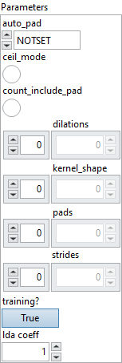

<h1>AveragePool</h1>

<h2>Description</h2>

AveragePool consumes an input tensor X and applies average pooling across the tensor according to kernel sizes, stride sizes, and pad lengths.

average pooling consisting of computing the average on all values of a subset of the input tensor according to the kernel size and downsampling the data into the output tensor Y for further processing. The output spatial shape is calculated differently depending on whether explicit padding is used, where pads is employed, or auto padding is used, where auto_pad is utilized. With explicit padding (<a href="https://pytorch.org/docs/stable/generated/torch.nn.MaxPool2d.html?highlight=maxpool#torch.nn.MaxPool2d">https://pytorch.org/docs/stable/generated/torch.nn.MaxPool2d.html?highlight=maxpool#torch.nn.MaxPool2d</a>):

output_spatial_shape

[

i

]

=

floor

((

input_spatial_shape

[

i

]

+

pad_shape

[

i

]

-

dilation

[

i

]

*

(

kernel_shape

[

i

]

-

1

)

-

1

)

/

strides_spatial_shape

[

i

]

+

1

)

or

output_spatial_shape

[

i

]

=

ceil

((

input_spatial_shape

[

i

]

+

pad_shape

[

i

]

-

dilation

[

i

]

*

(

kernel_shape

[

i

]

-

1

)

-

1

)

/

strides_spatial_shape

[

i

]

+

1

)

if ceil_mode is enabled. <code>pad_shape</code> is the sum of pads along axis <code>i</code>.

<code>auto_pad</code> is a DEPRECATED attribute. If you are using them currently, the output spatial shape will be following when ceil_mode is enabled:

VALID

:

output_spatial_shape

[

i

]

=

ceil

((

input_spatial_shape

[

i

]

-

((

kernel_spatial_shape

[

i

]

-

1

)

*

dilations

[

i

]

+

1

)

+

1

)

/

strides_spatial_shape

[

i

])

SAME_UPPER

or

SAME_LOWER

:

output_spatial_shape

[

i

]

=

ceil

(

input_spatial_shape

[

i

]

/

strides_spatial_shape

[

i

])

or when ceil_mode is disabled (<a href="https://www.tensorflow.org/api_docs/python/tf/keras/layers/AveragePooling2D">https://www.tensorflow.org/api_docs/python/tf/keras/layers/AveragePooling2D</a>):

VALID

:

output_spatial_shape

[

i

]

=

floor

((

input_spatial_shape

[

i

]

-

((

kernel_spatial_shape

[

i

]

-

1

)

*

dilations

[

i

]

+

1

))

/

strides_spatial_shape

[

i

])

+

1

SAME_UPPER

or

SAME_LOWER

:

output_spatial_shape

[

i

]

=

floor

((

input_spatial_shape

[

i

]

-

1

)

/

strides_spatial_shape

[

i

])

+

1

And pad shape will be following if <code>SAME_UPPER</code> or <code>SAME_LOWER</code>:

pad_shape

[

i

]

=

(

output_spatial_shape

[

i

]

-

1

)

*

strides_spatial_shape

[

i

]

+

((

kernel_spatial_shape

[

i

]

-

1

)

*

dilations

[

i

]

+

1

)

-

input_spatial_shape

[

i

]

The output of each pooling window is divided by the number of elements (exclude pad when attribute count_include_pad is zero).

<h3>Input parameters</h3>

<table>
  <tbody>
    <tr>
      <td width="64" valign="top"></td>
      <td valign="top"><strong><a href="../../../../../../more-deep-learning/nodes-parameters/specified_outputs_name/README.md">specified_outputs_name</a> : <em>array, </em></strong>this parameter lets you manually assign custom names to the output tensors of a node.</td>
    </tr>
    <tr>
      <td width="64" valign="top"></td>
      <td valign="top"><strong>X (heterogeneous) – T : <em>object, </em></strong>input data tensor from the previous operator; dimensions for image case are (N x C x H x W), where N is the batch size, C is the number of channels, and H and W are the height and the width of the data. For non image case, the dimensions are in the form of (N x C x D1 x D2 … Dn), where N is the batch size. Optionally, if dimension denotation is in effect, the operation expects the input data tensor to arrive with the dimension denotation of [DATA_BATCH, DATA_CHANNEL, DATA_FEATURE, DATA_FEATURE …].</td>
    </tr>
  </tbody>
</table>

<table>
  <tbody>
    <tr>
      <td valign="top" width="70%">
<strong>Parameters : <em>cluster,</em></strong>

<table>
  <tbody>
    <tr>
      <td width="64" valign="top"></td>
      <td valign="top"><strong>auto_pad : <em>enum,</em></strong> auto_pad must be either NOTSET, SAME_UPPER, SAME_LOWER or VALID. Where default value is NOTSET, which means explicit padding is used. SAME_UPPER or SAME_LOWER mean pad the input so that <code>output_shape = ceil(input_shape / strides)</code> for each axis <code>i</code>. The padding is split between the two sides equally or almost equally (depending on whether it is even or odd). In case the padding is an odd number, the extra padding is added at the end for SAME_UPPER and at the beginning for SAME_LOWER.</td>
    </tr>
    <tr>
      <td width="64" valign="top"></td>
      <td valign="top">Default value “NOTSET”.</td>
    </tr>
    <tr>
      <td width="64" valign="top"></td>
      <td valign="top"><strong>ceil_mode</strong> <strong>:</strong> <em><strong>boolean</strong></em>, whether to use ceil or floor (default) to compute the output shape.</td>
    </tr>
    <tr>
      <td width="64" valign="top"></td>
      <td valign="top">Default value “False”.</td>
    </tr>
    <tr>
      <td width="64" valign="top"></td>
      <td valign="top"><strong>count_include_pad</strong> <strong>:</strong> <em><strong>boolean</strong></em>, whether include pad pixels when calculating values for the edges. Default is false, doesn’t count include pad.</td>
    </tr>
    <tr>
      <td width="64" valign="top"></td>
      <td valign="top">Default value “False”.</td>
    </tr>
    <tr>
      <td width="64" valign="top"></td>
      <td valign="top"><strong>dilations : <em>array,</em></strong> dilation value along each spatial axis of filter. If not present, the dilation defaults to 1 along each spatial axis.</td>
    </tr>
    <tr>
      <td width="64" valign="top"></td>
      <td valign="top">Default value “empty”.</td>
    </tr>
    <tr>
      <td width="64" valign="top"></td>
      <td valign="top"><strong>kernel_shape : <em>array,</em></strong> the size of the kernel along each axis.</td>
    </tr>
    <tr>
      <td width="64" valign="top"></td>
      <td valign="top">Default value “empty”.</td>
    </tr>
    <tr>
      <td width="64" valign="top"></td>
      <td valign="top"><strong>pads</strong> <strong>: <em>array,</em></strong> padding for the beginning and ending along each spatial axis, it can take any value greater than or equal to 0. The value represent the number of pixels added to the beginning and end part of the corresponding axis. <code>pads</code> format should be as follow [x1_begin, x2_begin…x1_end, x2_end,…], where xi_begin the number of pixels added at the beginning of axis <code>i</code> and xi_end, the number of pixels added at the end of axis <code>i</code>. This attribute cannot be used simultaneously with auto_pad attribute. If not present, the padding defaults to 0 along start and end of each spatial axis.</td>
    </tr>
    <tr>
      <td width="64" valign="top"></td>
      <td valign="top">Default value “empty”.</td>
    </tr>
    <tr>
      <td width="64" valign="top"></td>
      <td valign="top"><strong>strides : <em>array,</em></strong> stride along each spatial axis. If not present, the stride defaults to 1 along each spatial axis.</td>
    </tr>
    <tr>
      <td width="64" valign="top"></td>
      <td valign="top">Default value “empty”.</td>
    </tr>
    <tr>
      <td width="64" valign="top"></td>
      <td valign="top"><strong>training? :</strong> <em><strong>boolean</strong></em>, whether the layer is in training mode (can store data for backward).</td>
    </tr>
    <tr>
      <td width="64" valign="top"></td>
      <td valign="top">Default value “True”.</td>
    </tr>
    <tr>
      <td width="64" valign="top"></td>
      <td valign="top"><strong>lda coeff :</strong> <em><strong>float</strong></em>, defines the coefficient by which the loss derivative will be multiplied before being sent to the previous layer (since during the backward run we go backwards).</td>
    </tr>
    <tr>
      <td width="64" valign="top"></td>
      <td valign="top">Default value “1”.</td>
    </tr>
    <tr>
      <td width="64" valign="top"></td>
      <td valign="top"><strong>name (optional) :</strong> <em><strong>string,</strong></em> name of the node.</td>
    </tr>
  </tbody>
</table></td>
      <td valign="top" width="30%">

</td>
    </tr>
  </tbody>
</table>

<h3>Output parameters</h3>

<table>
  <tbody>
    <tr>
      <td width="64" valign="top"></td>
      <td valign="top"><strong>Y (heterogeneous) – T : <em>object, </em></strong>output data tensor from average or max pooling across the input tensor. Dimensions will vary based on various kernel, stride, and pad sizes. Floor value of the dimension is used.</td>
    </tr>
  </tbody>
</table>

<h2>Type Constraints</h2>

<strong>T</strong> in (<code>tensor(double)</code>, <code>tensor(float)</code>, <code>tensor(float16)</code>) : Constrain input and output types to float tensors.

<h2>Example</h2>

All these exemples are snippets PNG, you can drop these Snippet onto the block diagram and get the depicted code added to your VI (Do not forget to install Deep Learning library to run it).

