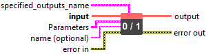
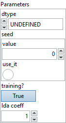

<h1>Bernouilli</h1>

<h2>Description</h2>

Draws binary random numbers (0 or 1) from a Bernoulli distribution. The input tensor should be a tensor containing probabilities p (a value in the range [0,1]) to be used for drawing the binary random number, where an output of 1 is produced with probability p and an output of 0 is produced with probability (1-p).

This operator is non-deterministic and may not produce the same values in different implementations (even if a seed is specified).

<h3>Input parameters</h3>

<table>
  <tbody>
    <tr>
      <td width="64" valign="top"></td>
      <td valign="top"><strong><a href="../../../../../../more-deep-learning/nodes-parameters/specified_outputs_name/README.md">specified_outputs_name</a> : <em>array, </em></strong>this parameter lets you manually assign custom names to the output tensors of a node.</td>
    </tr>
    <tr>
      <td width="64" valign="top"></td>
      <td valign="top"><strong>input (heterogeneous) – T1 : <em>object, </em></strong>all values in input have to be in the range:[0, 1].</td>
    </tr>
  </tbody>
</table>

<table>
  <tbody>
    <tr>
      <td valign="top" width="70%">
<strong>Parameters : <em>cluster,</em></strong>

<table>
  <tbody>
    <tr>
      <td width="64" valign="top"></td>
      <td valign="top"><strong>dtype : <em>enum,</em></strong> the data type for the elements of the output tensor. if not specified, we will use the data type of the input tensor.</td>
    </tr>
    <tr>
      <td width="64" valign="top"></td>
      <td valign="top">Default value “UNDEFINED”.</td>
    </tr>
    <tr>
      <td width="64" valign="top"></td>
      <td valign="top"><strong>seed : <em>float, </em></strong>seed to the random generator, if not specified we will auto generate one.</td>
    </tr>
    <tr>
      <td width="64" valign="top"></td>
      <td valign="top"><strong>training? :</strong> <em><strong>boolean</strong></em>, whether the layer is in training mode (can store data for backward).</td>
    </tr>
    <tr>
      <td width="64" valign="top"></td>
      <td valign="top">Default value “True”.</td>
    </tr>
    <tr>
      <td width="64" valign="top"></td>
      <td valign="top"><strong>lda coeff :</strong> <em><strong>float</strong></em>, defines the coefficient by which the loss derivative will be multiplied before being sent to the previous layer (since during the backward run we go backwards).</td>
    </tr>
    <tr>
      <td width="64" valign="top"></td>
      <td valign="top">Default value “1”.</td>
    </tr>
    <tr>
      <td width="64" valign="top"></td>
      <td valign="top"><strong>name (optional) :</strong> <em><strong>string,</strong></em> name of the node.</td>
    </tr>
  </tbody>
</table></td>
      <td valign="top" width="30%">

</td>
    </tr>
  </tbody>
</table>

<h3>Output parameters</h3>

<table>
  <tbody>
    <tr>
      <td width="64" valign="top"></td>
      <td valign="top"><strong>output (heterogeneous) – T2 : <em>object, </em></strong>the returned output tensor only has values 0 or 1, same shape as input tensor.</td>
    </tr>
  </tbody>
</table>

<h2>Type Constraints</h2>

<strong>T1</strong> in (<code>tensor(double)</code>, <code>tensor(float)</code>, <code>tensor(float16)</code>) : Constrain input types to float tensors.

<strong>T2</strong> in (<code>tensor(bfloat16)</code>, <code>tensor(bool)</code>, <code>tensor(double)</code>, <code>tensor(float)</code>, <code>tensor(float16)</code>, <code>tensor(int16)</code>, <code>tensor(int32)</code>, 
<code>tensor(int64)</code>, <code>tensor(int8)</code>, <code>tensor(uint16)</code>, <code>tensor(uint32)</code>, <code>tensor(uint64)</code>, <code>tensor(uint8)</code>) : Constrain output types to all numeric tensors and bool tensors.

<h2>Example</h2>

All these exemples are snippets PNG, you can drop these Snippet onto the block diagram and get the depicted code added to your VI (Do not forget to install Deep Learning library to run it).

