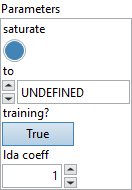

<h1>Cast</h1>

<h2>Description</h2>

The operator casts the elements of a given input tensor to a data type specified by the ‘to’ argument and returns an output tensor of the same size in the converted type. The ‘to’ argument must be one of the data types specified in the ‘DataType’ enum field in the TensorProto message.

Casting from string tensor in plain (e.g., “3.14” and “1000”) and scientific numeric representations (e.g., “1e-5” and “1E8”) to float types is supported. For example, converting string “100.5” to an integer may yield result 100. There are some string literals reserved for special floating-point values; “+INF” (and “INF”), “-INF”, and “NaN” are positive infinity, negative infinity, and not-a-number, respectively. Any string which can exactly match “+INF” in a case-insensitive way would be mapped to positive infinite. Similarly, this case-insensitive rule is applied to “INF” and “NaN”. When casting from numeric tensors to string tensors, plain floating-point representation (such as “314.15926”) would be used. Converting non-numerical-literal string such as “Hello World!” is an undefined behavior. Cases of converting string representing floating-point arithmetic value, such as “2.718”, to INT is an undefined behavior.

Conversion from a numerical type to any numerical type is always allowed. User must be aware of precision loss and value change caused by range difference between two types. For example, a 64-bit float 3.1415926459 may be round to a 32-bit float 3.141592. Similarly, converting an integer 36 to Boolean may produce 1 because we truncate bits which can’t be stored in the targeted type.

In more detail, the conversion among numerical types should follow these rules if the destination type is not a float 8 type.

<ul>
<li>Casting from floating point to:
<ul>
<li>floating point: +/- infinity if OOR (out of range).</li>
<li>fixed point: undefined if OOR.</li>
<li>bool: +/- 0.0 to False; all else to True.</li>
</ul>
</li>
<li>Casting from fixed point to:
<ul>
<li>floating point: +/- infinity if OOR. (+ infinity in the case of uint)</li>
<li>fixed point: when OOR, discard higher bits and reinterpret (with respect to two’s complement representation for signed types). For example, 200 (int16) -&gt; -56 (int8).</li>
<li>bool: zero to False; nonzero to True.</li>
</ul>
</li>
<li>Casting from bool to:
<ul>
<li>floating point: <code>{1.0, 0.0}</code>.</li>
<li>fixed point: <code>{1, 0}</code>.</li>
<li>bool: no change.</li>
</ul>
</li>
</ul>

Float 8 type were introduced to speed up the training of deep models. By default the conversion of a float <em>x</em> obeys to the following rules. <code>[x]</code> means the value rounded to the target mantissa width.

x

E4M3FN

E4M3FNUZ

E5M2

E5M2FNUZ

0

0

0

0

0

-0

-0

0

-0

0

NaN

NaN

NaN

NaN

NaN

Inf

FLT_MAX

NaN

FLT_MAX

NaN

-Inf

-FLT_MAX

NaN

-FLT_MAX

NaN

[x] &gt; FLT_MAX

FLT_MAX

FLT_MAX

FLT_MAX

FLT_MAX

[x] &lt; -FLT_MAX

-FLT_MAX

-FLT_MAX

-FLT_MAX

-FLT_MAX

else

RNE

RNE

RNE

RNE

The behavior changes if the parameter ‘saturate’ is set to False. The rules then become :

x

E4M3FN

E4M3FNUZ

E5M2

E5M2FNUZ

0

0

0

0

0

-0

-0

0

-0

0

NaN

NaN

NaN

NaN

NaN

-NaN

-NaN

NaN

-NaN

NaN

Inf

NaN

NaN

Inf

NaN

-Inf

-NaN

NaN

-Inf

NaN

[x] &gt; FLT_MAX

NaN

NaN

Inf

NaN

[x] &lt; -FLT_MAX

NaN

NaN

-Inf

NaN

else

RNE

RNE

RNE

RNE

<h3>Input parameters</h3>

<table>
  <tbody>
    <tr>
      <td width="64" valign="top"></td>
      <td valign="top"><strong><a href="../../../../../../more-deep-learning/nodes-parameters/specified_outputs_name/README.md">specified_outputs_name</a> : <em>array, </em></strong>this parameter lets you manually assign custom names to the output tensors of a node.</td>
    </tr>
    <tr>
      <td width="64" valign="top"></td>
      <td valign="top"><strong>input (heterogeneous) – T1 : <em>object, </em></strong>input tensor to be cast.</td>
    </tr>
  </tbody>
</table>

<table>
  <tbody>
    <tr>
      <td valign="top" width="70%">
<strong>Parameters : <em>cluster,</em></strong>

<table>
  <tbody>
    <tr>
      <td width="64" valign="top"></td>
      <td valign="top"><strong>saturate</strong> <strong>:</strong> <em><strong>boolean</strong></em>, the parameter defines how the conversion behaves if an input value is out of range of the destination type. It only applies for float 8 conversion (float8e4m3fn, float8e4m3fnuz, float8e5m2, float8e5m2fnuz). All cases are fully described in two tables inserted in the operator description.</td>
    </tr>
    <tr>
      <td width="64" valign="top"></td>
      <td valign="top">Default value “True”.</td>
    </tr>
    <tr>
      <td width="64" valign="top"></td>
      <td valign="top"><strong>to : <em>enum, </em></strong>the data type to which the elements of the input tensor are cast. Strictly must be one of the types from DataType enum in TensorProto.</td>
    </tr>
    <tr>
      <td width="64" valign="top"></td>
      <td valign="top">Default value “UNDEFINED”.</td>
    </tr>
    <tr>
      <td width="64" valign="top"></td>
      <td valign="top"><strong>training? :</strong> <em><strong>boolean</strong></em>, whether the layer is in training mode (can store data for backward).</td>
    </tr>
    <tr>
      <td width="64" valign="top"></td>
      <td valign="top">Default value “True”.</td>
    </tr>
    <tr>
      <td width="64" valign="top"></td>
      <td valign="top"><strong>lda coeff :</strong> <em><strong>float</strong></em>, defines the coefficient by which the loss derivative will be multiplied before being sent to the previous layer (since during the backward run we go backwards).</td>
    </tr>
    <tr>
      <td width="64" valign="top"></td>
      <td valign="top">Default value “1”.</td>
    </tr>
    <tr>
      <td width="64" valign="top"></td>
      <td valign="top"><strong>name (optional) :</strong> <em><strong>string,</strong></em> name of the node.</td>
    </tr>
  </tbody>
</table></td>
      <td valign="top" width="30%">

</td>
    </tr>
  </tbody>
</table>

<h3>Output parameters</h3>

<table>
  <tbody>
    <tr>
      <td width="64" valign="top"></td>
      <td valign="top"><strong>output (heterogeneous) – T2 : <em>object, </em></strong>output tensor with the same shape as input with type specified by the ‘to’ argument.</td>
    </tr>
  </tbody>
</table>

<h2>Type Constraints</h2>

<strong>T1</strong> in (<code>tensor(bfloat16)</code>, <code>tensor(bool)</code>, <code>tensor(double)</code>, <code>tensor(float)</code>, <code>tensor(float16)</code>, <code>tensor(float8e4m3fn)</code>, <code>tensor(float8e4m3fnuz)</code>, <code>tensor(float8e5m2)</code>, <code>tensor(float8e5m2fnuz)</code>, <code>tensor(int16)</code>, <code>tensor(int32)</code>, <code>tensor(int64)</code>, <code>tensor(int8)</code>, <code>tensor(string)</code>, <code>tensor(uint16)</code>, <code>tensor(uint32)</code>, <code>tensor(uint64)</code>, <code>tensor(uint8)</code>) : Constrain input types. Casting from complex is not supported.

<strong>T2</strong> in (<code>tensor(bfloat16)</code>, <code>tensor(bool)</code>, <code>tensor(double)</code>, <code>tensor(float)</code>, <code>tensor(float16)</code>, <code>tensor(float8e4m3fn)</code>, 
<code>tensor(float8e4m3fnuz)</code>, <code>tensor(float8e5m2)</code>, <code>tensor(float8e5m2fnuz)</code>, <code>tensor(int16)</code>, <code>tensor(int32)</code>, <code>tensor(int64)</code>, <code>tensor(int8)</code>, <code>tensor(string)</code>, <code>tensor(uint16)</code>, <code>tensor(uint32)</code>, <code>tensor(uint64)</code>, <code>tensor(uint8)</code>) : Constrain output types. Casting to complex is not supported.

<h2>Example</h2>

All these exemples are snippets PNG, you can drop these Snippet onto the block diagram and get the depicted code added to your VI (Do not forget to install Deep Learning library to run it).

