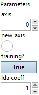

<h1>ConcatFromSequence</h1>

<h2>Description</h2>

Concatenate a sequence of tensors into a single tensor. All input tensors must have the same shape, except for the dimension size of the axis to concatenate on. By default ‘new_axis’ is 0, the behavior is similar to numpy.concatenate. When ‘new_axis’ is 1, the behavior is similar to numpy.stack.

<h3>Input parameters</h3>

<table>
  <tbody>
    <tr>
      <td width="64" valign="top"></td>
      <td valign="top"><strong><a href="../../../../../../more-deep-learning/nodes-parameters/specified_outputs_name/README.md">specified_outputs_name</a> : <em>array, </em></strong>this parameter lets you manually assign custom names to the output tensors of a node.</td>
    </tr>
    <tr>
      <td width="64" valign="top"></td>
      <td valign="top"><strong>input_sequence (heterogeneous) – S : <em>object, </em></strong>sequence of tensors for concatenation.</td>
    </tr>
  </tbody>
</table>

<table>
  <tbody>
    <tr>
      <td valign="top" width="70%">
<strong>Parameters : <em>cluster,</em></strong>

<table>
  <tbody>
    <tr>
      <td width="64" valign="top"></td>
      <td valign="top"><strong>axis : <em>integer, </em></strong>which axis to concat on. Accepted range in <code>[-r, r - 1]</code>, where <code>r</code> is the rank of input tensors. When <code>new_axis</code> is 1, accepted range is <code>[-r - 1, r]</code>.</td>
    </tr>
    <tr>
      <td width="64" valign="top"></td>
      <td valign="top">Default value “0”.</td>
    </tr>
    <tr>
      <td width="64" valign="top"></td>
      <td valign="top"><strong>new_axis :</strong> <em><strong>boolean</strong></em>, insert and concatenate on a new axis or not, default 0 means do not insert new axis.</td>
    </tr>
    <tr>
      <td width="64" valign="top"></td>
      <td valign="top">Default value “False”.</td>
    </tr>
    <tr>
      <td width="64" valign="top"></td>
      <td valign="top"><strong>training? :</strong> <em><strong>boolean</strong></em>, whether the layer is in training mode (can store data for backward).</td>
    </tr>
    <tr>
      <td width="64" valign="top"></td>
      <td valign="top">Default value “True”.</td>
    </tr>
    <tr>
      <td width="64" valign="top"></td>
      <td valign="top"><strong>lda coeff :</strong> <em><strong>float</strong></em>, defines the coefficient by which the loss derivative will be multiplied before being sent to the previous layer (since during the backward run we go backwards).</td>
    </tr>
    <tr>
      <td width="64" valign="top"></td>
      <td valign="top">Default value “1”.</td>
    </tr>
    <tr>
      <td width="64" valign="top"></td>
      <td valign="top"><strong>name (optional) :</strong> <em><strong>string,</strong></em> name of the node.</td>
    </tr>
  </tbody>
</table></td>
      <td valign="top" width="30%">

</td>
    </tr>
  </tbody>
</table>

<h3>Output parameters</h3>

<table>
  <tbody>
    <tr>
      <td width="64" valign="top"></td>
      <td valign="top"><strong>concat_result (heterogeneous) – T : <em>object, </em></strong>concatenated tensor.</td>
    </tr>
  </tbody>
</table>

<h2>Type Constraints</h2>

<strong>S</strong> in (<code>seq(tensor(bool))</code>, <code>seq(tensor(complex128))</code>, <code>seq(tensor(complex64))</code>, <code>seq(tensor(double))</code>, <code>seq(tensor(float))</code>, <code>seq(tensor(float16))</code>, <code>seq(tensor(int16))</code>, <code>seq(tensor(int32))</code>, <code>seq(tensor(int64))</code>, <code>seq(tensor(int8))</code>, <code>seq(tensor(string))</code>, <code>seq(tensor(uint16))</code>, <code>seq(tensor(uint32))</code>, <code>seq(tensor(uint64))</code>, <code>seq(tensor(uint8))</code>) : Constrain input types to any tensor type.

<strong>T</strong> in (<code>tensor(bool)</code>, <code>tensor(complex128)</code>, <code>tensor(complex64)</code>, <code>tensor(double)</code>, <code>tensor(float)</code>, <code>tensor(float16)</code>, <code>tensor(int16)</code>, 
<code>tensor(int32)</code>, <code>tensor(int64)</code>, <code>tensor(int8)</code>, <code>tensor(string)</code>, <code>tensor(uint16)</code>, <code>tensor(uint32)</code>, <code>tensor(uint64)</code>, <code>tensor(uint8)</code>) : Constrain output types to any tensor type.

<h2>Example</h2>

All these exemples are snippets PNG, you can drop these Snippet onto the block diagram and get the depicted code added to your VI (Do not forget to install Deep Learning library to run it).

