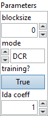

<h1>DepthToSpace</h1>

<h2>Description</h2>

DepthToSpace rearranges (permutes) data from depth into blocks of spatial data.

This is the reverse transformation of SpaceToDepth. More specifically, this op outputs a copy of the input tensor where values from the depth dimension are moved in spatial blocks to the height and width dimensions. By default, <code>mode</code> = <code>DCR</code>. In the DCR mode, elements along the depth dimension from the input tensor are rearranged in the following order: depth, column, and then row. The output y is computed from the input x as below:

b

,

c

,

h

,

w

=

x

.

shape

tmp

=

np

.

reshape

(

x

,

[

b

,

blocksize

,

blocksize

,

c

//

(

blocksize

**

2

),

h

,

w

])

tmp

=

np

.

transpose

(

tmp

,

[

0

,

3

,

4

,

1

,

5

,

2

])

y

=

np

.

reshape

(

tmp

,

[

b

,

c

//

(

blocksize

**

2

),

h

*

blocksize

,

w

*

blocksize

])

In the CRD mode, elements along the depth dimension from the input tensor are rearranged in the following order: column, row, and the depth. The output y is computed from the input x as below :

b, c, h, w = x.shape 
tmp = np.reshape(x, [b, c // (blocksize ** 2), blocksize, blocksize, h, w]) 
tmp = np.transpose(tmp, [0, 1, 4, 2, 5, 3]) 
y = np.reshape(tmp, [b, c // (blocksize ** 2), h * blocksize, w * blocksize])

<h3>Input parameters</h3>

<table>
  <tbody>
    <tr>
      <td width="64" valign="top"></td>
      <td valign="top"><strong><a href="../../../../../../more-deep-learning/nodes-parameters/specified_outputs_name/README.md">specified_outputs_name</a> : <em>array, </em></strong>this parameter lets you manually assign custom names to the output tensors of a node.</td>
    </tr>
    <tr>
      <td width="64" valign="top"></td>
      <td valign="top"><strong>input (heterogeneous) – T : <em>object, </em></strong>input tensor of [N,C,H,W], where N is the batch axis, C is the channel or depth, H is the height and W is the width.</td>
    </tr>
  </tbody>
</table>

<table>
  <tbody>
    <tr>
      <td valign="top" width="70%">
<strong>Parameters : <em>cluster,</em></strong>

<table>
  <tbody>
    <tr>
      <td width="64" valign="top"></td>
      <td valign="top"><strong>blocksize : <em>integer, </em></strong>blocks of [blocksize, blocksize] are moved.</td>
    </tr>
    <tr>
      <td width="64" valign="top"></td>
      <td valign="top">Default value “0”.</td>
    </tr>
    <tr>
      <td width="64" valign="top"></td>
      <td valign="top"><strong>mode : <em>enum, </em></strong>DCR for depth-column-row order re-arrangement. Use CRD for column-row-depth order.</td>
    </tr>
    <tr>
      <td width="64" valign="top"></td>
      <td valign="top">Default value “DCR”.</td>
    </tr>
    <tr>
      <td width="64" valign="top"></td>
      <td valign="top"><strong>training? :</strong> <em><strong>boolean</strong></em>, whether the layer is in training mode (can store data for backward).</td>
    </tr>
    <tr>
      <td width="64" valign="top"></td>
      <td valign="top">Default value “True”.</td>
    </tr>
    <tr>
      <td width="64" valign="top"></td>
      <td valign="top"><strong>lda coeff :</strong> <em><strong>float</strong></em>, defines the coefficient by which the loss derivative will be multiplied before being sent to the previous layer (since during the backward run we go backwards).</td>
    </tr>
    <tr>
      <td width="64" valign="top"></td>
      <td valign="top">Default value “1”.</td>
    </tr>
    <tr>
      <td width="64" valign="top"></td>
      <td valign="top"><strong>name (optional) :</strong> <em><strong>string,</strong></em> name of the node.</td>
    </tr>
  </tbody>
</table></td>
      <td valign="top" width="30%">

</td>
    </tr>
  </tbody>
</table>

<h3>Output parameters</h3>

<table>
  <tbody>
    <tr>
      <td width="64" valign="top"></td>
      <td valign="top"><strong>output (heterogeneous) – T : <em>object, </em></strong>output tensor of [N, C/(blocksize * blocksize), H * blocksize, W * blocksize].</td>
    </tr>
  </tbody>
</table>

<h2>Type Constraints</h2>

<strong>T</strong> in (<code>tensor(bfloat16)</code>, <code>tensor(bool)</code>, <code>tensor(complex128)</code>, <code>tensor(complex64)</code>, <code>tensor(double)</code>, <code>tensor(float)</code>, <code>tensor(float16)</code>, <code>tensor(int16)</code>, <code>tensor(int32)</code>, <code>tensor(int64)</code>, <code>tensor(int8)</code>, <code>tensor(string)</code>, <code>tensor(uint16)</code>, <code>tensor(uint32)</code>, <code>tensor(uint64)</code>, <code>tensor(uint8)</code>) : Constrain input and output types to all tensor types.

<h2>Example</h2>

All these exemples are snippets PNG, you can drop these Snippet onto the block diagram and get the depicted code added to your VI (Do not forget to install Deep Learning library to run it).

