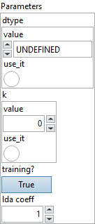

<h1>EyeLike</h1>

<h2>Description</h2>

Generate a 2D tensor (matrix) with ones on the diagonal and zeros everywhere else. Only 2D tensors are supported, i.e. input T1 must be of rank 2. The shape of the output tensor is the same as the input tensor. The data type can be specified by the ‘dtype’ argument. If ‘dtype’ is not specified, then the type of input tensor is used. By default, the main diagonal is populated with ones, but attribute ‘k’ can be used to populate upper or lower diagonals. The ‘dtype’ argument must be one of the data types specified in the ‘DataType’ enum field in the TensorProto message and be valid as an output type.

<h3>Input parameters</h3>

<table>
  <tbody>
    <tr>
      <td width="64" valign="top"></td>
      <td valign="top"><strong><a href="../../../../../../more-deep-learning/nodes-parameters/specified_outputs_name/README.md">specified_outputs_name</a> : <em>array, </em></strong>this parameter lets you manually assign custom names to the output tensors of a node.</td>
    </tr>
    <tr>
      <td width="64" valign="top"></td>
      <td valign="top"><strong>input (heterogeneous) – T1 : <em>object, </em></strong>2D input tensor to copy shape, and optionally, type information from.</td>
    </tr>
  </tbody>
</table>

<table>
  <tbody>
    <tr>
      <td valign="top" width="70%">
<strong>Parameters : <em>cluster,</em></strong>

<table>
  <tbody>
    <tr>
      <td width="64" valign="top"></td>
      <td valign="top"><strong>dtype : <em>enum, </em></strong>the data type for the elements of the output tensor. If not specified,the data type of the input tensor T1 is used. If input tensor T1 is also notspecified, then type defaults to ‘float’.</td>
    </tr>
    <tr>
      <td width="64" valign="top"></td>
      <td valign="top">Default value “UNDEFINED”.</td>
    </tr>
    <tr>
      <td width="64" valign="top"></td>
      <td valign="top"><strong>k : <em>integer, </em></strong>Index of the diagonal to be populated with ones. Default is 0. If T2 is the output, this op sets T2[i, i+k] = 1. k = 0 populates the main diagonal, k > 0 populates an upper diagonal, and k < 0 populates a lower diagonal.</td>
    </tr>
    <tr>
      <td width="64" valign="top"></td>
      <td valign="top">Default value “0”.</td>
    </tr>
    <tr>
      <td width="64" valign="top"></td>
      <td valign="top"><strong>training? :</strong> <em><strong>boolean</strong></em>, whether the layer is in training mode (can store data for backward).</td>
    </tr>
    <tr>
      <td width="64" valign="top"></td>
      <td valign="top">Default value “True”.</td>
    </tr>
    <tr>
      <td width="64" valign="top"></td>
      <td valign="top"><strong>lda coeff :</strong> <em><strong>float</strong></em>, defines the coefficient by which the loss derivative will be multiplied before being sent to the previous layer (since during the backward run we go backwards).</td>
    </tr>
    <tr>
      <td width="64" valign="top"></td>
      <td valign="top">Default value “1”.</td>
    </tr>
    <tr>
      <td width="64" valign="top"></td>
      <td valign="top"><strong>name (optional) :</strong> <em><strong>string,</strong></em> name of the node.</td>
    </tr>
  </tbody>
</table></td>
      <td valign="top" width="30%">

</td>
    </tr>
  </tbody>
</table>

<h3>Output parameters</h3>

<table>
  <tbody>
    <tr>
      <td width="64" valign="top"></td>
      <td valign="top"><strong>output (heterogeneous) – T2 : <em>object, </em></strong>output tensor, same shape as input tensor T1.</td>
    </tr>
  </tbody>
</table>

<h2>Type Constraints</h2>

<strong>T1</strong> in (<code>tensor(bool)</code>, <code>tensor(double)</code>, <code>tensor(float)</code>, <code>tensor(float16)</code>, <code>tensor(int16)</code>, <code>tensor(int32)</code>, <code>tensor(int64)</code>, <code>tensor(int8)</code>, <code>tensor(uint16)</code>, <code>tensor(uint32)</code>, <code>tensor(uint64)</code>, <code>tensor(uint8)</code>) : Constrain input types. Strings and complex are not supported.

<strong>T2</strong> in (<code>tensor(bool)</code>, <code>tensor(double)</code>, <code>tensor(float)</code>, <code>tensor(float16)</code>, <code>tensor(int16)</code>, <code>tensor(int32)</code>, <code>tensor(int64)</code>, <code>tensor(int8)</code>, 
<code>tensor(uint16)</code>, <code>tensor(uint32)</code>, <code>tensor(uint64)</code>, <code>tensor(uint8)</code>) : Constrain output types. Strings and complex are not supported.

<h2>Example</h2>

All these exemples are snippets PNG, you can drop these Snippet onto the block diagram and get the depicted code added to your VI (Do not forget to install Deep Learning library to run it).

