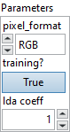

<h1>ImageDecoder</h1>

<h2>Description</h2>

Loads and decodes and image from a file. If it can’t decode for any reason (e.g. corrupted encoded stream, invalid format, it will return an empty matrix).

The following image formats are supported :

<ul>
<li>
<ul>
<li>BMP</li>
<li>JPEG (note: Lossless JPEG support is optional)</li>
<li>JPEG2000</li>
<li>TIFF</li>
<li>PNG</li>
<li>WebP</li>
<li>Portable image format (PBM, PGM, PPM, PXM, PNM) Decoded images follow a channel-last layout: (Height, Width, Channels). <strong>JPEG chroma upsampling method:</strong> When upsampling the chroma components by a factor of 2, the pixels are linearly interpolated so that the centers of the output pixels are 1/4 and 3/4 of the way between input pixel centers. When rounding, 0.5 is rounded down and up at alternative pixels locations to prevent bias towards larger values (ordered dither pattern). Considering adjacent input pixels A, B, and C, B is upsampled to pixels B0 and B1 so that :

<pre>B0 = round_half_down((1/4) * A + (3/4) * B)

B1 = round_half_up((3/4) * B + (1/4) * C)

</pre>

This method, is the default chroma upsampling method in the well-established libjpeg-turbo library, also referred as “smooth” or “fancy” upsampling.
</li>
</ul>
</li>
</ul>

<h3></h3>

<h3>Input parameters</h3>

<table>
  <tbody>
    <tr>
      <td width="64" valign="top"></td>
      <td valign="top"><strong><a href="../../../../../../more-deep-learning/nodes-parameters/specified_outputs_name/README.md">specified_outputs_name</a> : <em>array, </em></strong>this parameter lets you manually assign custom names to the output tensors of a node.</td>
    </tr>
    <tr>
      <td width="64" valign="top"></td>
      <td valign="top"><strong>encoded_stream (heterogeneous) – T1 : <em>object, </em></strong>encoded stream.</td>
    </tr>
  </tbody>
</table>

<table>
  <tbody>
    <tr>
      <td valign="top" width="70%">
<strong>Parameters : <em>cluster,</em></strong>

<table>
  <tbody>
    <tr>
      <td width="64" valign="top"></td>
      <td valign="top"><strong>pixel_format : <em>enum,</em></strong> pixel format. Can be one of “RGB”, “BGR”, or “Grayscale”.</td>
    </tr>
    <tr>
      <td width="64" valign="top"></td>
      <td valign="top">Default value “RGB”.</td>
    </tr>
    <tr>
      <td width="64" valign="top"></td>
      <td valign="top"><strong>training? :</strong> <em><strong>boolean</strong></em>, whether the layer is in training mode (can store data for backward).</td>
    </tr>
    <tr>
      <td width="64" valign="top"></td>
      <td valign="top">Default value “True”.</td>
    </tr>
    <tr>
      <td width="64" valign="top"></td>
      <td valign="top"><strong>lda coeff :</strong> <em><strong>float</strong></em>, defines the coefficient by which the loss derivative will be multiplied before being sent to the previous layer (since during the backward run we go backwards).</td>
    </tr>
    <tr>
      <td width="64" valign="top"></td>
      <td valign="top">Default value “1”.</td>
    </tr>
    <tr>
      <td width="64" valign="top"></td>
      <td valign="top"><strong>name (optional) :</strong> <em><strong>string,</strong></em> name of the node.</td>
    </tr>
  </tbody>
</table></td>
      <td valign="top" width="30%">

</td>
    </tr>
  </tbody>
</table>

<h3>Output parameters</h3>

<table>
  <tbody>
    <tr>
      <td width="64" valign="top"></td>
      <td valign="top"><strong>image (heterogeneous) – T2 : <em>object, </em></strong>decoded image.</td>
    </tr>
  </tbody>
</table>

<h2>Type Constraints</h2>

<strong>T1</strong> in (<code>tensor(uint8)</code>) : Constrain input types to 8-bit unsigned integer tensor.

<strong>T2</strong> in (<code>tensor(uint8)</code>) : Constrain output types to 8-bit unsigned integer tensor.

<h2>Example</h2>

All these exemples are snippets PNG, you can drop these Snippet onto the block diagram and get the depicted code added to your VI (Do not forget to install Deep Learning library to run it).

