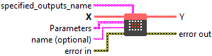
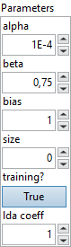

<h1>LRN</h1>

<h2>Description</h2>

Local Response Normalization proposed in the <a href="https://papers.nips.cc/paper/4824-imagenet-classification-with-deep-convolutional-neural-networks.pdf">AlexNet paper</a>. It normalizes over local input regions.

The local region is defined across the channels. For an element <code>X[n, c, d1, ..., dk]</code> in a tensor of shape <code>(N x C x D1 x D2, ..., Dk)</code>, its region is <code>{X[n, i, d1, ..., dk] | max(0, c - floor((size - 1) / 2)) &lt;= i &lt;= min(C - 1, c + ceil((size - 1) / 2))}</code>.

<code>square_sum[n, c, d1, ..., dk] = sum(X[n, i, d1, ..., dk] ^ 2)</code>, where <code>max(0, c - floor((size - 1) / 2)) &lt;= i &lt;= min(C - 1, c + ceil((size - 1) / 2))</code>.

<code>Y[n, c, d1, ..., dk] = X[n, c, d1, ..., dk] / (bias + alpha / size * square_sum[n, c, d1, ..., dk] ) ^ beta</code>

<h3>Input parameters</h3>

<table>
  <tbody>
    <tr>
      <td width="64" valign="top"></td>
      <td valign="top"><strong><a href="../../../../../../more-deep-learning/nodes-parameters/specified_outputs_name/README.md">specified_outputs_name</a> : <em>array, </em></strong>this parameter lets you manually assign custom names to the output tensors of a node.</td>
    </tr>
    <tr>
      <td width="64" valign="top"></td>
      <td valign="top"><strong>X (heterogeneous) – T : <em>object, </em></strong>input data tensor from the previous operator; dimensions for image case are (N x C x H x W), where N is the batch size, C is the number of channels, and H and W are the height and the width of the data. For non image case, the dimensions are in the form of (N x C x D1 x D2 … Dn), where N is the batch size. Optionally, if dimension denotation is in effect, the operation expects the input data tensor to arrive with the dimension denotation of [DATA_BATCH, DATA_CHANNEL, DATA_FEATURE, DATA_FEATURE …].</td>
    </tr>
  </tbody>
</table>

<table>
  <tbody>
    <tr>
      <td valign="top" width="70%">
<strong>Parameters : <em>cluster,</em></strong>

<table>
  <tbody>
    <tr>
      <td width="64" valign="top"></td>
      <td valign="top"><strong>alpha : <em>float,</em></strong> scaling parameter.</td>
    </tr>
    <tr>
      <td width="64" valign="top"></td>
      <td valign="top">Default value “1E-4”.</td>
    </tr>
    <tr>
      <td width="64" valign="top"></td>
      <td valign="top"><strong>beta :</strong> <em><strong>float</strong></em>, the exponent.</td>
    </tr>
    <tr>
      <td width="64" valign="top"></td>
      <td valign="top">Default value “0.75”.</td>
    </tr>
    <tr>
      <td width="64" valign="top"></td>
      <td valign="top"><strong>bias : <em>float,</em></strong> a constant added to the denominator in the normalization calculation. It is used to avoid division by zero or very small values that could destabilize learning.</td>
    </tr>
    <tr>
      <td width="64" valign="top"></td>
      <td valign="top">Default value “1”.</td>
    </tr>
    <tr>
      <td width="64" valign="top"></td>
      <td valign="top"><strong>size : <em>integer,</em></strong> the number of channels to sum over.</td>
    </tr>
    <tr>
      <td width="64" valign="top"></td>
      <td valign="top">Default value “0”.</td>
    </tr>
    <tr>
      <td width="64" valign="top"></td>
      <td valign="top"><strong>training? :</strong> <em><strong>boolean</strong></em>, whether the layer is in training mode (can store data for backward).</td>
    </tr>
    <tr>
      <td width="64" valign="top"></td>
      <td valign="top">Default value “True”.</td>
    </tr>
    <tr>
      <td width="64" valign="top"></td>
      <td valign="top"><strong>lda coeff :</strong> <em><strong>float</strong></em>, defines the coefficient by which the loss derivative will be multiplied before being sent to the previous layer (since during the backward run we go backwards).</td>
    </tr>
    <tr>
      <td width="64" valign="top"></td>
      <td valign="top">Default value “1”.</td>
    </tr>
    <tr>
      <td width="64" valign="top"></td>
      <td valign="top"><strong>name (optional) :</strong> <em><strong>string,</strong></em> name of the node.</td>
    </tr>
  </tbody>
</table></td>
      <td valign="top" width="30%">

</td>
    </tr>
  </tbody>
</table>

<h3>Output parameters</h3>

<table>
  <tbody>
    <tr>
      <td width="64" valign="top"></td>
      <td valign="top"><strong>Y (heterogeneous) – T : <em>object, </em></strong>output tensor, which has the shape and type as input tensor.</td>
    </tr>
  </tbody>
</table>

<h2>Type Constraints</h2>

<strong>T</strong> in (<code>tensor(bfloat16)</code>, <code>tensor(double)</code>, <code>tensor(float)</code>, <code>tensor(float16)</code>) : Constrain input and output types to float tensors.

<h2>Example</h2>

All these exemples are snippets PNG, you can drop these Snippet onto the block diagram and get the depicted code added to your VI (Do not forget to install Deep Learning library to run it).

