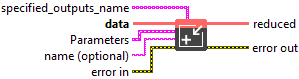
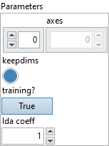

<h1>ReduceSumInteger</h1>

<h2>Description</h2>

Computes the sum of the low-precision input tensor’s element along the provided axes. The resulting tensor has the same rank as the input if keepdims equal 1. If keepdims equal 0, then the resulting tensor have the reduced dimension pruned. The above behavior is similar to numpy, with the exception that numpy default keepdims to False instead of True.

<h3>Input parameters</h3>

<table>
  <tbody>
    <tr>
      <td width="64" valign="top"></td>
      <td valign="top"><strong><a href="../../../../../../more-deep-learning/nodes-parameters/specified_outputs_name/README.md">specified_outputs_name</a> : <em>array, </em></strong>this parameter lets you manually assign custom names to the output tensors of a node.</td>
    </tr>
    <tr>
      <td width="64" valign="top"></td>
      <td valign="top"><strong>data (heterogeneous) – T1 : <em>object, </em></strong>an input tensor.</td>
    </tr>
  </tbody>
</table>

<table>
  <tbody>
    <tr>
      <td valign="top" width="70%">
<strong>Parameters : <em>cluster,</em></strong>

<table>
  <tbody>
    <tr>
      <td width="64" valign="top"></td>
      <td valign="top"><strong>axes : <em>array,</em></strong> a list of integers, along which to reduce. The default is to reduce over all the dimensions of the input tensor.</td>
    </tr>
    <tr>
      <td width="64" valign="top"></td>
      <td valign="top">Default value “empty”.</td>
    </tr>
    <tr>
      <td width="64" valign="top"></td>
      <td valign="top"><strong>keepdims :</strong> <em><strong>boolean</strong></em>, keep the reduced dimension or not, true mean keep reduced dimension.</td>
    </tr>
    <tr>
      <td width="64" valign="top"></td>
      <td valign="top">Default value “True”.</td>
    </tr>
    <tr>
      <td width="64" valign="top"></td>
      <td valign="top"><strong>training? :</strong> <em><strong>boolean</strong></em>, whether the layer is in training mode (can store data for backward).</td>
    </tr>
    <tr>
      <td width="64" valign="top"></td>
      <td valign="top">Default value “True”.</td>
    </tr>
    <tr>
      <td width="64" valign="top"></td>
      <td valign="top"><strong>lda coeff :</strong> <em><strong>float</strong></em>, defines the coefficient by which the loss derivative will be multiplied before being sent to the previous layer (since during the backward run we go backwards).</td>
    </tr>
    <tr>
      <td width="64" valign="top"></td>
      <td valign="top">Default value “1”.</td>
    </tr>
    <tr>
      <td width="64" valign="top"></td>
      <td valign="top"><strong>name (optional) :</strong> <em><strong>string,</strong></em> name of the node.</td>
    </tr>
  </tbody>
</table></td>
      <td valign="top" width="30%">

</td>
    </tr>
  </tbody>
</table>

<h3>Output parameters</h3>

<table>
  <tbody>
    <tr>
      <td width="64" valign="top"></td>
      <td valign="top"><strong>reduced (heterogeneous) – T2 : <em>object, </em></strong>reduced output tensor.</td>
    </tr>
  </tbody>
</table>

<h2>Type Constraints</h2>

<strong>T1</strong> in (<code>tensor(int8)</code>, <code>tensor(uint8)</code>) : Constrain input type to 8-bit integer tensor.

<strong>T2</strong> in (<code>tensor(int32)</code>, <code>tensor(uint32)</code>) : Constrain output data type to 32-bit integer tensor.T2 must be tensor(uint32) when T1 is tensor(uint8),or must be tensor(int32) when T1 is tensor(int8).

<h2>Example</h2>

All these exemples are snippets PNG, you can drop these Snippet onto the block diagram and get the depicted code added to your VI (Do not forget to install Deep Learning library to run it).

