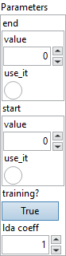

<h1>Shape</h1>

<h2>Description</h2>

Takes a tensor as input and outputs an 1D int64 tensor containing the shape of the input tensor. Optional attributes start and end can be used to compute a slice of the input tensor’s shape. If start axis is omitted, the slice starts from axis 0. The end axis, if specified, is exclusive (and the returned value will not include the size of that axis). If the end axis is omitted, the axes upto the last one will be included. Negative axes indicate counting back from the last axis. Note that axes will be clamped to the range [0, r], where r is the rank of the input tensor if they are out-of-range (after adding r in the case of negative axis). Thus, specifying any end value &gt; r is equivalent to specifying an end value of r, and specifying any start value &lt; -r is equivalent to specifying a start value of 0. If start &gt; end, the result will be an empty shape.

<h3>Input parameters</h3>

<table>
  <tbody>
    <tr>
      <td width="64" valign="top"></td>
      <td valign="top"><strong><a href="../../../../../../more-deep-learning/nodes-parameters/specified_outputs_name/README.md">specified_outputs_name</a> : <em>array, </em></strong>this parameter lets you manually assign custom names to the output tensors of a node.</td>
    </tr>
    <tr>
      <td width="64" valign="top"></td>
      <td valign="top"><strong>data (heterogeneous) – T : <em>object, </em></strong>an input tensor.</td>
    </tr>
  </tbody>
</table>

<table>
  <tbody>
    <tr>
      <td valign="top" width="70%">
<strong>Parameters : <em>cluster,</em></strong>

<table>
  <tbody>
    <tr>
      <td width="64" valign="top"></td>
      <td valign="top"><strong>end : <em>integer,</em></strong> ending axis for slicing the shape. Negative value means counting dimensions from the back. If omitted, sizes of all axes upto (including) the last one will be included.</td>
    </tr>
    <tr>
      <td width="64" valign="top"></td>
      <td valign="top">Default value “0”.</td>
    </tr>
    <tr>
      <td width="64" valign="top"></td>
      <td valign="top"><strong>start : <em>integer,</em></strong> starting axis for slicing the shape. Negative value means counting dimensions from the back.</td>
    </tr>
    <tr>
      <td width="64" valign="top"></td>
      <td valign="top">Default value “0”.</td>
    </tr>
    <tr>
      <td width="64" valign="top"></td>
      <td valign="top"><strong>training? :</strong> <em><strong>boolean</strong></em>, whether the layer is in training mode (can store data for backward).</td>
    </tr>
    <tr>
      <td width="64" valign="top"></td>
      <td valign="top">Default value “True”.</td>
    </tr>
    <tr>
      <td width="64" valign="top"></td>
      <td valign="top"><strong>lda coeff :</strong> <em><strong>float</strong></em>, defines the coefficient by which the loss derivative will be multiplied before being sent to the previous layer (since during the backward run we go backwards).</td>
    </tr>
    <tr>
      <td width="64" valign="top"></td>
      <td valign="top">Default value “1”.</td>
    </tr>
    <tr>
      <td width="64" valign="top"></td>
      <td valign="top"><strong>name (optional) :</strong> <em><strong>string,</strong></em> name of the node.</td>
    </tr>
  </tbody>
</table></td>
      <td valign="top" width="30%">

</td>
    </tr>
  </tbody>
</table>

<h3>Output parameters</h3>

<table>
  <tbody>
    <tr>
      <td width="64" valign="top"></td>
      <td valign="top"><strong>shape (heterogeneous) – T1 : <em>object, </em></strong>shape of the input tensor.</td>
    </tr>
  </tbody>
</table>

<h2>Type Constraints</h2>

<strong>T</strong> in (<code>tensor(bfloat16)</code>, <code>tensor(bool)</code>, <code>tensor(complex128)</code>, <code>tensor(complex64)</code>, <code>tensor(double)</code>, <code>tensor(float)</code>, <code>tensor(float16)</code>, <code>tensor(float4e2m1)</code>, <code>tensor(float8e4m3fn)</code>, <code>tensor(float8e4m3fnuz)</code>, <code>tensor(float8e5m2)</code>, <code>tensor(float8e5m2fnuz)</code>, <code>tensor(float8e8m0)</code>, <code>tensor(int16)</code>, <code>tensor(int32)</code>, <code>tensor(int4)</code>, <code>tensor(int64)</code>, <code>tensor(int8)</code>, <code>tensor(string)</code>, <code>tensor(uint16)</code>, <code>tensor(uint32)</code>, <code>tensor(uint4)</code>, <code>tensor(uint64)</code>, <code>tensor(uint8)</code>) : Input tensor can be of arbitrary type.

<strong>T1</strong> in (<code>tensor(int64)</code>) : Constrain output to int64 tensor.

<h2>Example</h2>

All these exemples are snippets PNG, you can drop these Snippet onto the block diagram and get the depicted code added to your VI (Do not forget to install Deep Learning library to run it).

