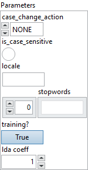

<h1>StringNormalizer</h1>

<h2>Description</h2>

StringNormalization performs string operations for basic cleaning. This operator has only one input (denoted by X) and only one output (denoted by Y). This operator first examines the elements in the X, and removes elements specified in “stopwords” attribute. After removing stop words, the intermediate result can be further lowercased, uppercased, or just returned depending the “case_change_action” attribute. This operator only accepts [C]- and [1, C]-tensor. If all elements in X are dropped, the output will be the empty value of string tensor with shape [1] if input shape is [C] and shape [1, 1] if input shape is [1, C].

<h3>Input parameters</h3>

<table>
  <tbody>
    <tr>
      <td width="64" valign="top"></td>
      <td valign="top"><strong><a href="../../../../../../more-deep-learning/nodes-parameters/specified_outputs_name/README.md">specified_outputs_name</a> : <em>array, </em></strong>this parameter lets you manually assign custom names to the output tensors of a node.</td>
    </tr>
    <tr>
      <td width="64" valign="top"></td>
      <td valign="top"><strong>X (heterogeneous) – tensor(string) : <em>object, </em></strong>UTF-8 strings to normalize.</td>
    </tr>
  </tbody>
</table>

<table>
  <tbody>
    <tr>
      <td valign="top" width="70%">
<strong>Parameters : <em>cluster,</em></strong>

<table>
  <tbody>
    <tr>
      <td width="64" valign="top"></td>
      <td valign="top"><strong>case_change_action : <em>enum,</em></strong> string enum that cases output to be lowercased/uppercases/unchanged. Valid values are “LOWER”, “UPPER”, “NONE”.</td>
    </tr>
    <tr>
      <td width="64" valign="top"></td>
      <td valign="top">Default value “NONE”.</td>
    </tr>
    <tr>
      <td width="64" valign="top"></td>
      <td valign="top"><strong>is_case_sensitive :</strong> <em><strong>boolean</strong></em>, whether the identification of stop words in X is case-sensitive.</td>
    </tr>
    <tr>
      <td width="64" valign="top"></td>
      <td valign="top">Default value “False”.</td>
    </tr>
    <tr>
      <td width="64" valign="top"></td>
      <td valign="top"><strong>locale : <em>string,</em></strong> environment dependent string that denotes the locale according to which output strings needs to be upper/lowercased.Default en_US or platform specific equivalent as decided by the implementation.</td>
    </tr>
    <tr>
      <td width="64" valign="top"></td>
      <td valign="top"><strong>stopwords : <em>array,</em></strong> list of stop words. If not set, no word would be removed from X.</td>
    </tr>
    <tr>
      <td width="64" valign="top"></td>
      <td valign="top"><strong>training? :</strong> <em><strong>boolean</strong></em>, whether the layer is in training mode (can store data for backward).</td>
    </tr>
    <tr>
      <td width="64" valign="top"></td>
      <td valign="top">Default value “True”.</td>
    </tr>
    <tr>
      <td width="64" valign="top"></td>
      <td valign="top"><strong>lda coeff :</strong> <em><strong>float</strong></em>, defines the coefficient by which the loss derivative will be multiplied before being sent to the previous layer (since during the backward run we go backwards).</td>
    </tr>
    <tr>
      <td width="64" valign="top"></td>
      <td valign="top">Default value “1”.</td>
    </tr>
    <tr>
      <td width="64" valign="top"></td>
      <td valign="top"><strong>name (optional) :</strong> <em><strong>string,</strong></em> name of the node.</td>
    </tr>
  </tbody>
</table></td>
      <td valign="top" width="30%">

</td>
    </tr>
  </tbody>
</table>

<h3>Output parameters</h3>

<table>
  <tbody>
    <tr>
      <td width="64" valign="top"></td>
      <td valign="top"><strong>Y (heterogeneous) – tensor(string) : <em>object, </em></strong>UTF-8 Normalized strings.</td>
    </tr>
  </tbody>
</table>

<h2>Example</h2>

All these exemples are snippets PNG, you can drop these Snippet onto the block diagram and get the depicted code added to your VI (Do not forget to install Deep Learning library to run it).

