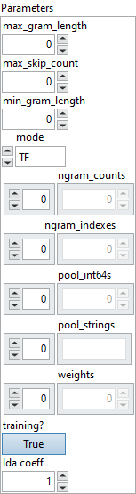

<h1>TfldfVectorizer</h1>

<h2>Description</h2>

This transform extracts n-grams from the input sequence and save them as a vector.

Input can be either a 1-D or 2-D tensor. For 1-D input, output is the n-gram representation of that input. For 2-D input, the output is also a 2-D tensor whose i-th row is the n-gram representation of the i-th input row. More specifically, if input shape is [C], the corresponding output shape would be [max(ngram_indexes) + 1]. If input shape is [N, C], this operator produces a [N, max(ngram_indexes) + 1]-tensor.

In contrast to standard n-gram extraction, here, the indexes of extracting an n-gram from the original sequence are not necessarily consecutive numbers. The discontinuity between indexes are controlled by the number of skips. If the number of skips is 2, we should skip two tokens when scanning through the original sequence. Let’s consider an example. Assume that input sequence is [94, 17, 36, 12, 28] and the number of skips is 2. The associated 2-grams are [94, 12] and [17, 28] respectively indexed by [0, 3] and [1, 4]. If the number of skips becomes 0, the 2-grams generated are [94, 17], [17, 36], [36, 12], [12, 28] indexed by [0, 1], [1, 2], [2, 3], [3, 4], respectively.

The output vector (denoted by Y) stores the count of each n-gram; Y[ngram_indexes] indicates the times that the i-th n-gram is found. The attribute ngram_indexes is used to determine the mapping between index i and the corresponding n-gram’s output coordinate. If pool_int64s is [94, 17, 17, 36], ngram_indexes is [1, 0], ngram_counts=[0, 0], then the Y[0] (first element in Y) and Y[1] (second element in Y) are the counts of [17, 36] and [94, 17], respectively. An n-gram which cannot be found in pool_strings/pool_int64s should be ignored and has no effect on the output. Note that we may consider all skips up to S when generating the n-grams.

The examples used above are true if mode is “TF”. If mode is “IDF”, all the counts larger than 1 would be truncated to 1 and the i-th element in weights would be used to scale (by multiplication) the count of the i-th n-gram in pool. If mode is “TFIDF”, this operator first computes the counts of all n-grams and then scale them by the associated values in the weights attribute.

Only one of pool_strings and pool_int64s can be set. If pool_int64s is set, the input should be an integer tensor. If pool_strings is set, the input must be a string tensor.

<h3>Input parameters</h3>

<table>
  <tbody>
    <tr>
      <td width="64" valign="top"></td>
      <td valign="top"><strong><a href="../../../../../../more-deep-learning/nodes-parameters/specified_outputs_name/README.md">specified_outputs_name</a> : <em>array, </em></strong>this parameter lets you manually assign custom names to the output tensors of a node.</td>
    </tr>
    <tr>
      <td width="64" valign="top"></td>
      <td valign="top"><strong>X (heterogeneous) – T : <em>object, </em></strong>input for n-gram extraction.</td>
    </tr>
  </tbody>
</table>

<table>
  <tbody>
    <tr>
      <td valign="top" width="70%">
<strong>Parameters : <em>cluster,</em></strong>

<table>
  <tbody>
    <tr>
      <td width="64" valign="top"></td>
      <td valign="top"><strong>max_gram_length : <em>integer,</em></strong> maximum n-gram length. If this value is 3, 3-grams will be used to generate the output.</td>
    </tr>
    <tr>
      <td width="64" valign="top"></td>
      <td valign="top">Default value “0”.</td>
    </tr>
    <tr>
      <td width="64" valign="top"></td>
      <td valign="top"><strong>max_skip_count : <em>integer,</em></strong> maximum number of items (integers/strings) to be skipped when constructing an n-gram from X. If max_skip_count=1, min_gram_length=2, max_gram_length=3, this operator may generate 2-grams with skip_count=0 and skip_count=1, and 3-grams with skip_count=0 and skip_count=1.</td>
    </tr>
    <tr>
      <td width="64" valign="top"></td>
      <td valign="top">Default value “0”.</td>
    </tr>
    <tr>
      <td width="64" valign="top"></td>
      <td valign="top"><strong>min_gram_length : <em>integer,</em></strong> minimum n-gram length. If this value is 2 and max_gram_length is 3, output may contain counts of 2-grams and 3-grams.</td>
    </tr>
    <tr>
      <td width="64" valign="top"></td>
      <td valign="top">Default value “0”.</td>
    </tr>
    <tr>
      <td width="64" valign="top"></td>
      <td valign="top"><strong>mode : <em>enum,</em></strong> the weighting criteria. It can be one of “TF” (term frequency), “IDF” (inverse document frequency), and “TFIDF” (the combination of TF and IDF).</td>
    </tr>
    <tr>
      <td width="64" valign="top"></td>
      <td valign="top">Default value “TF”.</td>
    </tr>
    <tr>
      <td width="64" valign="top"></td>
      <td valign="top"><strong>ngram_counts : <em>array,</em></strong> the starting indexes of 1-grams, 2-grams, and so on in pool. It is useful when determining the boundary between two consecutive collections of n-grams. For example, if ngram_counts is [0, 17, 36], the first index (zero-based) of 1-gram/2-gram/3-gram in pool are 0/17/36. This format is essentially identical to CSR (or CSC) sparse matrix format, and we choose to use this due to its popularity.</td>
    </tr>
    <tr>
      <td width="64" valign="top"></td>
      <td valign="top">Default value “empty”.</td>
    </tr>
    <tr>
      <td width="64" valign="top"></td>
      <td valign="top"><strong>ngram_indexes : <em>array,</em></strong> list of int64s (type: AttributeProto::INTS). This list is parallel to the specified ‘pool_*’ attribute. The i-th element in ngram_indexes indicate the coordinate of the i-th n-gram in the output tensor.</td>
    </tr>
    <tr>
      <td width="64" valign="top"></td>
      <td valign="top">Default value “empty”.</td>
    </tr>
    <tr>
      <td width="64" valign="top"></td>
      <td valign="top"><strong>pool_int64s : <em>array,</em></strong> list of int64 n-grams learned from the training set. Either this or pool_strings attributes must be present but not both. It’s an 1-D tensor starting with the collections of all 1-grams and ending with the collections of n-grams. The i-th element in pool stores the n-gram that should be mapped to coordinate ngram_indexes in the output vector.</td>
    </tr>
    <tr>
      <td width="64" valign="top"></td>
      <td valign="top">Default value “empty”.</td>
    </tr>
    <tr>
      <td width="64" valign="top"></td>
      <td valign="top"><strong>pool_strings : <em>array,</em></strong> list of strings n-grams learned from the training set. Either this or pool_int64s attributes must be present but not both. It’s an 1-D tensor starting with the collections of all 1-grams and ending with the collections of n-grams. The i-th element in pool stores the n-gram that should be mapped to coordinate ngram_indexes in the output vector.</td>
    </tr>
    <tr>
      <td width="64" valign="top"></td>
      <td valign="top">Default value “empty”.</td>
    </tr>
    <tr>
      <td width="64" valign="top"></td>
      <td valign="top"><strong>weights : <em>array,</em></strong> list of floats. This attribute stores the weight of each n-gram in pool. The i-th element in weights is the weight of the i-th n-gram in pool. Its length equals to the size of ngram_indexes. By default, weights is an all-one tensor.This attribute is used when mode is “IDF” or “TFIDF” to scale the associated word counts.</td>
    </tr>
    <tr>
      <td width="64" valign="top"></td>
      <td valign="top">Default value “empty”.</td>
    </tr>
    <tr>
      <td width="64" valign="top"></td>
      <td valign="top"><strong>training? :</strong> <em><strong>boolean</strong></em>, whether the layer is in training mode (can store data for backward).</td>
    </tr>
    <tr>
      <td width="64" valign="top"></td>
      <td valign="top">Default value “True”.</td>
    </tr>
    <tr>
      <td width="64" valign="top"></td>
      <td valign="top"><strong>lda coeff :</strong> <em><strong>float</strong></em>, defines the coefficient by which the loss derivative will be multiplied before being sent to the previous layer (since during the backward run we go backwards).</td>
    </tr>
    <tr>
      <td width="64" valign="top"></td>
      <td valign="top">Default value “1”.</td>
    </tr>
    <tr>
      <td width="64" valign="top"></td>
      <td valign="top"><strong>name (optional) :</strong> <em><strong>string,</strong></em> name of the node.</td>
    </tr>
  </tbody>
</table></td>
      <td valign="top" width="30%">

</td>
    </tr>
  </tbody>
</table>

<h3>Output parameters</h3>

<table>
  <tbody>
    <tr>
      <td width="64" valign="top"></td>
      <td valign="top"><strong>Y (heterogeneous) – T1 : <em>object, </em></strong>Ngram results.</td>
    </tr>
  </tbody>
</table>

<h2>Type Constraints</h2>

<strong>T</strong> in (<code>tensor(int32)</code>, <code>tensor(int64)</code>, <code>tensor(string)</code>) : Input is ether string UTF-8 or int32/int64.

<strong>T1</strong> in (<code>tensor(float)</code>) : 1-D tensor of floats.

<h2>Example</h2>

All these exemples are snippets PNG, you can drop these Snippet onto the block diagram and get the depicted code added to your VI (Do not forget to install Deep Learning library to run it).

